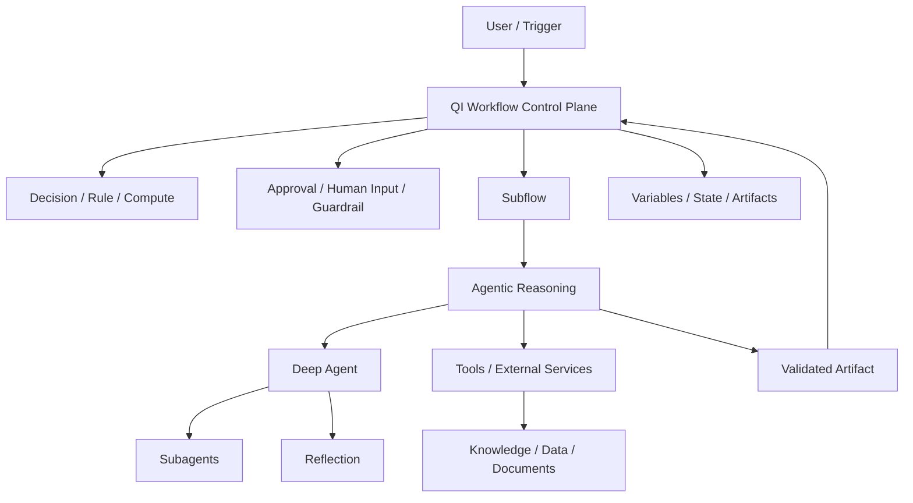
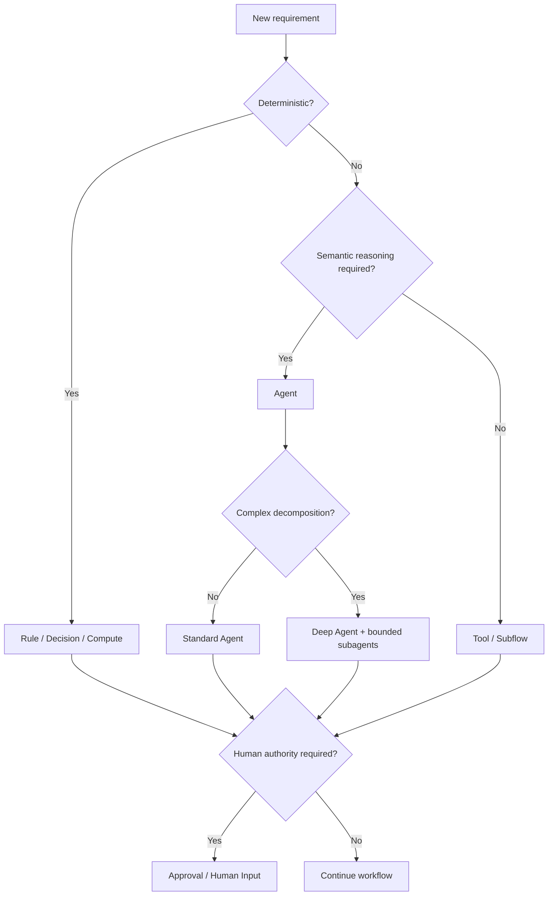

# QI Studio Architecture

## System mental model



## Separation of responsibility

### Workflow control plane

Owns process state, deterministic branching, approvals, guardrails, orchestration boundaries, retries where explicitly designed, and movement between stages.

### Agentic reasoning plane

Owns semantic interpretation, ambiguity handling, qualitative reasoning, synthesis, and bounded delegation.

### Tool execution plane

Owns retrieval, extraction, computation, external actions, system integrations, and other operations that should be explicit and repeatable.

### State and artifact plane

Owns structured execution state, typed artifacts, provenance, validation status, and versioned outputs.

### Human authority plane

Owns approvals, configuration confirmation, exception handling, and decisions that must become authoritative through a human gate.

## Core rule

```text
LLM may propose -> Workflow decides what is permitted -> Tools execute -> Validators verify -> Human approval establishes authority
```

## Architecture selection



## Boundary principle

The safest enterprise design places the workflow outside the agent. The agent solves a bounded task; it does not silently become the state machine unless that behavior is explicitly justified and tested.

## Artifact-oriented design

A stage should ideally receive typed input artifacts and return typed output artifacts.

Recommended minimum metadata:

- artifact_id
- run_id
- artifact_type
- version
- producer
- status
- provenance
- validation_status
- created_at

## Versioning

When QI Studio behavior changes, update:

1. affected capability page
2. interaction pages
3. examples
4. diagrams
5. evidence record
6. known limitations
7. changelog

Do not overwrite historical observations without preserving the prior state.
