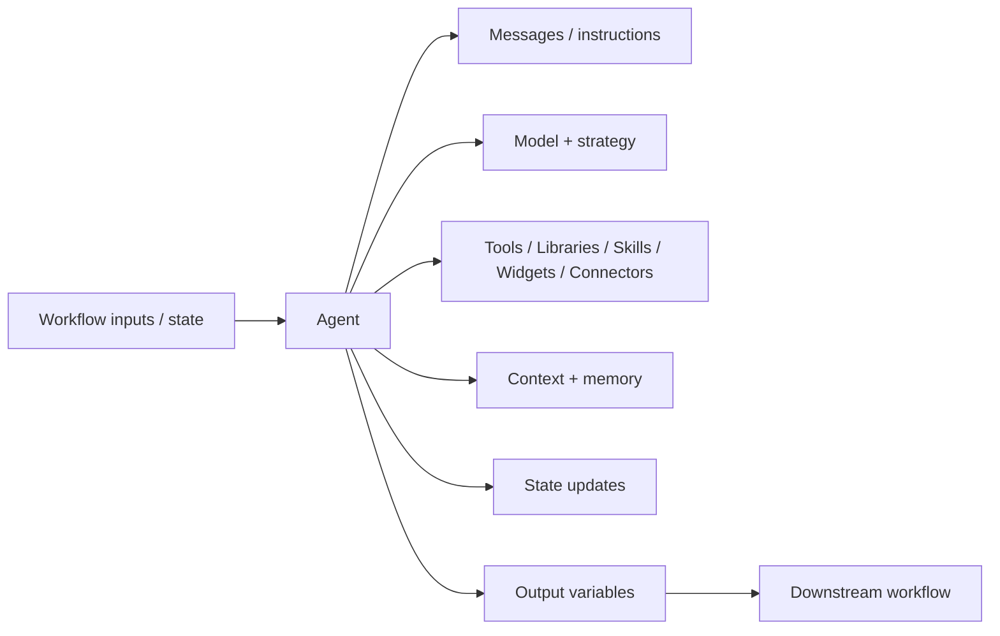

# Agent Node

> **Evidence status:** Observed + Documented; selected runtime semantics remain Open.
> **Evidence date:** 2026-08-23
> **Primary evidence:** User-supplied QI Studio Agent screenshots and tool configuration descriptions.

The **Agent** node is the semantic execution primitive for tasks that require reasoning, interpretation, synthesis, or iterative tool use. It combines a model and strategy with messages, capabilities, context controls, memory, state updates and output variables.

## 1. Mental model



Use the Agent for semantic work. Prefer deterministic primitives for exact rules, calculations and explicit state transitions.

## 2. Agent strategy

Observed strategy options:

- `ReAct`
- `Deep Agent`

### ReAct

Use when the Agent needs iterative reasoning and tool use.

```text
Reason → Act → Observe → Reason → … → Result
```

### Deep Agent

The observed UI exposes:

- Enable SubAgents
- Max parallel subagents, with a visible maximum of 3
- Run subagents in parallel

The displayed UI establishes these controls, not the full scheduling or aggregation semantics.

## 3. Model selection

The observed build exposes models from multiple provider families, including OpenAI, Google and Anthropic. The exact model list is environment/version dependent and should be treated as point-in-time UI evidence rather than a permanent catalog.

Choose a model using the workload's:

- quality requirement
- tool-use requirement
- context size
- latency sensitivity
- cost sensitivity

## 4. Messages

Observed message roles:

- `system`
- `user`
- `assistant`

Use them deliberately:

```text
System     → role, rules, constraints
User       → current task/request
Injected context → state, files, retrieved evidence
Assistant examples → only when intentionally useful
```

Do not bury deterministic workflow control inside instructions when a native node or variable can express it explicitly.

## 5. Capabilities

The Agent UI exposes:

- Tools
- Libraries
- Skills
- Widgets
- Connectors

Expose only the capabilities required for the task. A smaller tool surface reduces ambiguity and unintended actions.

The system-tool governance pattern is:

```text
SearchSystemTools
      ↓
GetSystemToolSchema
      ↓
ExecuteSystemTool
      ↓
Validate result
```

For knowledge-source workflows, `get-knowledge-workflow-instructions` must be called first according to the supplied product rule.

See [Agent Tool Catalog](../03-Evidence/Agent-Tool-Catalog.md).

## 6. Response Format

Observed choices:

- Plain Text
- JSON

Use Plain Text for natural-language output.

Use JSON when the Agent output is a structured inter-stage contract.

Preferred pattern:

```text
Agent → structured output → deterministic validation/routing → downstream step
```

## 7. Advanced settings

The observed Advanced surface contains:

- Response Format
- Include Thoughts
- Guardrails
- Context Management
- Long-term Memory
- Error Handling
- State Update
- Output Variables

The UI presence of a control does not establish its complete runtime behavior.

### Context Management

Observed settings include:

- Scope: Tool results only / Full history
- Strategy: Replace / Drop
- Threshold: Tokens / Turns

Use Tool-results-only when large tool/file/API payloads are the dominant context problem. Use Full history when conversation growth is itself the problem.

The exact token accounting, threshold boundaries and resulting message payload remain Open.

### Long-term Memory

The UI describes this as durable memory for useful facts across conversations. It is distinct from:

```text
Workflow state       → current orchestration data
Conversation history → conversational context
Long-term memory     → selected durable facts across sessions
```

Do not treat long-term memory as a generic workflow database.

### Include Thoughts

The control exists in the observed UI. Exact runtime representation, downstream exposure and persistence are Open.

### Error Handling

The control exists in the observed UI. Exact retry, fallback and failure-state semantics are Open.

### Guardrails

Guardrails are exposed as a configurable capability. Do not assume exact sequencing or failure routing without runtime evidence.

## 8. State Update

Observed operations:

- Append
- Extend
- Set
- Clear

Observed conversation-history role choices:

- User
- Assistant
- System
- Tool

Example:

```text
conversationHistory
  ← Append
     role = Assistant
     value = current node text
```

The Agent UI also exposes conditional state updates through **Run only when**.

The exact transactionality and type behavior of state operations remain Open.

## 9. Variable browser

The observed variable browser groups data into scopes/categories including:

- Current Node
- Workflow / referenced contexts
- Environment
- Authorization
- Metadata
- Flow / business state
- System

Observed System values include `attachments`, `dateTime.utcNow`, `files`, `humanInput`, `sessionId`, `timestamp`, `uiAction` and `userQuery`.

Observed metadata/environment/security values include names such as `agentName`, `bpc`, `environment`, `modelId`, `version`, `workflowId`, `baseURL`, `Authorization` and `RuntimeToken`.

**Security:** never persist real authorization values, runtime tokens, credentials or API keys in prompts, tests or this repository.

## 10. Output variables

Observed Agent outputs include:

| Output | Type shown | Purpose |
|---|---|---|
| `text` | string | Agent text output |
| `toolCalls` | array | Tool-call information |
| `structuredOutput` | object | Structured Agent result |
| `success` | boolean | Execution status |
| `error` | object | Error information |
| `error.message` | string | Error message |
| `error.status_code` | number | Error status |

The exact mapping required to make these values available to downstream Output or other nodes should be verified in the target workflow.

## 11. Design rules

1. Use deterministic nodes for deterministic logic.
2. Give the Agent only the tools and capabilities it needs.
3. Prefer structured JSON output for inter-stage contracts.
4. Keep current workflow state separate from long-term memory and conversation history.
5. Make consequential external actions explicit and place them behind Approval where required.
6. Never invent undocumented Agent tool or runtime behavior.
7. Record runtime discoveries in `03-Evidence/` and remove the corresponding item from `04-Verification/` once confirmed.

## 12. Open verification items

- Context Management threshold and message semantics.
- Long-term Memory persistence and retrieval timing.
- Include Thoughts output semantics.
- Error Handling and recovery semantics.
- Deep Agent subagent scheduling and failure isolation.
- Agent state-update semantics.
- Variable scope precedence.
- Complete downstream output mapping.
