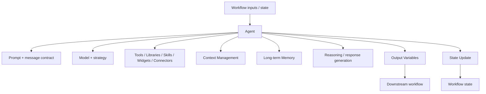
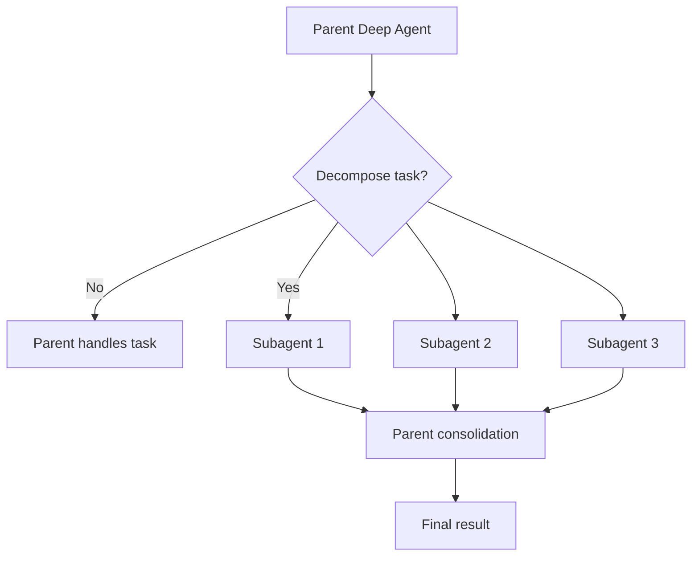
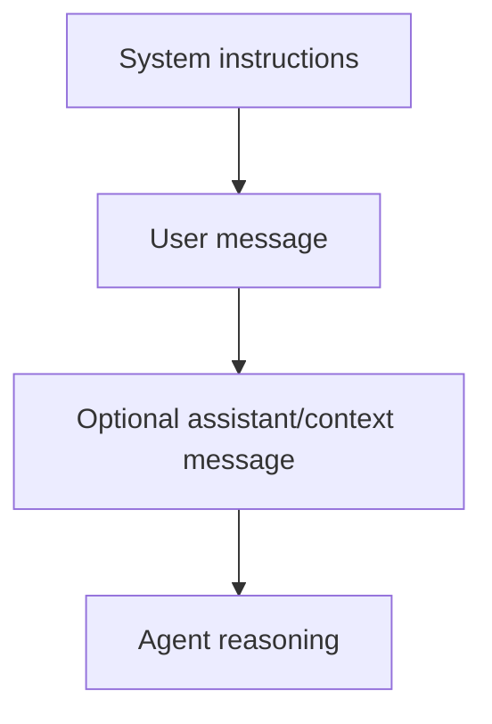
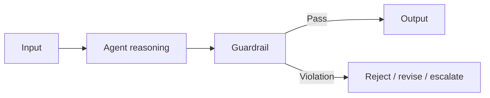
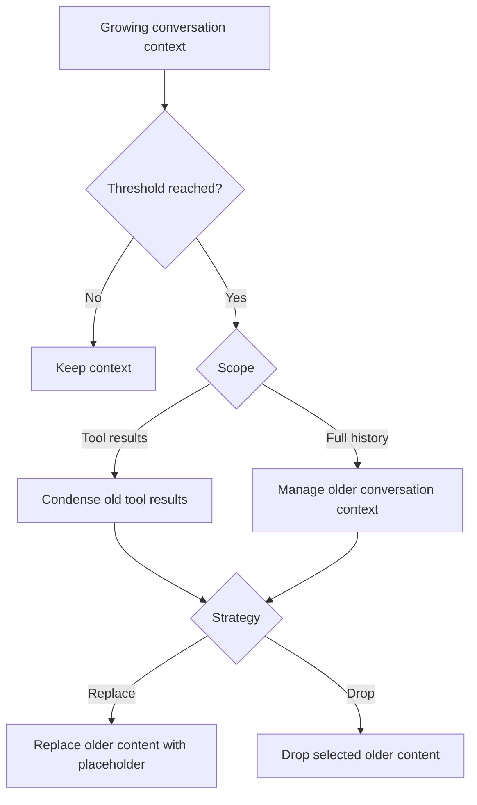
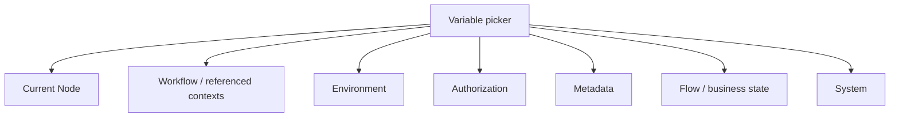
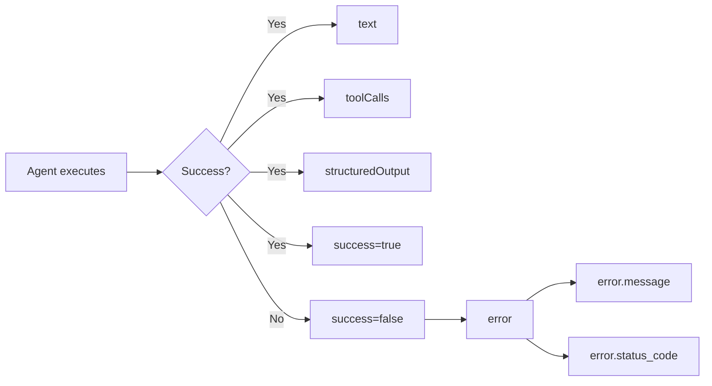
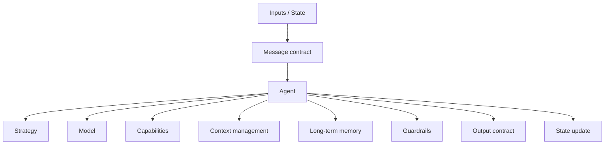

# Agent Node

> **Evidence status:** DOCUMENTED + OBSERVED
> **Evidence date:** 2026-08-23
> **Primary evidence:** User-supplied QI Studio Agent screenshots.
> **Scope:** Agent configuration, model/strategy selection, prompts/messages, tools, libraries, skills, widgets, connectors, advanced settings, context management, memory, state updates, output variables, and variable browser behavior.
>
> See also: [START Node](./Start.md) | [Variables and State](../05-Data-State/README.md) | [Tools](../04-Tools/README.md) | [Testing](../11-Testing/README.md)

## 1. What the Agent node is

The Agent node is the primary QI Studio primitive for bounded semantic reasoning and tool-using task execution. The screenshots show that an Agent combines a model, agent strategy, instructions/messages, optional tools and knowledge-oriented capabilities, and runtime controls such as context management, memory, state updates, and output variables.

A useful mental model is:



The Agent is therefore not just an LLM call. It is a configurable execution boundary where reasoning, context, capabilities, and state interaction are composed.

## 2. Agent Strategy

The screenshots show an **Agent Strategy** selector.

Observed strategies include:

- `ReAct`
- `Deep Agent`

The strategy determines the execution pattern used by the agent rather than simply selecting a different model.

### ReAct

The observed UI presents ReAct as a standard agent strategy. ReAct is appropriate when the agent must reason about a task and use available tools iteratively.

```text
Reason -> Act -> Observe -> Reason -> ... -> Final result
```

### Deep Agent

The Deep Agent configuration exposes additional controls for delegation. The screenshot shows:

- **Enable SubAgents**
- **Max parallel subagents**, with a displayed cap of `3`
- **Run subagents in parallel**

The UI explains that a single general-purpose subagent is exposed and that the parent Agent decides at runtime how many subagents to spawn, from zero up to the configured maximum, with each inheriting the parent tools, skill, model, and prompt.

Conceptually:



### Selection rule

Use the least complex strategy that solves the problem:

| Requirement | Preferred strategy |
|---|---|
| Tool-using semantic task | ReAct |
| Complex decomposition / parallel analysis | Deep Agent |
| Simple deterministic transformation | Prefer a deterministic node instead of an Agent |

Do not use Deep Agent merely because the workflow has many steps. Deep Agent is most justified when the work can be usefully decomposed into semi-independent analytical tasks.

## 3. Model selection

The model picker exposes models across providers. The supplied screenshots visibly include model choices from OpenAI, Google, and Anthropic.

Observed examples include:

### OpenAI
- OpenAI GPT-4.1 mini
- OpenAI GPT-4.1
- OpenAI GPT-5
- OpenAI GPT-5 mini
- OpenAI GPT-5 nano
- OpenAI GPT-5.1
- OpenAI GPT-5.2
- OpenAI GPT-5.4 mini
- OpenAI GPT-5.4 nano
- Auto
- OpenAI GPT Chat Latest
- Experimental GEP Contracts SLM

### Google
Visible examples include:
- Gemini 2.5 Pro
- Gemini 2.5 Flash
- Gemini 3 Flash (Preview)
- Gemini 2.5 Flash Lite
- Gemini 3.1 Pro Preview
- Gemini 3.1 Flash-Lite Preview

### Anthropic
Visible examples include:
- Claude Opus 4.6
- Claude Sonnet 4.5

The screenshots also display model context-window indicators such as `400K`, `1M`, or `128K`.

### Model selection principle

Treat model selection as part of the node's quality, cost, latency, and context architecture.

Document model choice for important workflows:

```yaml
model:
strategy:
reason_for_choice:
expected_context_size:
expected_tool_use:
cost_sensitivity:
latency_sensitivity:
quality_risk:
```

Do not hard-code an assumption about which model is best without documenting the workload and evaluation criteria.

## 4. Instructions and messages

The Agent configuration supports message blocks with roles. The supplied screenshots show:

- `system`
- `user`
- `assistant`

The observed default-style user message maps workflow state into the agent:

```text
User Query: {{system/userQuery}}
Attachments: {{system/attachments}}
```

The assistant message area supports variable insertion using the UI's `{` variable insertion mechanism.

### Message architecture

Think of the Agent prompt as a structured message stack rather than one giant prompt:



### Recommended practice

Keep these distinct:

1. **System instructions**: role, constraints, operating rules, quality bar.
2. **User message**: current request or current semantic task.
3. **Injected context**: workflow state, retrieved evidence, files, prior outputs.
4. **Assistant/example messages**: only when they serve a deliberate prompting purpose.

Do not bury workflow control logic inside free-form instructions when a native node or state variable can express it deterministically.

## 5. Tool surface

The Agent UI exposes capability sections for:

- Tools
- Libraries
- Skills
- Widgets
- Connectors

The exact availability depends on the QI Studio environment and selected Agent configuration.

### Why the separation matters

These are not interchangeable concepts.

| Capability | Role |
|---|---|
| Tools | Perform explicit operations or access functions |
| Libraries | Provide reusable supporting resources |
| Skills | Package reusable agent behavior/instructions |
| Widgets | UI-facing interaction capabilities |
| Connectors | Integrate with external applications/services |

### Tool exposure rule

Give an Agent only the capabilities it needs.

Excessive tools increase tool-selection ambiguity, prompt/context overhead, unintended action surface, debugging complexity, and potential failure modes.

The repository's existing tool governance standard should be applied here: **discover -> inspect schema -> execute -> validate** where discovery/schema tooling is used.

## 6. Advanced settings

The Agent's Advanced section visibly contains controls for:

- Response Format
- Include Thoughts
- Guardrails
- Context Management
- Long-term Memory
- Error Handling
- State Update
- Output Variables

These controls should be documented as separate concerns.

## 7. Response Format

The screenshots show a selector between:

- `Plain Text`
- `JSON`

Use **Plain Text** when downstream consumers expect natural language.

Use **JSON** when the Agent output is an inter-stage contract and downstream nodes need structured fields.

Recommended pattern:

```text
Agent -> JSON artifact -> deterministic node / validator -> downstream stage
```

Do not parse fragile natural-language output downstream when a structured response is available and suitable.

## 8. Include Thoughts

The screenshots show an **Include Thoughts** toggle in Advanced settings.

The playbook should treat this as an execution/output configuration option whose exact returned representation and downstream semantics must be governed by the runtime contract. The screenshots establish that the control exists, but do not by themselves define all data-exposure, logging, or billing implications.

**Do not infer hidden reasoning behavior beyond what the product explicitly exposes.**

Open questions to test/document separately:

- What exactly is returned when enabled?
- Is it returned to callers, intermediate metadata, or both?
- Does it affect context size or cost?
- Does it affect streaming events?
- What is persisted in run history?

## 9. Guardrails

The Agent UI exposes a Guardrails section with a count and add/configure control.

Use guardrails around tasks where the Agent needs explicit constraints on behavior or output.

Recommended architecture:



Guardrails should not be treated as a substitute for deterministic business rules. Use deterministic nodes for rules that must be exact and repeatable.

## 10. Context Management

This is one of the most important Agent controls shown in the screenshots.

The UI describes Context Management as keeping the agent efficient as conversations grow, preventing slow replies and rising costs by managing messages carried from prior turns.

Observed controls:

### Enable/disable

A Context Management toggle controls whether the feature is active.

### Scope

Two scopes are shown:

| Scope | Visible meaning |
|---|---|
| **Tool results only** | Search results, files, API responses |
| **Full history** | Tool results plus user and AI messages |

### Strategy

Two strategy choices are shown:

- **Replace**
- **Drop**

The UI describes Replace as replacing old tool-result data with a placeholder.

### Threshold

The threshold can be configured in:

- **Tokens**
- **Turns**

The screenshots indicate that the threshold activates the context-management behavior once the configured limit is reached. One screenshot also states that system prompts and tool definitions are always sent in full and do not count toward this specific threshold.

Conceptually:



### Design guidance

Use Tool-results-only scope when the main context problem is large search/file/API payloads while conversation history remains important.

Use Full-history scope when long-running conversations themselves are the dominant context problem.

Prefer Replace when provenance or a compact reminder of omitted content is useful.

Use Drop when the old content is genuinely unnecessary.

Treat threshold configuration as a workload-specific parameter, not a universal number.

## 11. Long-term Memory

The screenshots show a separate **Long-term Memory** toggle.

The UI describes it as allowing the agent to remember useful facts from past conversations and bring them back later, including preferences or decisions that should persist across sessions.

This is distinct from current workflow state, conversation history, context management, and session continuity.

Mental model:

```text
Current run state      -> transient execution context
Conversation history   -> conversational context
Context management     -> compression / pruning of context
Long-term memory       -> selected durable facts across sessions
```

Do not use long-term memory as a generic data store for arbitrary workflow state.

## 12. Error Handling

The Agent UI exposes an Error Handling toggle.

The screenshots do not provide enough information to define all error-handling configuration or retry semantics, so this remains an evidence-backed capability with runtime details to be documented as they become visible.

Recommended documentation dimensions:

```yaml
failure_class:
retryable:
max_retries:
backoff:
fallback:
state_after_failure:
partial_outputs:
user_visible_behavior:
```

A major design question is whether an Agent failure should fail the workflow, route to an explicit recovery stage, retry the Agent, ask for human input, or return a partial artifact. Do not hide these decisions inside a vague retry-everything policy.

## 13. State Update

The Agent node exposes a State Update section.

The supplied screenshots show a configured update writing to:

```text
conversationHistory
```

with:

```text
Role: Assistant
Value: Current Node / text
```

The available update operations shown are:

- Append
- Extend
- Set
- Clear

This is more expressive than the START screenshot's observed Set/Append/Clear controls, because Agent state update additionally exposes **Extend**.

### Operations

**Append**: add one logical item to a collection.

**Extend**: add multiple items/elements to a collection.

**Set**: replace the current state value.

**Clear**: reset/remove the stored value.

### Role selection

The screenshot exposes role choices:

- User
- Assistant
- System
- Tool

This is particularly relevant when updating conversational history.

Example:

```text
conversationHistory
   <- Append
      role = Assistant
      content = Current Node / text
```

### Conditional update

The Agent State Update section includes **Run only when**. This creates a conditional state mutation.

Use it to prevent state pollution when an output is empty, failed, irrelevant, or only valid for certain branches.

## 14. Variable browser in Agent state updates

One of the screenshots shows the variable picker used when selecting a state target or source. The browser is categorized by scope rather than presenting one undifferentiated list.

Observed categories and values include:

### Current Node
- `conversationHistory` (`Array`)

### Workflow / referenced execution contexts
The screenshot shows a workflow/agent context such as:
- `MASTER_RFP_QUALITATIVE_BID_ANALYSIS`
- `CONVERSATION`

These contexts also expose values such as `conversationHistory`.

### Environment
- `baseURL` (`String`)

### Authorization
- `Authorization` (`String`)
- `RuntimeToken` (`String`)

**Security note:** these are system-owned sensitive values. Do not expose or persist them unnecessarily and never hard-code them in prompts or repository documentation.

### Metadata
- `agentName` (`String`)
- `bpc` (`String`)
- `environment` (`String`)
- `modelId` (`String`)
- `version` (`String`)
- `workflowId` (`String`)

### Flow / business state
Observed objects include:
- `evaluationCriteria` (`Object`)
- `knockoutResult` (`Object`)
- `scoringResult` (`Object`)
- `supplierSubmission` (`Object`)
- `validationResult` (`Object`)

### System
Observed system-owned values include:

| Variable | Type shown |
|---|---|
| `attachments` | Array |
| `dateTime.utcNow` | String |
| `files` | Array |
| `humanInput` | String |
| `sessionId` | String |
| `timestamp` | Number |
| `uiAction` | Object |
| `userQuery` | String |

Architectural implication:



This matters for debugging. When a value is missing, stale, or unexpectedly different, first determine **which scope owns it** before changing prompts or creating another variable.

## 15. Output Variables

The Agent node visibly exposes output variables. The screenshot shows at least:

| Output | Type | Purpose shown |
|---|---|---|
| `text` | string | The text output from the agent |
| `toolCalls` | array | Tool calls output from the agent |
| `structuredOutput` | object | Structured output from the agent |
| `success` | boolean | Whether the node executed successfully |
| `error` | object | Error details when the node fails |
| `error.message` | string | Error message |
| `error.status_code` | number | Error status code |

Conceptually:



### Output design rule

When an Agent feeds another node, prefer `structuredOutput` over parsing `text` wherever the downstream contract is structured.

Keep `text` for human-facing narrative and `structuredOutput` for machine-facing contracts.

## 16. Production configuration pattern

A robust production Agent can be thought of as:



The workflow author should deliberately decide each of these layers rather than relying blindly on defaults.

## 17. Agent configuration checklist

### Identity and purpose
- Name is meaningful.
- Description states the bounded responsibility.
- Agent is not duplicating logic better handled by deterministic nodes.

### Strategy and model
- Strategy is justified.
- Model is justified.
- Deep Agent is only used where decomposition adds value.
- Parallel subagents are genuinely independent.

### Instructions
- System prompt defines role and constraints.
- User prompt carries the current task/context.
- Variables are injected explicitly.
- Sensitive system variables are not unnecessarily included.

### Capabilities
- Only required tools are exposed.
- Libraries, skills, widgets, and connectors are intentional.
- Tool contracts are documented.

### Advanced behavior
- Response format matches the downstream contract.
- Guardrails are configured for material risk.
- Context management scope/strategy/threshold are intentional.
- Long-term memory is enabled only for durable facts.
- Error handling is explicitly designed.
- State updates are intentional and conditional where appropriate.

### Outputs
- `text` is used for narrative outputs.
- `structuredOutput` is used for machine-readable downstream contracts.
- `success` and `error` are handled explicitly.
- Tool-call outputs are only propagated where needed.

## 18. Common anti-patterns

### Anti-pattern 1: One giant Agent does everything

Bad:

```text
Agent -> decide -> calculate -> validate -> approve -> execute -> report
```

Better:

```text
Agent -> semantic analysis
Decision -> deterministic decision
Compute -> calculation
Guardrail -> constraint check
Approval -> human authority
Tool -> external action
```

### Anti-pattern 2: Too many tools

More tools do not automatically mean a smarter Agent. They expand the action surface and make tool selection harder.

### Anti-pattern 3: Natural language as a state contract

Do not make downstream nodes scrape key values from `text` when `structuredOutput` can carry the data explicitly.

### Anti-pattern 4: Context management used as a substitute for architecture

If an Agent repeatedly receives huge tool outputs, first ask whether retrieval/extraction should be normalized before the Agent receives it.

### Anti-pattern 5: Long-term memory used as workflow state

Persistent memory and run-state are different concerns.

### Anti-pattern 6: Credentials treated as ordinary variables

Authorization and RuntimeToken appearing in the variable browser does not mean they belong in prompts, logs, outputs, or persistent state.

## 19. Evidence classification

### CONFIRMED / OBSERVED from screenshots
- Agent has a strategy selector.
- Agent has a model selector.
- Agent supports system/user/assistant message blocks.
- Agent exposes Tools, Libraries, Skills, Widgets, and Connectors sections.
- Advanced settings include Response Format, Include Thoughts, Guardrails, Context Management, Long-term Memory, Error Handling, State Update, and Output Variables.
- Context Management has Tool results only vs Full history scopes.
- Context Management exposes Replace vs Drop strategies.
- Threshold can be configured using Tokens or Turns.
- Long-term Memory is a separate toggle.
- Agent state updates support Append, Extend, Set, Clear in the observed UI.
- Conversational state updates can specify a role such as User, Assistant, System, or Tool.
- A variable picker exposes multiple namespaces including Current Node, workflow/referenced contexts, Environment, Authorization, Metadata, Flow, and System.
- Output Variables include text, toolCalls, structuredOutput, success, and error details.
- Deep Agent exposes subagent enablement, a displayed maximum of three parallel subagents, and parallel execution controls.
- The model picker exposes models from multiple providers.

### UNKNOWN / TO TEST
- Exact semantics and runtime payload of Include Thoughts.
- Exact Guardrail evaluation sequence and failure behavior.
- Context compression algorithm behind Replace.
- Whether Drop and Replace differ in token/cost behavior beyond visible intent.
- Exact threshold calculation and boundary conditions.
- Whether Long-term Memory is consulted automatically on every run or only under specific conditions.
- Exact Error Handling configuration and retry semantics.
- Exact meaning of Extend for every supported data type.
- Transactionality of multiple Agent state updates.
- Cross-context variable precedence when similarly named variables exist.
- Runtime behavior when scoped values are missing, null, or stale.
- Exact Deep Agent subagent scheduling, failure isolation, result aggregation, and ordering.
- Exact model fallback semantics for Auto.

## 20. Related pages
- [Orchestration Primitives](./README.md)
- [START Node](./Start.md)
- [Agent Architecture](../03-Agents/README.md)
- [Tools and Integrations](../04-Tools/README.md)
- [Data and State](../05-Data-State/README.md)
- [Human in the Loop](../08-Human-in-the-Loop/README.md)
- [Testing](../11-Testing/README.md)
- [Evidence Repository](../14-Evidence/README.md)
