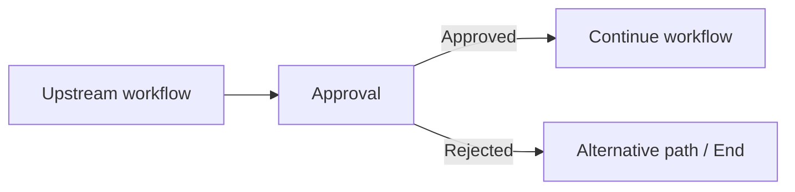
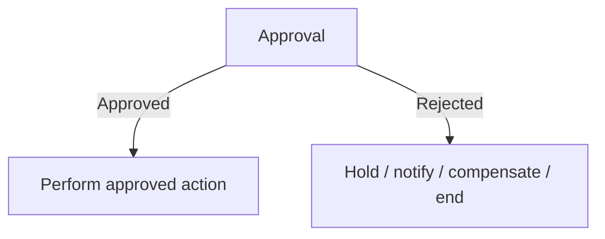
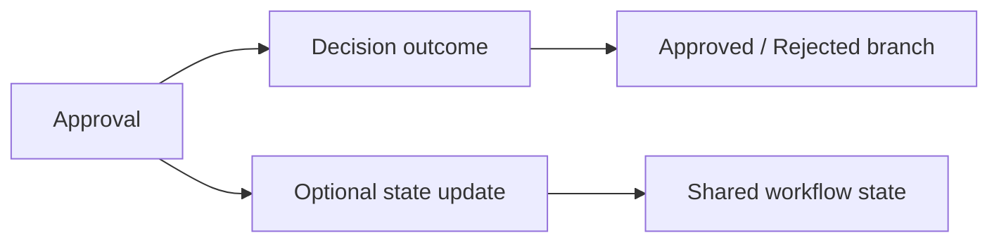
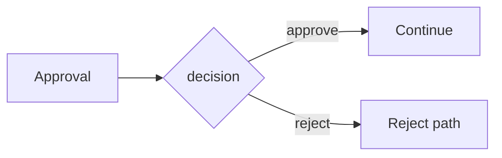
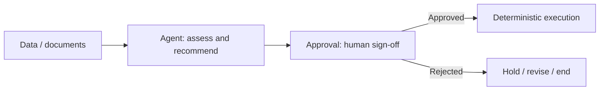
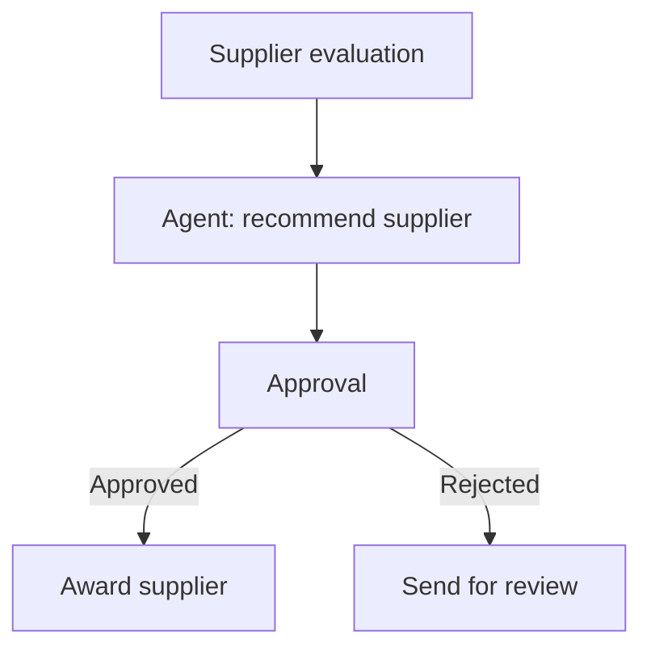
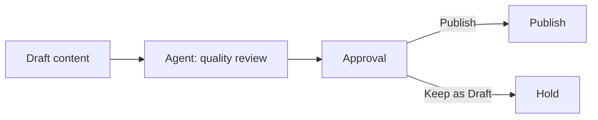

# Approval Node

> **Evidence status:** DOCUMENTED + OBSERVED
> **Evidence date:** 2026-08-23
> **Primary evidence:** User-supplied QI Studio Approval screenshot plus supplied product guidance text.
> **Scope:** Approval message, approve/reject actions, button labels, routing, advanced state updates, output variables, human checkpoints, design guidance, and verification questions.

The **Approval node** is QI Studio's human-approval checkpoint. It pauses the orchestration and waits for a person to choose between an approval action and a rejection action before the workflow continues.

> **Core principle:** Use Approval when a human must explicitly authorize a sensitive, consequential, or irreversible action. Treat the decision as a first-class workflow branch rather than as an unstructured conversation response.

## 1. What the Approval node does

Conceptually:



The node introduces a deliberate human checkpoint. The orchestration pauses at the node, presents the configured message and two actions, and then follows the route associated with the selected action.

Typical use cases include:

- approving a payment or financial action
- approving an external customer communication
- approving publication or release
- authorizing a destructive or irreversible data operation
- approving a high-risk procurement or supplier decision
- confirming a proposed action generated by an Agent

## 2. Approval Message

The node exposes an **Approval Message** field.

This is the message shown to the person making the decision.

Example:

```text
Approval required to proceed.
```

### Design standard

The message should tell the approver what they are approving and provide enough context to make an informed decision.

Weak:

```text
Approval required.
```

Better:

```text
Approve sending the supplier award notification for RFQ-1042?
The recommended supplier is Acme Components at the evaluated commercial terms.
```

The Approval node should not force the approver to reconstruct context from previous workflow steps.

## 3. Approve and Reject buttons

The node exposes two configurable labels:

- **Approve Button**
- **Reject Button**

The default labels shown by the supplied guidance are:

```text
Approve
Reject
```

The labels can be customized to fit the business action.

Examples:

```text
Send it / Hold
Publish / Cancel
Authorize / Decline
Award / Reject
Proceed / Stop
```

### Button-label rule

Use labels that describe the actual decision rather than forcing users to translate generic words such as Approve and Reject.

For example:

```text
Publish / Keep as Draft
```

is clearer in a publishing workflow than:

```text
Approve / Reject
```

## 4. Routing

The Approval node exposes two outgoing paths.

### Approved

The **Approved** handle should connect to the branch that continues the authorized workflow.

### Rejected

The **Rejected** handle should connect to an alternative path or an end node.

Conceptually:



The product guidance explicitly describes the Approved path as the continuation path and the Rejected path as the alternative or end path.

### Important graph-design rule

Do not leave one of the decision outcomes without an intentional downstream design when that outcome can occur in production.

A rejection should normally have an explicit consequence such as:

- stop the workflow
- return to review
- notify the requestor
- request additional information
- create an exception case

## 5. Advanced settings

The supplied Approval UI shows an **Advanced** section.

The visible advanced areas include:

- **State Update**
- **Output Variables**

The guidance describes these as optional fine-tuning controls that can be left at their defaults when they are not needed.

## 6. State Update

The Approval node exposes a **State Update** area with **Manage state updates** and **+ Add State**.

This allows the approval step to mutate workflow state in addition to determining the selected route.

Use state updates when the approval decision itself needs to become persistent workflow state.

Example:

```text
approvalStatus = "Approved"
```

or:

```text
approvalStatus = "Rejected"
```

A useful architecture is:



### Design rule

Keep the routing decision and persistent state conceptually separate:

- the **route** determines where the workflow goes
- the **state update** records information for later consumers

Do not create redundant state variables merely to mirror every visible configuration field.

## 7. Output Variables

The supplied Approval screenshot shows an **Output Variables** section.

One visible output variable is:

```text
decision : string
```

with the description:

```text
The user's decision: 'approve' or 'reject'
```

This establishes that the node can expose the human decision as structured output data for downstream workflow logic.

Conceptually:

```text
Approval output
    decision = "approve"
```

or:

```text
Approval output
    decision = "reject"
```

### Downstream usage

The structured decision can be useful for:

- logging
- auditing
- state updates
- notifications
- analytics
- downstream deterministic rules

A robust pattern is:



The node already provides separate routing handles, so output variables should be used when the decision value itself must be consumed as data, not as a replacement for the branch handles.

## 8. Approval vs Talk to User

Approval and a normal user-interaction node serve different purposes.

| Requirement | Preferred primitive |
|---|---|
| Human must explicitly authorize or reject an action | Approval |
| Human provides free-form information | Talk to User |
| Human selects among several structured options not represented by approve/reject | Talk to User or another appropriate input primitive |
| Workflow must pause before an irreversible action | Approval |

Use Approval when the workflow requires a binary human checkpoint with explicit routing semantics.

## 9. Approval vs Agent

Do not ask an Agent to simulate approval when an actual human sign-off is required.

A stronger pattern is:



The Agent can recommend. The Approval node records the human authorization.

This separation is especially important for actions with financial, legal, customer-facing, security, or irreversible consequences.

## 10. Example: procurement award approval



Approval message:

```text
Approve the recommended supplier award for RFQ-1042?
Recommended supplier: Acme Components.
```

Approve Button:

```text
Award Supplier
```

Reject Button:

```text
Send Back
```

Output variable:

```text
decision : string
```

State update, where useful:

```text
awardApprovalStatus = "Approved"
```

## 11. Example: customer communication

```text
Approval Message:
Send the finalized delay notification to the customer?

Approve Button:
Send Email

Reject Button:
Hold
```

Routing:

```text
Approved -> Email delivery
Rejected -> Return to drafting / exception queue
```

This is more actionable than generic button labels.

## 12. Example: publication workflow



Suggested button labels:

```text
Publish
Keep as Draft
```

## 13. Human-checkpoint design standards

### Make the decision concrete

The approver should know:

- what action will occur
- what object or record is affected
- why the action is being requested
- what the alternatives are when that context matters

### Put irreversible actions behind Approval

Examples:

```text
Payment release
Supplier award
Customer send
Record deletion
Production deployment
Public publication
```

### Keep approval messages concise but sufficient

Do not dump an entire document or workflow history into the approval message. Surface the information necessary to make the decision and route the user to deeper evidence where the surrounding product supports it.

### Use business-action labels

Prefer:

```text
Award / Rework
```

over:

```text
Approve / Reject
```

when those labels better represent the actual decision.

## 14. Common mistakes

### Mistake 1: generic approval message

An approver sees only `Approval required to proceed.` without enough context.

### Mistake 2: misleading button labels

Buttons say `Approve / Reject` even though the user is actually deciding `Publish / Keep as Draft`.

### Mistake 3: missing rejection path

The Rejected handle is not intentionally connected, leaving the business outcome underspecified.

### Mistake 4: using Approval for free-form input

If the human needs to provide a comment, explanation, or additional fields rather than a binary sign-off, another interaction primitive may be more appropriate before or after Approval.

### Mistake 5: duplicating route logic with unnecessary Rules

When the Approval node already provides Approved and Rejected handles, do not add a Rule just to rediscover the same binary choice unless there is a real downstream data-routing requirement.

### Mistake 6: treating the human decision as informal chat

A consequential approval should be represented through a structured Approval node so that the outcome is explicit and auditable.

## 15. Evidence vs assumptions

### Observed / documented with confidence

- Approval exists as a human-checkpoint node.
- The node exposes an Approval Message field.
- The node exposes configurable Approve Button and Reject Button labels.
- The default labels are `Approve` and `Reject`.
- The node exposes separate Approved and Rejected outgoing handles.
- The supplied guidance states that Approved continues the workflow and Rejected goes to an alternative path or end node.
- The node exposes an Advanced section.
- State Update is available under Advanced.
- Output Variables are available under Advanced.
- The supplied screenshot shows a `decision` string output variable.
- The supplied `decision` description states that the user's decision is `approve` or `reject`.
- The node is intended for actions where a person must explicitly sign off before proceeding.

### Still requiring runtime validation

- Exact runtime value casing and serialization of the `decision` output.
- Whether button label changes affect only presentation or also output values.
- Exact state-update timing relative to route selection.
- Whether state updates execute identically on Approved and Rejected outcomes.
- Approval timeout behavior.
- Resume behavior after long pauses.
- Behavior when a downstream handle is not connected.
- Whether approval events expose additional metadata such as user identity, timestamp, comments, or action history.
- Retry/replay semantics around a pending approval.

## 16. Verification test matrix

| Test | Purpose | Status |
|---|---|---|
| Approve path | Confirm Approved routing | To test |
| Reject path | Confirm Rejected routing | To test |
| Decision output on Approve | Confirm exact output value | To test |
| Decision output on Reject | Confirm exact output value | To test |
| Custom button labels | Determine whether outputs remain stable | To test |
| State update on Approve | Verify state mutation timing | To test |
| State update on Reject | Verify state mutation timing | To test |
| Missing downstream handle | Determine runtime behavior | To test |
| Long-running approval | Determine timeout/resume semantics | To test |
| Repeated approval execution | Determine replay/idempotency behavior | To test |

## 17. AI-agent interpretation rules

1. Treat Approval as a **human authorization checkpoint**, not a reasoning node.
2. Preserve two explicit outcomes: Approved and Rejected.
3. Use the approval message to explain the action requiring sign-off.
4. Prefer business-action button labels when they improve clarity.
5. Use the Approved handle for authorized continuation.
6. Use the Rejected handle for an intentional alternative or end path.
7. Use Output Variables when the human decision must be consumed as data.
8. Use State Update when the approval outcome must become persistent workflow state.
9. Do not invent unverified approval metadata or timeout behavior.
10. Record runtime discoveries in the evidence log before treating them as canonical behavior.
