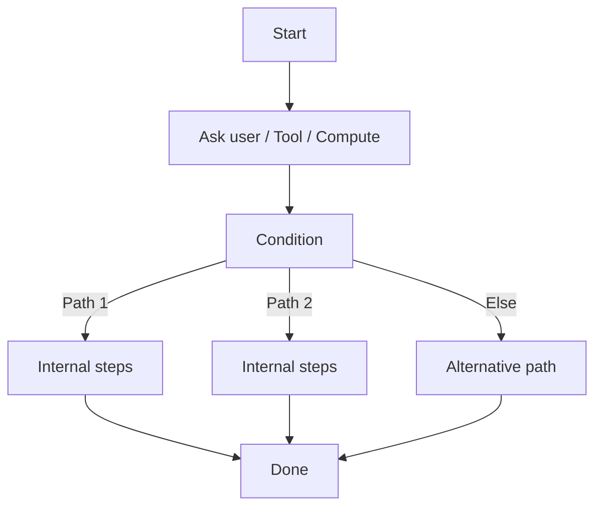
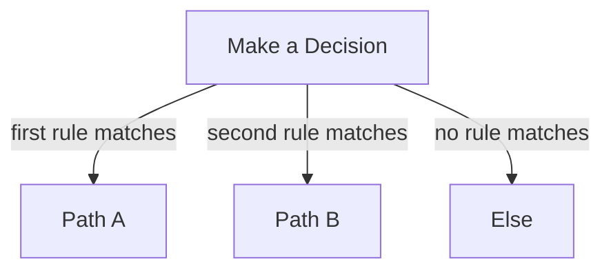
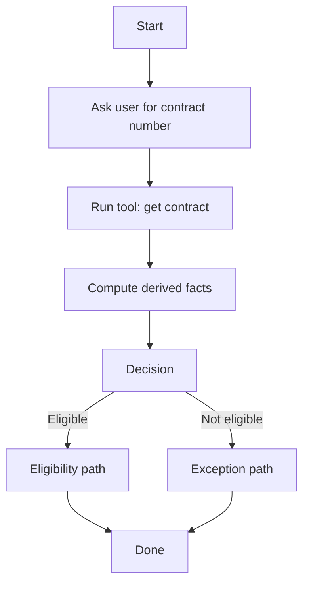
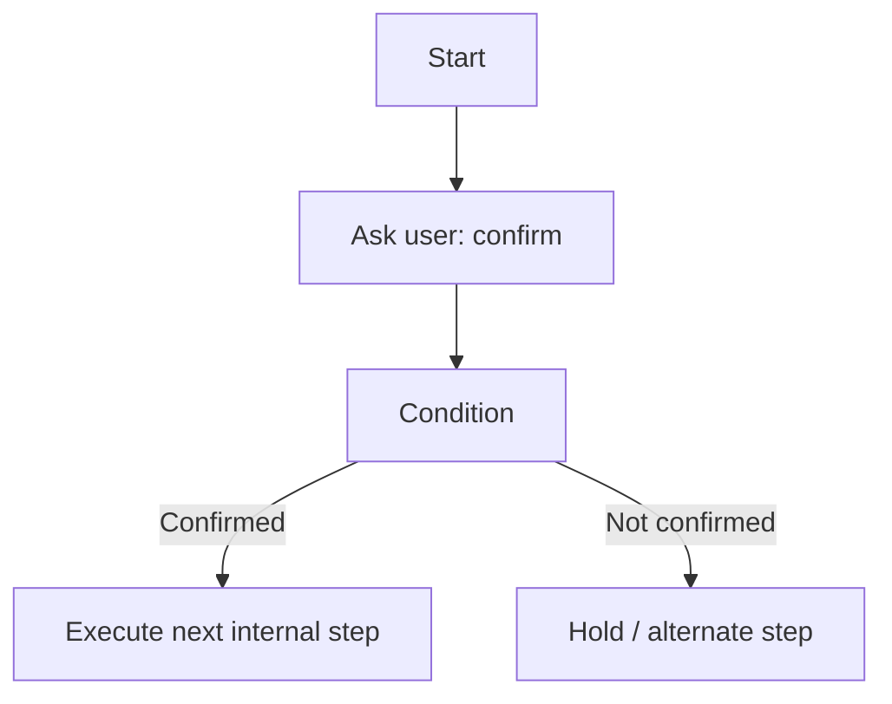
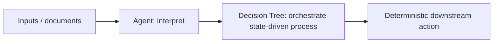

# Decision Tree Node (Experimental)

> **Evidence status:** DOCUMENTED + OBSERVED
> **Evidence date:** 2026-08-23
> **Primary evidence:** User-supplied QI Studio Decision Tree screenshots plus supplied product guidance text.
> **Scope:** Mini flow-builder behavior, Start, Ask User, Tool Call, Compute, Condition, Done, state and memory keys, branching, conditions, path routing, reflection, validation, and design patterns.

The **Decision Tree node** is an experimental mini flow-builder inside a single orchestration node. Instead of implementing one fixed action, it contains a small state-driven decision graph that can ask the user, call a tool, compute values, branch on conditions, or finish.

> **Core principle:** Use Decision Tree when a compact, state-driven interaction needs multiple internal steps and paths but should remain encapsulated inside one orchestration node.

## 1. What the Decision Tree node does

Conceptually:



The supplied product guidance describes Decision Tree as a **mini flow-builder inside a single node**. The runtime walks through the internal graph based on the state collected so far.

The visible screenshots show a Decision Tree canvas with an entry point and internal steps represented as compact cards. The Add-first-step menu exposes:

- Talk to user
- Run a tool
- Compute
- Make a decision
- Finish

## 2. Canvas and graph model

The supplied guidance identifies these core canvas concepts:

### Start

**Start** is the entry point for the internal tree.

Every internal step must ultimately connect back to Start to participate in the executable graph.

### Add Node / Add first step

The tree supports adding internal steps from the builder.

### Fit / Auto-layout

The guidance references Fit / Auto-layout controls for framing and tidying the internal graph.

### Memory Keys

The tree exposes the state or memory keys that it reads and writes.

### Issues

The builder provides validation feedback for graph issues. The guidance gives examples such as:

```text
not connected to Start
no produces key — it may loop
```

These validation signals should be resolved before shipping.

## 3. Internal step types

### 3.1 Ask user

**Purpose:** Talk to the user, present a message or interactive input, and capture the response into state.

The supplied screenshots show an Ask User configuration with the following concepts.

#### How the user answers

The UI exposes modes including:

- Types a reply
- Picks in a widget
- Handled to a person

#### Types a reply

The configuration exposes:

- Message to user
- Notes for the AI
- Information this step captures

The message is the prompt shown to the user.

The Notes for the AI field provides plain-language instructions about how the model should interpret the reply.

The Information this step captures field identifies what should be remembered from the step for later use.

Example:

```text
Message to user:
Which contract would you like to terminate?

Information captured:
contract number
```

#### Picks in a widget

The screenshot exposes:

- Runs only when condition
- How the user answers
- Widget to show
- Notes for the AI
- Information this step captures

The Widget to show field identifies the interactive picker that replaces a plain text response box.

The Notes for the AI field can explain how to interpret the selected value.

Example:

```text
Widget:
leave_type_picker

Notes:
Treat "1" or "yes" as a confirmation.
```

#### Handled to a person

The screenshot shows a human-handled interaction mode with:

- Where the answer goes
- Parameters to pass
- Add a message
- Add notes for the AI
- Information this step captures

The **Where the answer goes** field identifies the person or step that handles the reply.

The parameters section supports values supplied as typed text or saved-value references.

Conceptually:

```text
human_input_node
```

with parameters such as:

```text
setting_name = {{value}}
```

Use this mode when the internal tree intentionally hands a user interaction to another human-handled workflow step.

### 3.2 Run a tool

**Purpose:** Call a backend tool and write its result into tree state.

The screenshot shows a Tool Call step with:

- Runs only when condition
- Tool 1
- Which tool to run
- Information sent to the tool
- Save the tool's results as
- Add tool
- Notes for the AI
- Information this step captures

#### Which tool to run

The builder expects a tool identifier, with the screenshot giving an example pattern such as:

```text
get_contract_by_number
```

#### Information sent to the tool

Inputs are mapped as name/value pairs. The UI supports typed text and saved-value references.

Example:

```text
input name: contract_number
value: {{contractNumber}}
```

#### Save tool results as

The tool result can be stored in state under a chosen name, allowing later internal steps to consume it.

Example:

```text
remember as: contract
value: {{part of the result}}
```

The node supports adding additional tool calls within the same internal step configuration.

### 3.3 Compute

**Purpose:** Derive or transform state without directly asking the user.

The screenshot shows a Compute step with:

- Runs only when condition
- Values this step adds to memory
- Values this step clears from memory
- Information this step captures
- Notes for the AI

#### Values this step adds to memory

The step can write values into shared state for later internal steps.

Example:

```text
riskBand = "high"
```

#### Values this step clears from memory

The step can intentionally invalidate previously stored keys.

Example:

```text
contract
```

Clearing a key is useful when a new branch makes earlier data stale or unsafe to reuse.

### 3.4 Condition / Make a decision

**Purpose:** Split the internal tree into different paths based on state.

The screenshot shows a Make a Decision step with named paths and per-path rules.

Each path has:

- Path name
- Path condition / rule
- State field
- Comparison operator
- Comparison value

The builder also exposes:

- Add another path
- when Path 1
- when Path 2
- when else
- Add first step of this path

The guidance states that paths are checked top-to-bottom and the **first matching path wins**.

### 3.5 Done / Finish

**Purpose:** End the internal Decision Tree flow with success / end semantics.

The screenshot shows a Done step with:

- Runs only when condition
- Message shown at the end

Example:

```text
All done, your request has been submitted.
```

The final message may use saved values through templating where supported.

## 4. Conditions

Internal steps can expose **Runs only when** conditions.

The supplied screenshots show a condition editor with:

- state field
- comparison operator
- value or `{{path}}`
- add/remove controls

The visible operator list includes:

- Equals
- Not Equals
- Greater Than or Equal To
- Less Than or Equal To
- Greater Than
- Less Than
- Contains
- Is Empty
- Is Not Empty

This makes internal steps conditionally executable based on currently known state.

### Condition evaluation example

```text
state field: approvalStatus
operator: Equals
value: Approved
```

The internal step should execute only when the configured condition is satisfied.

## 5. Decision paths and precedence

A Make a Decision step can contain multiple named paths.

Conceptually:



The supplied guidance explicitly states:

> Paths are checked top-to-bottom. The first match wins.

Therefore, path ordering is part of the logic.

### Design implication

Place more specific conditions before broader conditions.

Prefer:

```text
>= 85 -> High
>= 70 -> Medium
else -> Low
```

over overlapping conditions arranged in an arbitrary order.

## 6. State and memory keys

Decision Tree is state-driven.

The internal graph reads known state and writes new state as it progresses.

The guidance distinguishes several state concepts.

### Produces keys

A step's **produces key** marks the state key or keys that the step fills when it completes.

This acts as a progress marker and helps prevent the internal graph from repeatedly executing the same step.

### State / Memory keys

These are shared values carried through the tree.

Internal steps can:

- read from state
- write to state
- clear state
- use state in message templates and conditions

### Captured information

Ask User, Tool, and Compute steps expose fields describing what information the step captures for later steps.

### Invalidating state

Clearing a key intentionally removes information so later steps cannot accidentally reuse stale values.

## 7. Message templating

The guidance describes a message template model using `{{path}}` to render stored state values.

Example:

```text
Hello {{user.name}}
```

or:

```text
Approve contract {{contract.number}}?
```

Treat template paths as references to available state rather than arbitrary JavaScript expressions.

## 8. Notes for the AI

Many internal steps expose **Notes for the AI**.

These notes provide natural-language handling guidance for model interpretation.

Example:

```text
Treat "1" or "yes" as a confirmation.
```

Use notes to clarify semantic interpretation, not to hide deterministic business rules that should be represented explicitly as Conditions.

A useful separation is:

```text
Notes for AI = interpretation guidance
Condition     = deterministic routing
```

## 9. Extra conditions

The supplied guidance describes **Extra conditions** as optional gates on top of the graph-implied ordering.

Most ordinary steps should leave these empty unless an additional execution gate is genuinely needed.

Use extra conditions sparingly so that the internal graph remains understandable.

## 10. Require reflection before this step fires

The Decision Tree guidance identifies a **Require reflection before this step fires** control.

This introduces an additional safety pause before a step executes.

The guidance recommends using this sparingly, especially for irreversible actions.

Appropriate candidates include:

```text
Delete record
Send money
Award supplier
Publish externally
Send sensitive customer communication
```

Do not add reflection gates everywhere. Excessive use can make the tree slow, opaque, and difficult to reason about.

## 11. Tool-driven Decision Tree pattern

A common pattern is:



This structure keeps data retrieval and deterministic transformation inside the tree while preserving explicit branching.

## 12. Approval-like Decision Tree pattern

A Decision Tree can also coordinate a human-response sequence before a final action, but it should not replace a dedicated Approval node when explicit approval semantics are required at the orchestration level.

Example:



Use the dedicated Approval node where the product-level behavior needs an explicit Approved/Rejected human checkpoint.

## 13. Decision Tree vs Rule

Use **Rule** when the orchestration needs a single straightforward deterministic branch.

Use **Decision Tree** when the decision itself contains several internal steps, user interactions, tool calls, computations, and multiple paths.

| Requirement | Preferred primitive |
|---|---|
| One simple deterministic condition | Rule |
| Several internal steps with state | Decision Tree |
| Tool call followed by branching | Decision Tree |
| User interaction followed by branching | Decision Tree |
| Complex internal mini-flow that should remain encapsulated | Decision Tree |

Do not turn a one-condition Rule into a Decision Tree just because the latter can express it.

## 14. Decision Tree vs Agent

Use Agent when semantic judgement or flexible interpretation is the difficult part.

Use Decision Tree when the overall control flow can be explicitly modeled as steps, state, and conditions.

A strong hybrid pattern is:



Agent can be used inside the broader workflow as a reasoning component while Decision Tree provides explicit execution structure.

## 15. Validation and issue handling

The guidance recommends resolving internal graph Issues before shipping.

Examples of problems to look for include:

- a step that is not connected to Start
- a step that does not produce a useful key and may loop
- paths without a meaningful first step
- conditions that can never match
- state dependencies that are never populated
- branches that can never terminate in Done

A healthy Decision Tree should have a clear progression:

```text
Start
  ↓
State acquisition / interaction
  ↓
Transformation / tool calls
  ↓
Decision
  ↓
Path-specific work
  ↓
Done
```

## 16. Common mistakes

### Mistake 1: using Decision Tree for a trivial rule

Use Rule instead.

### Mistake 2: relying on hidden state

If a condition depends on a value, make the producer of that value explicit.

### Mistake 3: overlapping conditions in the wrong order

Remember that the first matching path wins.

### Mistake 4: failing to clear stale state

Use invalidation when an old value could contaminate a later branch.

### Mistake 5: endlessly adding internal steps

Decision Tree is a mini flow-builder, not a replacement for an entire orchestration graph. Split large workflows when the internal tree becomes difficult to inspect or validate.

### Mistake 6: putting deterministic rules into AI notes

Use explicit Conditions for business logic. Use AI notes for semantic interpretation.

### Mistake 7: overusing reflection

Reserve reflection pauses for sensitive or irreversible actions.

## 17. Evidence vs assumptions

### Observed / documented with confidence

- Decision Tree is an experimental node.
- It acts as a mini flow-builder inside a single node.
- Start is the internal entry point.
- Internal step types include Ask User, Tool Call, Compute, Condition/Decision, and Done.
- Ask User supports typed reply, widget interaction, and human-handled response modes in the observed UI.
- Ask User exposes message, AI notes, and captured information concepts.
- Widget mode exposes a widget identifier.
- Human-handled mode exposes a destination and parameters.
- Tool Call exposes tool selection, tool inputs, result saving, notes, and captured information.
- Compute exposes memory additions, memory clearing, notes, and captured information.
- Condition supports named paths and comparison rules.
- The visible comparison operators include Equals, Not Equals, Greater Than or Equal To, Less Than or Equal To, Greater Than, Less Than, Contains, Is Empty, and Is Not Empty.
- Decision paths are evaluated top-to-bottom and the first match wins.
- Done can display a final message.
- `{{path}}` is used for saved-value templating.
- The builder exposes internal validation / Issues concepts.
- Produces keys, state/memory, extra conditions, and reflection are documented concepts for tree control.

### Still requiring runtime validation

- Exact state schema representation and serialization inside Decision Tree.
- Exact produces-key semantics and loop-prevention algorithm.
- Whether a step can produce multiple keys and how completion is determined.
- Tool-call timeout and retry behavior inside a tree.
- Async behavior of internal tool calls and Compute operations.
- Exact semantics of captured information vs explicit state writes.
- State clearing timing relative to path evaluation.
- Exact behavior when multiple conditions use missing values.
- Whether Conditions support implicit type coercion.
- Reflection behavior and its runtime payload.
- Persistence and resume behavior for trees interrupted mid-flow.
- Maximum internal step/path count.
- Exact auto-layout behavior and graph constraints.
- Error handling and recovery semantics inside an internal path.

## 18. Verification test matrix

| ID | Test | Purpose | Status |
|---|---|---|---|
| DT-001 | Simple Ask User -> Done | Validate basic interaction lifecycle | To test |
| DT-002 | Ask User -> Condition | Validate state capture and branch evaluation | To test |
| DT-003 | Widget selection | Validate widget value capture | To test |
| DT-004 | Human-handled response | Validate routing to another handler | To test |
| DT-005 | Tool call -> saved result | Validate result storage path | To test |
| DT-006 | Compute add/clear state | Validate memory mutation semantics | To test |
| DT-007 | Three decision paths | Validate first-match precedence | To test |
| DT-008 | Is Empty / Is Not Empty | Validate empty-state conditions | To test |
| DT-009 | Missing state field | Validate condition behavior | To test |
| DT-010 | Loop-prone graph | Validate produces-key validation | To test |
| DT-011 | Reflection gate | Validate pause/continue semantics | To test |
| DT-012 | Interrupted tree | Validate resume behavior | To test |
| DT-013 | Large tree | Determine practical step/path limits | To test |
| DT-014 | Tool failure | Determine internal failure and recovery behavior | To test |

## 19. AI-agent interpretation rules

1. Treat Decision Tree as a compact internal state machine.
2. Start is the internal entry point.
3. Prefer explicit state production over hidden dependencies.
4. Use Ask User for interaction, Tool Call for backend execution, Compute for deterministic transformation, Condition for routing, and Done for termination.
5. Treat path ordering as significant because the first matching path wins.
6. Use `{{path}}` for saved-value references where supported.
7. Use Notes for AI for semantic interpretation guidance, not as a substitute for deterministic Conditions.
8. Clear stale state deliberately when branches make earlier values invalid.
9. Resolve Issues before shipping.
10. Use reflection gates only for steps where an additional safety pause is justified.
11. Keep large workflow logic outside the Decision Tree when the internal graph becomes difficult to maintain.
12. Treat runtime limits and advanced semantics as unverified until experimentally confirmed.
