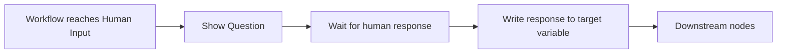

# HUMAN INPUT Node

> **Evidence status:** Runtime Confirmed for the tested free-text path.
> **Evidence date:** 2026-08-23
> **Primary evidence:** User-supplied QI Studio Human Input screenshots plus two controlled end-to-end runtime tests.

The **Human Input** node pauses an orchestration, asks a person a question, captures the response, and stores it in a configured variable target so downstream steps can use it.

Use Human Input for free-form information collection. Use **Approval** for a binary human authorization checkpoint with Approved and Rejected routing.

## 1. Configuration

### Question

The **Question** field controls the prompt shown to the person.

Example:

```text
Please provide your input.
```

The question should state exactly what information the workflow needs.

### Save Response As

The node lets the designer choose where the response is stored.

A system-scoped example shown in the UI is:

```text
system / humanInput
```

A controlled runtime test also confirmed a user-created Flow Variable target:

```text
flow.startTestResponse
```

## 2. Runtime-confirmed behavior

### Flow Variable path

```text
Human Input → flow.startTestResponse → Output {{flow.startTestResponse}}
```

The test produced:

```text
flow.startTestResponse = "START_TEST"
nodes.human_input_0.input = "START_TEST"
nodes.output_0.output.messages = "START_TEST"
```

**PASS: Runtime Confirmed.**

### System Variable path

```text
Human Input → system.humanInput → Output {{system.humanInput}}
```

The test produced:

```text
system.humanInput = "START_TEST"
nodes.human_input_0.input = "START_TEST"
nodes.output_0.output.messages = "START_TEST"
User Window = "START_TEST"
```

**PASS: Runtime Confirmed.**

These tests establish that the captured response is available to downstream Output through an explicit variable reference.

See [Start → Human Input → Output E2E Evidence](../03-Evidence/Start-HumanInput-Output-E2E.md).

## 3. Advanced configuration

### State Update

The Advanced section exposes **State Update** with state-mutation controls.

The supplied screenshot shows no state update configured in the captured example. Ordering between an optional state update and response persistence has not been runtime-tested.

### Output Variables

The UI exposes:

| Output | Type shown | Meaning shown |
|---|---|---|
| `input` | object | The user's input response |
| `variableTarget` | string | The flow variable path where input was stored |

The exact runtime serialization of the `input` output variable remains open. The runtime tests instead validate the node's direct `input` field and the configured target variable.

## 4. Conceptual execution



## 5. Human Input vs Approval

| Requirement | Human Input | Approval |
|---|---|---|
| Free-form response | Yes | No, primary purpose is binary authorization |
| Explicit approve/reject choice | Not the intended primitive | Yes |
| Separate Approved / Rejected routes | Not established by Human Input | Yes |
| Stores a human response/decision | Yes | Yes |

## 6. Important Output rule

The Human Input node can complete successfully without producing a user-visible final response. The workflow must provide the Output node with an explicit usable response source.

A historical regression produced:

```text
No response content found in the execution result. Please try again.
```

The controlled follow-up tests established that the missing explicit Output response source was the relevant failure condition.

## 7. Still unverified

- Complete Output expression-language coverage.
- Exact persisted shape of `input` for every response mode.
- Automatic creation and overwrite behavior for untested target variables/scopes.
- State Update ordering relative to response persistence.
- Timeout, abandonment and resume behavior.
- Behavior across widget or other Human Input response modes not included in the controlled tests.

Do not promote these items to runtime facts until tested.
