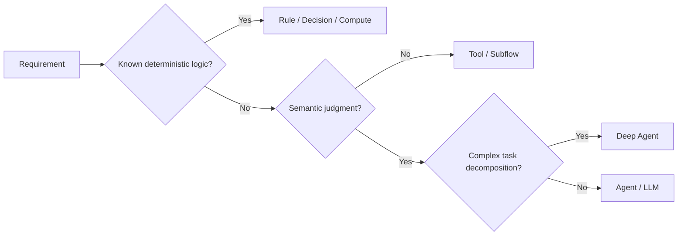

# Orchestration Primitives

This section is the canonical encyclopedia for QI Studio workflow nodes. Each primitive should have a dedicated page as evidence accumulates.

## Current taxonomy

| Primitive | Responsibility | Default stance |
|---|---|---|
| Agent | Bounded semantic reasoning | Use for interpretation and judgment |
| Deep Agent | Complex reasoning/decomposition | Use when bounded decomposition is valuable |
| LLM | Language generation/reasoning step | Use when an autonomous agent is unnecessary |
| External Agent | Invoke external agent capability | Use at explicit system boundaries |
| Decision | Deterministic branching | Prefer for known business logic |
| Rule | Deterministic condition | Prefer for simple rules |
| Compute | Arithmetic/transformation | Prefer over LLM calculations |
| Variable Update | Mutate workflow state | Use for explicit state changes |
| Subflow | Reusable workflow | Use for modular business processes |
| Handoff | Transfer responsibility | Use for explicit ownership boundaries |
| Guardrail | Enforce constraints | Use around high-risk actions |
| Approval | Human authorization | Use when authority must be explicit |
| Human Input | Gather human information | Use when the workflow requires user-provided data |
| Output | Deliver a result | Keep reporting/output separate from business logic |

## Primitive selection matrix

The detailed node pages should always be linked from this page and should backlink here.