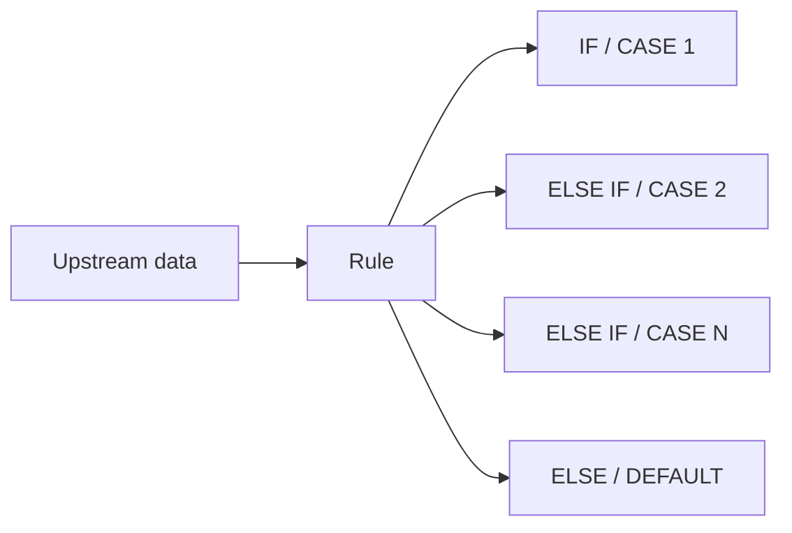
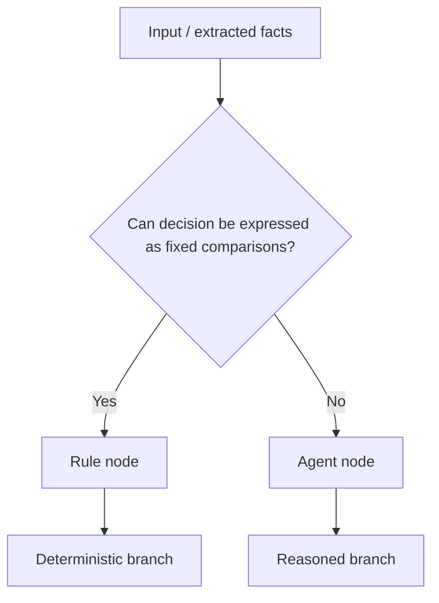
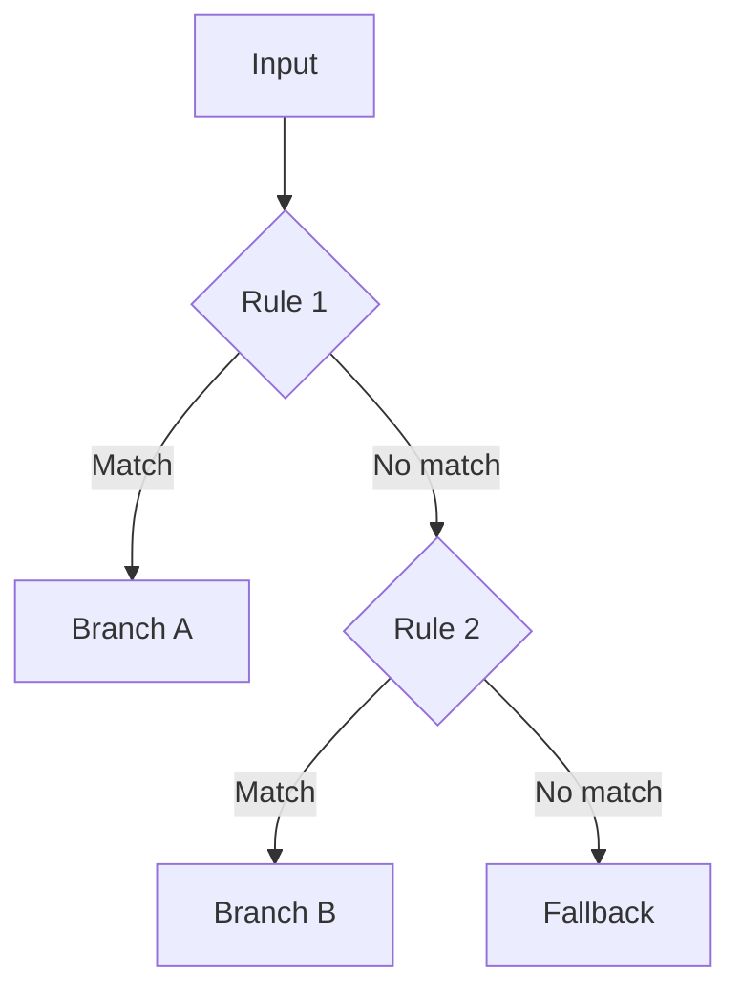
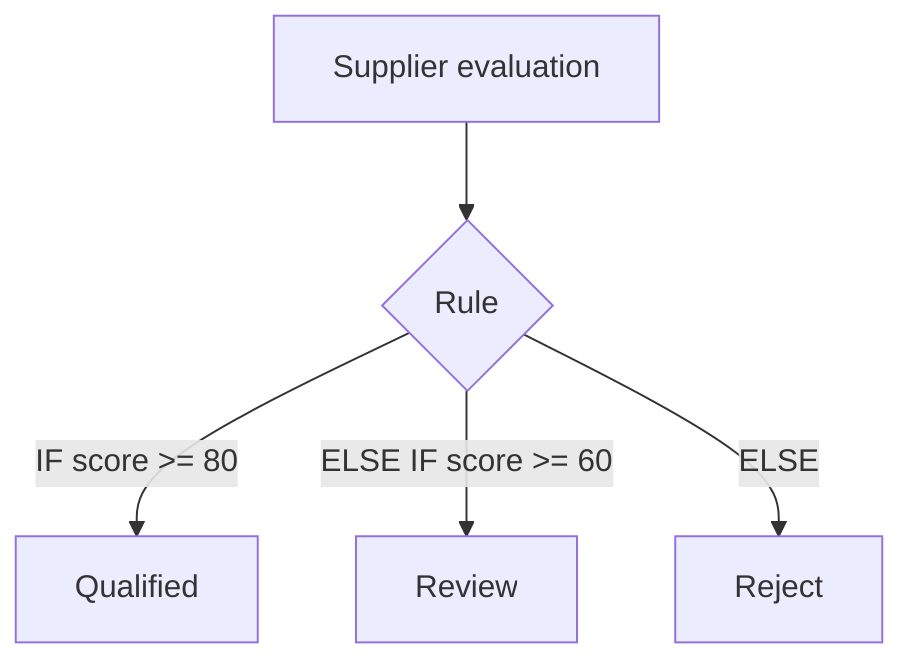
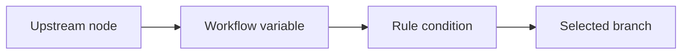
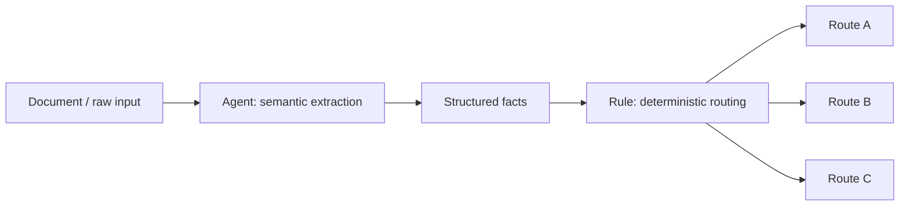

# Rule Node

> **Evidence status:** DOCUMENTED + OBSERVED
> **Evidence date:** 2026-08-23
> **Primary evidence:** User-supplied QI Studio Rule screenshots plus supplied product guidance text.
> **Scope:** Rule blocks, IF / ELSE IF / ELSE execution, operators, condition grouping, enable/disable behavior, field references, output handles, and design guidance.

The Rule node is QI Studio's deterministic branching primitive. It evaluates explicit conditions and routes the orchestration through the first matching branch.

> **Core principle:** Use a Rule node when the decision can be expressed as a known, explicit comparison. Use an Agent when the decision requires semantic reasoning, judgement, interpretation, or non-deterministic analysis.

## 1. What the Rule node does

A Rule node acts as a deterministic fork in the orchestration:



The supplied guidance states that rule blocks are evaluated **top to bottom**. The **first block whose condition is true wins** and the remaining blocks are skipped.

That makes Rule execution fundamentally different from a parallel fan-out. It is an ordered decision chain.

## 2. When to use Rule vs Agent

| Situation | Use |
|---|---|
| Route by a known status value | Rule |
| Route by category | Rule |
| Check whether an amount crosses a threshold | Rule |
| Check whether a field is empty | Rule |
| Route using several explicit fields | Rule |
| Decide based on judgement or interpretation | Agent |
| Classify ambiguous natural language | Agent |
| Weigh competing qualitative factors | Agent |
| Infer intent not expressible as fixed conditions | Agent |

A useful architecture is:



Do not use an Agent for a decision that should be exact, auditable, and repeatable.

## 3. Rule blocks

A Rule node is built from ordered blocks.

### IF block

- Always required.
- The first block is labelled **IF**.
- The UI identifies it as **CASE 1**.

### ELSE IF blocks

- Optional.
- Added using **+ ELSE IF**.
- Used to introduce additional mutually ordered decision cases.
- Each block creates its own output handle.

### ELSE / DEFAULT block

- Optional.
- Runs when no earlier enabled block matches.
- The UI labels it **ELSE** and identifies it as **DEFAULT**.
- It has its own output handle.

Conceptual order:

```text
IF CASE 1
  ↓ false
ELSE IF CASE 2
  ↓ false
ELSE IF CASE 3
  ↓ false
ELSE / DEFAULT
```

### First-match semantics

The critical behavior is:

```text
Evaluate CASE 1
  ├─ true  -> execute CASE 1 branch, stop checking
  └─ false -> evaluate CASE 2
                ├─ true  -> execute CASE 2 branch, stop checking
                └─ false -> continue...
```

Therefore **ordering matters**.

## 4. Conditions

Each condition is composed of three visible pieces:

1. **Select field**
2. **Operator**
3. **Enter value**

Example:

```text
Select field: supplier.status
Operator:     Equals
Enter value:  Qualified
```

The field normally refers to data produced by an earlier node or available workflow state.

The supplied Rule guidance explicitly notes that field references can use the variable expression form:

```text
{{flow.fieldName}}
```

This means a Rule should be thought of as evaluating workflow data, not just manually entered constants.

## 5. Observed operators

The supplied screenshots show the following operator list:

| Operator | Intended use |
|---|---|
| **Equals** | Exact equality check |
| **Not Equals** | True when values differ |
| **Greater Than or Equal To** | Numeric/date threshold, inclusive |
| **Less Than or Equal To** | Numeric/date threshold, inclusive |
| **Greater Than** | Numeric/date threshold, exclusive |
| **Less Than** | Numeric/date threshold, exclusive |
| **Contains** | Check whether a value contains another value |
| **Is Empty** | Check that a field has no value |
| **Is Not Empty** | Check that a field has a value |

### Important implementation note

The screenshots establish that these operators are available. They do **not** by themselves establish every type-coercion rule, null-handling rule, case-sensitivity rule, or date comparison rule.

Those details should be runtime-tested and recorded separately rather than guessed.

## 6. Multiple conditions in one block

A block can contain multiple conditions.

The screenshot shows **+ Add Condition** and an **AND / OR** selector.

### AND

All conditions in the block must be true.

```text
Condition A AND Condition B AND Condition C
```

### OR

At least one condition in the block must be true.

```text
Condition A OR Condition B OR Condition C
```

Example:

```text
IF
    supplierStatus = "Qualified"
    AND
    commercialScore >= 80
```

or:

```text
IF
    supplierStatus = "Qualified"
    OR
    supplierStatus = "Preferred"
```

## 7. Condition grouping and precedence

The screenshots confirm AND/OR within a block, but they do not establish whether nested groups such as:

```text
(A AND B) OR (C AND D)
```

are supported.

Until tested, do not assume arbitrary nested Boolean expressions exist.

For complex logic, use multiple ordered Rule blocks or construct the logic through separate deterministic nodes where appropriate.

A safe design is often to make the logic explicit:



## 8. Enable / disable behavior

Each Rule block has a visible toggle.

The supplied guidance states that switching a block **off** skips that block **without deleting it**.

This is useful during workflow development and testing:

```text
Enabled block   -> participates in evaluation
Disabled block  -> skipped
```

### Recommended testing practice

Temporarily disable experimental branches rather than deleting them when:

- comparing two decision strategies
- debugging a workflow
- isolating a failing branch
- preserving a known-good configuration while testing a new one

Document intentional disabled blocks before production deployment so that test configuration does not silently become business logic.

## 9. Output handles and graph behavior

The Rule node creates separate output handles for its blocks.

The supplied node screenshot shows handles corresponding to:

- IF / CASE 1
- ELSE IF / CASE 2
- ELSE / DEFAULT

The product guidance states:

- each rule block creates a new output handle on the node
- each handle represents the branch that executes when that block matches
- removing a rule block removes its handle and connected edges

This has an important workflow-design consequence:

> **Changing the number or order of Rule blocks can change graph connectivity.**

Treat Rule-block edits as structural changes, not just cosmetic configuration changes.

## 10. Example: supplier qualification routing



Equivalent logic:

```text
IF score >= 80
    -> Qualified

ELSE IF score >= 60
    -> Review

ELSE
    -> Reject
```

### Why ordering matters

If the `score >= 60` block is placed before `score >= 80`, then a score of `85` may match the broader first condition and never reach the more specific branch.

Therefore:

> Put **more specific / higher-priority cases before broader catch-all cases**.

## 11. Example: supplier status routing

```text
IF supplier.status = "Strategic"
    -> Strategic workflow

ELSE IF supplier.status = "Approved"
    -> Standard workflow

ELSE IF supplier.status = "Pending"
    -> Validation workflow

ELSE
    -> Exception workflow
```

This is an ideal Rule-node use case because the decision is explicit and auditable.

## 12. Example: compound condition

```text
IF
    supplier.category = "Critical"
    AND
    supplier.score >= 85
    AND
    supplier.validationStatus = "Passed"
```

This produces a single deterministic branch when all three facts are true.

## 13. Example: OR condition

```text
IF
    country = "India"
    OR
    country = "Singapore"
```

The branch executes when either condition is satisfied.

## 14. Empty-value checks

The `Is Empty` and `Is Not Empty` operators are important for workflow hygiene.

Example:

```text
IF supplier.taxId Is Empty
    -> Request missing tax information

ELSE
    -> Continue validation
```

This is generally preferable to forcing an Agent to reason about whether a field exists.

## 15. Rule node and state / variables

A Rule node should consume values from the workflow's available variable space.

A good mental model is:



When debugging a Rule:

1. Verify the field reference points to the expected scope.
2. Verify the actual runtime value.
3. Verify the operator matches the data type and intended semantics.
4. Verify condition grouping.
5. Verify block order.
6. Verify the block is enabled.
7. Verify the downstream edge is attached to the intended output handle.

Do not start by changing the Rule logic if the upstream value itself is wrong.

## 16. Rule-node design standards

### Prefer explicitness

A reviewer should be able to understand every branch without interpreting prose.

Bad:

```text
IF "this looks like a high-value supplier"
```

Better:

```text
IF annualSpend >= 10000000
```

### Keep branches mutually intentional

Do not create overlapping conditions accidentally.

Bad:

```text
IF score >= 60
ELSE IF score >= 80
```

Better:

```text
IF score >= 80
ELSE IF score >= 60
```

### Keep ELSE meaningful

Use ELSE for a deliberate fallback, not as a dumping ground for logic that should have been explicitly modelled.

### Avoid rule explosion

If a Rule node becomes a large matrix of highly interdependent conditions, consider whether the decision should be broken into simpler deterministic stages or delegated to an Agent for semantic classification followed by deterministic routing.

## 17. Rule vs multiple downstream edges

Do not confuse a Rule node with ordinary graph connectivity.

A Rule node is appropriate when the routing decision depends on **evaluated conditions**.

Simple graph edges are appropriate when the flow is unconditional.

```text
Unconditional:
A -> B

Conditional:
A -> Rule -> B/C/D
```

## 18. Rule vs Agent hybrid architecture

Many production workflows should use both.



This is often stronger than asking an Agent to both interpret the evidence and make every downstream routing decision.

The Agent handles ambiguity. The Rule handles certainty.

## 19. Common mistakes

### Mistake 1: using an Agent for fixed logic

If the rule is `status == Approved`, an Agent is unnecessary.

### Mistake 2: placing broad conditions first

A broad early condition can capture cases intended for a more specific later case.

### Mistake 3: forgetting disabled blocks

A disabled block is intentionally skipped even though it remains visible.

### Mistake 4: not testing empty values

Null/empty behavior can change routing, especially when fields are produced by extraction or tools.

### Mistake 5: assuming operator semantics

The UI establishes operator availability, not every type-conversion or case-sensitivity behavior.

### Mistake 6: deleting a block casually

Deleting a block removes its output handle and can remove connected edges. Disable during testing when preserving graph structure is desirable.

## 20. Evidence vs assumptions

### Observed with confidence

- Rule node exists as a branching primitive.
- IF block is first and required.
- ELSE IF blocks can be added.
- ELSE / DEFAULT is available as a fallback.
- Blocks are ordered.
- Conditions contain field, operator, and value components.
- AND / OR condition grouping is visible.
- Operators listed in this document are visible in the supplied screenshots.
- Individual blocks have enable/disable toggles.
- Rule blocks create separate output handles.
- Removing a rule block removes its handle and connected edges.
- `{{flow.fieldName}}` is documented in the visible product guidance as a field-reference pattern.

### Still requiring runtime validation

- Exact handling of `null` vs empty string.
- Case sensitivity of text comparisons.
- Numeric type coercion.
- Date/time comparison semantics.
- Array/object behavior for `Contains`.
- Behavior when the referenced field is missing.
- Nested AND/OR groups and Boolean precedence.
- Whether disabled blocks persist exactly as configured after publishing/versioning.
- Exact execution telemetry for skipped branches.

These items should be promoted from **Open Question** to **Verified** only after a reproducible test is run and its result is captured.

## 21. Verification test matrix

| Test | Purpose | Status |
|---|---|---|
| Exact string equality | Verify `Equals` | To test |
| Different string | Verify `Not Equals` | To test |
| Numeric threshold | Verify `Greater Than` | To test |
| Inclusive threshold | Verify `Greater Than or Equal To` | To test |
| Missing field | Determine null/missing behavior | To test |
| Empty string | Compare with `Is Empty` | To test |
| Contains text | Verify substring behavior | To test |
| AND block | Verify all conditions required | To test |
| OR block | Verify any condition sufficient | To test |
| Overlapping blocks | Verify first-match precedence | To test |
| Disabled block | Verify it is skipped | To test |
| Remove block | Verify handle/edge removal | Observed in product guidance |

## 22. AI-agent interpretation rules

A future AI agent reading this file should follow these rules:

1. Treat Rule as **deterministic branching**, not reasoning.
2. Evaluate blocks conceptually **top to bottom**.
3. Stop at the **first matching enabled block**.
4. Treat ELSE as the fallback only when no earlier block matches.
5. Inspect field scope and actual upstream values before rewriting rule logic.
6. Do not assume operator semantics that have not been runtime-tested.
7. Remember that deleting blocks can alter graph handles and edges.
8. Use Agent -> structured facts -> Rule when semantic interpretation must be separated from deterministic routing.
9. Record every runtime-discovered behavior in the evidence log before treating it as canonical.
10. Preserve the distinction between **Observed**, **Verified**, **Inferred**, and **Open Question** knowledge.
