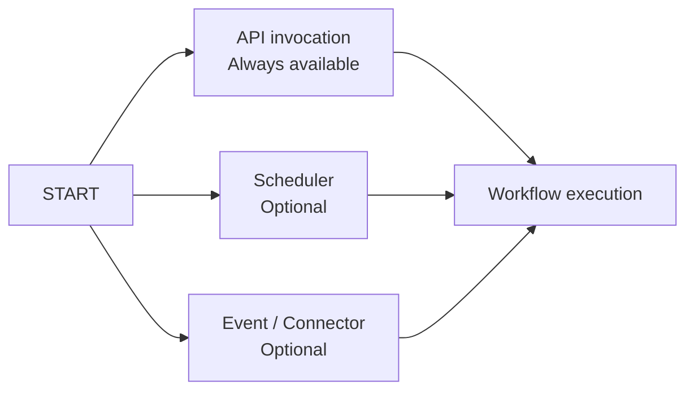
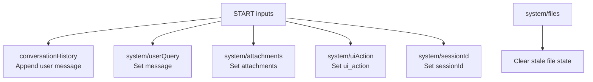
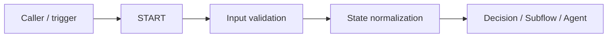

# START Node

> Canonical capability page. Related: [Orchestration Primitives](README.md), [START State Updates](../05-Data-State/START-State-Updates.md), [API Integration](../04-Tools/API-Integration.md), and [Evidence](../14-Evidence/README.md).

**Evidence status:** CONFIRMED for the UI and product-documentation behavior visible in the supplied screenshots. Runtime semantics that are not directly evidenced are called out as open questions.

## What START is

START is the mandatory entry point for every QI Studio orchestration. The supplied QI Studio documentation states that every orchestration begins with exactly one START node and that it cannot be deleted.

START is more than a visual entry point. It defines the orchestration's trigger boundary, input contract, and optional initial state mappings.

It answers three questions:

1. When should this orchestration run?
2. What information does it need to start?
3. How should those inputs be remembered in shared state?

## Trigger model



### API invocation

API invocation is always available. The API Reference shows a runtime workflow-engine endpoint that accepts an input interface and runtime options.

**Use when:** another application, user-facing application, agent, or integration needs to start the orchestration on demand.

### Scheduler

Scheduler is an optional time-based trigger.

**Use when:** a workflow must run on a recurring schedule, such as a periodic report or scheduled check.

### Event

Event is an optional external-event trigger tied to a connected application.

**Use when:** a workflow should react to a connected-system event, such as a new item or application activity.

**Important:** the supplied product-documentation screenshot states that automatic triggers are experimental. The UI also indicates Event requires a connected app/event and Scheduler requires a configured schedule.

## Inputs

The START UI shows these standard inputs:

| Input | Type | Required | Meaning |
|---|---|---:|---|
| `message` | string | Yes | User message or query. |
| `attachments` | array | No | Files attached to the invocation. |
| `ui_action` | object | No | Payload from UI widget actions. |

Custom inputs can be added.

The input editor supports:

- variable name;
- type;
- description;
- required field;
- minimum length;
- maximum length;
- regex pattern;
- allowed values / enum;
- default value.

This makes START an **input-schema boundary** for the orchestration.

## String input example

The supplied `message` editor shows:

```text
name: message
type: string
required: true
description: The user's message or query
```

The same editor exposes validation fields for minimum length, maximum length, regex, allowed values and default value.

## Object input example

The supplied `ui_action` editor shows an object type with:

- Visual Editor
- JSON Schema view
- Add Field
- Additional Properties toggle
- Description
- Required flag
- Default JSON value

Use an object when an input has a stable structured contract rather than serializing an entire object into a string.

## Advanced state updates

START can write initial state before downstream nodes execute. The supplied screenshot shows six state-update configurations:

1. Append a user message into `conversationHistory`.
2. Clear `system/files`.
3. Set `system/userQuery` from `message`.
4. Set `system/attachments` from `attachments`.
5. Set `system/uiAction` from `ui_action`.
6. Set `system/sessionId` from `options.sessionId`.



### Observed state operations

- **Set**: write/replace the current value.
- **Append**: add to an existing collection/history.
- **Clear**: remove stale state.
- **Run only when**: conditionally execute a state update.

See [START State Updates](../05-Data-State/START-State-Updates.md) for the detailed state model.

## Session continuity

The API Reference identifies `options.sessionId` as the session identifier used for conversation continuity and states that it is auto-generated if not provided.

The START configuration screenshot maps `options.sessionId` into `system/sessionId`.

### Architectural rule

Let the runtime/workflow own session identity. Do not make an Agent invent session identifiers when the platform already provides one.

## API contract

The API Reference shows the conceptual request:

```json
{
  "interface": {
    "inputs": {
      "message": "Hello, how can you help me?"
    }
  },
  "options": {
    "sessionId": "session-001",
    "includeIntermediateParts": true
  }
}
```

The exact runtime hostname and workflow identifier are environment-specific and should never be committed together with credentials.

See [API Integration](../04-Tools/API-Integration.md).

## Recommended enterprise pattern

Treat START like an API boundary:



Keep critical state mappings visible and inspectable.

## When to use START state updates

Use START state updates for:

- normalizing invocation inputs;
- establishing current query state;
- initializing attachment state;
- initializing UI action state;
- maintaining conversation history;
- propagating session context;
- clearing stale trigger-derived state.

## When not to use START

Do not place significant business logic in START.

Avoid using START for:

- complex business branching;
- semantic interpretation;
- scoring or ranking;
- long-running domain processing;
- hidden business-rule mutation;
- calculations that should be explicit Compute/Script/Tool steps.

START should establish the contract, then let downstream primitives do the work they are designed for.

## Common mistakes

### 1. Hiding critical state initialization inside an Agent

This makes the workflow harder to inspect and debug. Prefer visible state updates.

### 2. Treating every input as persistent state

Decide deliberately what should be remembered and in what form.

### 3. Using Set where Append is required

Conversation history is a common example where replacement is incorrect.

### 4. Forgetting Clear for stale file state

If a workflow has trigger/file state that must be fresh per execution, explicitly clear or replace it according to the intended lifecycle.

### 5. Letting Agents own session identity

Use the platform/runtime session identifier.

### 6. Creating weak input contracts

Use type, required, enum and validation metadata where possible.

## What the supplied evidence establishes

- Exactly one START node is used and it cannot be deleted.
- API invocation is always available.
- Scheduler and Event are optional trigger modes.
- Automatic triggers are labelled experimental in the supplied product documentation.
- `message`, `attachments` and `ui_action` are standard input examples.
- Custom input definitions support validation metadata.
- Object inputs support visual editing and JSON Schema.
- START can update state through Set, Append and Clear.
- Individual state updates can be conditional.
- Conversation history can be initialized at START.
- Session ID can be propagated into system state.

## Still to test

- Exact runtime error when required custom input is missing.
- Exact validation semantics for regex, min/max and enum constraints.
- Ordering guarantees for multiple START state updates.
- Transactionality if one state update fails.
- Whether one START state update can depend on another update made earlier in the same node.
- Exact scheduler/event retry semantics.
- Session persistence behavior across workflow version changes.

## Related evidence

- [EVID-START-001](../14-Evidence/EVID-START-001.md)
