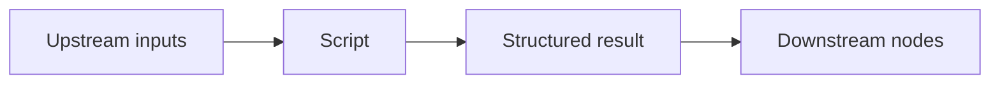
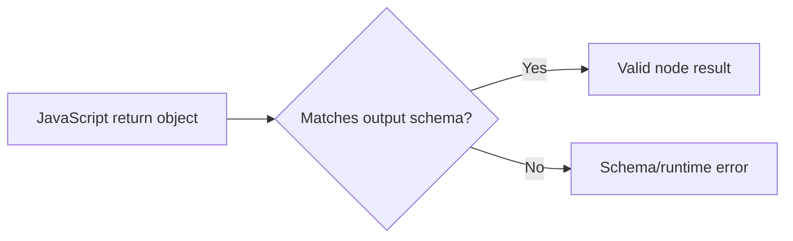
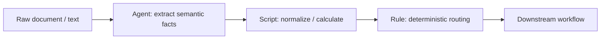
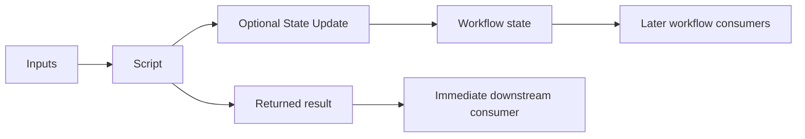
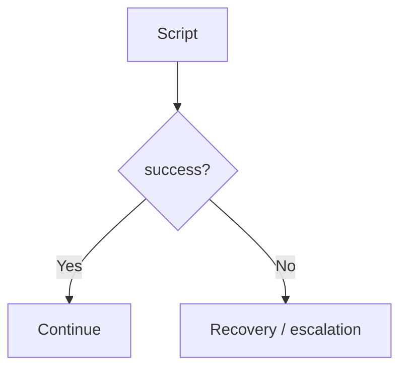

# Script Node

> **Evidence status:** DOCUMENTED + OBSERVED
> **Evidence date:** 2026-08-23
> **Primary evidence:** User-supplied QI Studio Script screenshots plus supplied product guidance text.
> **Scope:** Inputs, JavaScript execution, input/output schemas, testing, return contracts, advanced settings, state updates, and output variables.

The Script node runs user-defined JavaScript when a transformation, calculation, data reshape, or custom logic is not conveniently expressible through a built-in node.

> **Core principle:** Use Script for explicit computation and transformation. Keep the script small, typed through its input/output schema, deterministic where possible, and easy for a reviewer to understand.

## 1. What the Script node does

The Script node provides a controlled JavaScript execution boundary inside an orchestration.



The supplied guidance positions Script as a do-it-yourself node for cases such as:

- custom calculations
- data transformation
- reshaping objects
- date formatting
- combining fields
- other logic not directly supported by a built-in node

For simple conditional branching, the guidance explicitly recommends a Rule node instead.

## 2. Inputs

The Script node defines its input contract in the **Inputs** section.

Inputs are available in the script through the `input` object:

```javascript
input.<field>
```

Example:

```javascript
input.score
```

The UI lets each input define:

- name
- type
- description
- test value

The visible type selector includes:

- string
- number
- boolean
- object
- array<string>
- array<number>
- array<boolean>
- array<object>
- array<array>

### Example input contract

```text
score : number
```

Test value:

```text
95
```

The supplied screenshot shows exactly this configuration.

## 3. Input typing

The input schema is part of the Script node's interface, not just documentation.

A useful contract is:

```yaml
inputs:
  score:
    type: number
    required: true
```

Type the input according to the value the script actually expects.

Do not accept everything as a string and perform hidden coercion unless there is a deliberate reason to do so.

### Why typing matters

Explicit input types:

- reduce ambiguity
- improve readability
- make test cases meaningful
- reduce accidental comparisons between incompatible values
- clarify the interface to downstream workflow designers

## 4. Code

The Script node contains a code editor for JavaScript.

The supplied example establishes the runtime pattern:

```javascript
console.log("Evaluating score:", input.score);

let grade;

if (input.score >= 85) {
    grade = "A";
} else if (input.score >= 70) {
    grade = "B";
} else if (input.score >= 50) {
    grade = "C";
} else {
    grade = "F";
}

console.log("Grade:", grade);

return {
    grade,
};
```

The screenshot shows the test input `score = 95` and the declared output field `grade` as a string.

The expected result for that example is:

```json
{
  "grade": "A"
}
```

## 5. Reading values

Read configured inputs through the `input` object.

Example:

```javascript
const score = input.score;
```

The supplied product guidance also states that other nodes' outputs can be read using the appropriate `nodes.<nodeName>.result.<field>` expression where supported by the runtime.

This distinction matters:

```text
input.score
```

means a value explicitly defined in this Script node's Inputs contract, while a `nodes...` reference points to another node's execution output.

Prefer the node's input contract when wiring upstream values into Script because it makes the dependency visible and testable.

## 6. Return contract

The Script node requires an output schema under **Return (Output)**.

The output schema defines the shape of the object returned by the script.

The supplied screenshot shows:

```text
grade : string
```

The code returns:

```javascript
return {
    grade,
};
```

These two parts must agree.

### Contract rule

If the output schema says:

```text
grade : string
```

the script should return an object with a string-valued `grade` field.

Conceptually:



Do not treat the output schema as optional decoration. It is the downstream interface of the Script node.

## 7. Output field types

The output type selector visibly provides:

- string
- number
- boolean
- object
- array<string>
- array<number>
- array<boolean>
- array<object>
- array<array>

Choose the narrowest useful type that reflects the actual contract.

Example:

```text
riskScore : number
```

is preferable to:

```text
riskScore : string
```

when downstream nodes need to perform numerical comparisons.

## 8. Visual Editor vs JSON Schema

Both Inputs and Return (Output) expose:

- **Visual Editor**
- **JSON Schema**

The Visual Editor is useful for ordinary fields and readable configuration.

The JSON Schema view should be used when the interface requires precise schema control beyond the basic visual representation.

The exact JSON Schema options and validation semantics should be treated as runtime-specific unless separately documented.

## 9. Required fields

The screenshots show a **Required** toggle for output fields.

The configured `grade` output is marked required.

Required fields should be used when downstream workflow behavior depends on the field always being present.

Do not mark a field required merely because it is usually present. Requiredness is part of the contract and should reflect actual workflow guarantees.

## 10. Add Field

Both input and output sections expose **+ Add Field**.

This allows the Script interface to grow beyond one value.

Example:

```text
Inputs
- score : number
- threshold : number
- category : string

Outputs
- grade : string
- passed : boolean
- scoreDelta : number
```

Keep the contract purposeful. A Script with many unrelated fields is often a sign that its responsibilities should be split.

## 11. Test Script

The node provides **Test Script**.

The supplied guidance explicitly recommends testing the script using the configured test values before wiring the node into the wider orchestration.

Typical workflow:

```text
1. Define inputs
2. Provide test values
3. Write code
4. Define output schema
5. Test Script
6. Inspect result / errors
7. Wire downstream nodes
```

This is important because the Script node is a code execution surface. Testing locally in the node catches basic logic and schema errors before they propagate into a larger workflow.

## 12. Console logging

The supplied example uses:

```javascript
console.log(...)
```

for debugging.

Example:

```javascript
console.log("Evaluating score:", input.score);
console.log("Grade:", grade);
```

Use logging to expose important intermediate values during development, but do not log secrets, authorization values, sensitive payloads, or unnecessary large documents.

A good production mindset is:

```text
Log what is necessary to diagnose behavior.
Do not log everything merely because you can.
```

## 13. Advanced settings

The Script node exposes an **Advanced** section.

The screenshot shows:

### Error Handling

A configurable error-handling area exists.

The screenshots do not establish every retry/fallback semantic. Those must be runtime-tested before being treated as canonical behavior.

### State Update

The Script node supports state updates under Advanced.

The screenshot shows the section with:

```text
State Update (0)
Manage state updates
+ Add State
```

This means a Script can not only return a result but can also explicitly mutate workflow state when configured to do so.

Keep the distinction clear:

```text
return {...}
```

creates the Script's node result.

```text
State Update
```

persists a separate workflow-state mutation.

### Output Variables

The Script exposes runtime output variables.

The screenshot shows:

| Variable | Type | Meaning |
|---|---|---|
| `result` | object | The script return object (`nodeOutput.result`) |
| `success` | boolean | Whether the script executed successfully |
| `error` | object | Script error details when execution fails |
| `error.message` | string | Error message |
| `error.status_code` | number | Error status code |

This is important for downstream workflow design.

## 14. How downstream nodes read Script output

The supplied guidance states:

> In this node, the result can be read as `nodeOutput.result`. In other nodes, use `nodes.<nodeName>.result.<field>`.

Example:

```text
Script node name: SCORE_SCRIPT
Output field: grade
```

A downstream node can conceptually reference:

```text
nodes.SCORE_SCRIPT.result.grade
```

The exact expression UI should be confirmed using the variable browser rather than relying on hand-entered paths.

## 15. Script vs Rule

The product guidance explicitly distinguishes Script and Rule.

Use **Rule** for simple deterministic branching:

```text
score >= 85
score >= 70
score >= 50
otherwise
```

Use **Script** when the logic benefits from general-purpose computation or reshaping.

Example where Rule is simpler:

```text
IF score >= 85 -> A
ELSE IF score >= 70 -> B
ELSE -> C
```

Example where Script may be appropriate:

```javascript
const weighted = technical * 0.4 + commercial * 0.3 + risk * 0.3;
const normalized = Math.round(weighted * 100) / 100;
return { weighted, normalized };
```

Do not choose Script merely because JavaScript can express a Rule. Prefer the simplest native primitive for the job.

## 16. Script vs Agent

Use Script when the logic is explicit and deterministic.

Use Agent when the task requires semantic interpretation, judgement, or flexible reasoning.

A strong hybrid architecture is:



This separates responsibilities cleanly:

- Agent interprets.
- Script computes.
- Rule routes.

## 17. Common Script patterns

### Pattern A: normalization

```javascript
const value = String(input.value ?? "").trim().toLowerCase();

return {
    normalized: value,
};
```

### Pattern B: calculation

```javascript
const total = input.price * input.quantity;

return {
    total,
};
```

### Pattern C: reshaping

```javascript
return {
    supplierName: input.supplier.name,
    supplierId: input.supplier.id,
};
```

### Pattern D: deterministic classification

```javascript
let band;

if (input.score >= 85) band = "high";
else if (input.score >= 70) band = "medium";
else band = "low";

return { band };
```

Use the pattern that keeps the transformation easiest to understand and test.

## 18. Defensive coding

A Script node sits in a workflow, so inputs may occasionally be missing or malformed.

Where appropriate, validate inputs explicitly:

```javascript
if (typeof input.score !== "number" || Number.isNaN(input.score)) {
    throw new Error("score must be a valid number");
}
```

For optional fields, distinguish intentionally missing values from legitimate falsy values:

```javascript
const name = input.name ?? "Unknown";
```

Avoid broad coercion that silently hides data-quality problems.

## 19. State update from Script

Use Script state updates when a computed result needs to persist in shared workflow state.

Example architecture:



This gives two distinct outputs of the same execution:

1. the node result
2. an optional persistent state transition

Do not confuse them.

## 20. Failure handling

The Script node exposes an error object when execution fails.

The observed output variables include:

```text
success
error
error.message
error.status_code
```

Downstream workflow design can use the success/error contract to route failures explicitly.

A robust architecture can be:



Do not rely on downstream nodes blindly consuming `result` when the node may have failed.

## 21. Common mistakes

### Mistake 1: output schema does not match return object

The script returns a field not declared in the output schema, or declares a type that does not match the returned value.

### Mistake 2: treating Script like an Agent

Do not put vague reasoning prompts into code. Script is for executable logic.

### Mistake 3: using Script for simple branching

Use Rule when ordinary comparisons express the decision more clearly.

### Mistake 4: making one Script a giant business-logic container

Split transformations when responsibilities become unrelated or difficult to test.

### Mistake 5: logging sensitive information

Never log tokens, credentials, authorization values, or unnecessary sensitive business payloads.

### Mistake 6: hidden type coercion

Do not assume strings, numbers, booleans, and arrays will automatically behave as intended.

### Mistake 7: ignoring the test step

Use Test Script before integrating the node into a production flow.

## 22. Verification checklist

Before deploying a Script node:

1. Every required input is declared.
2. Input types match actual runtime values.
3. Test values represent realistic cases.
4. Code handles expected edge cases.
5. The return object matches the output schema exactly.
6. Required outputs are always produced on successful execution.
7. Logging does not expose sensitive information.
8. Error behavior is understood.
9. State updates, if any, are intentional.
10. Downstream nodes consume the declared result contract rather than relying on incidental values.

## 23. Evidence vs assumptions

### Observed / documented

- Script is a JavaScript execution node.
- Inputs are available as `input.<field>`.
- Inputs have configurable names and types.
- The visible input type list includes string, number, boolean, object, array<string>, array<number>, array<boolean>, array<object>, and array<array>.
- The node provides a code editor.
- `console.log(...)` is available for debugging.
- The node requires an output shape under Return (Output).
- The visible output type list matches the input type list.
- Inputs and outputs expose Visual Editor and JSON Schema views.
- Output fields can be marked Required.
- Test Script is available.
- Advanced exposes Error Handling, State Update, and Output Variables.
- Runtime outputs include result, success, error, error.message, and error.status_code.
- The supplied example uses `score = 95` and returns a string `grade`.

### Still requiring runtime validation

- Exact JavaScript runtime version and available built-in/global libraries.
- Execution time limits.
- Memory/resource limits.
- Async/promise behavior.
- External network access and its restrictions.
- Exact error-handling/retry semantics.
- State-update transactionality with multiple mutations.
- Output-schema enforcement details.
- JSON Schema feature depth.
- Exact downstream expression handling for arrays/objects.

## 24. AI-agent interpretation rules

1. Treat Script as a deterministic code-execution boundary.
2. Read inputs through the declared `input` contract.
3. Return an object matching the declared output schema.
4. Prefer Rule for simple branching and Script for computation/transformation.
5. Use Agent only when semantic judgement is actually required.
6. Test the script before integrating it into a larger orchestration.
7. Distinguish node result from persistent state updates.
8. Treat runtime limits and advanced execution semantics as unverified until tested.
9. Never expose secrets through logs, examples, state, or documentation.
