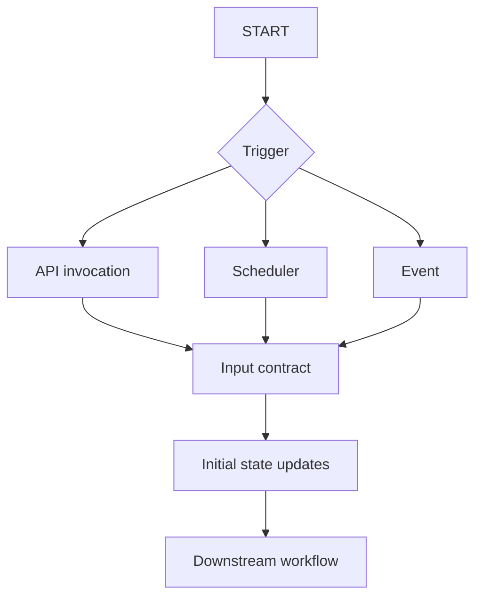
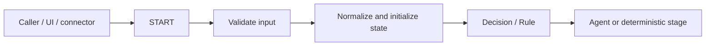

# START Node

> Evidence: DOCUMENTED + OBSERVED from QI Studio UI/documentation screenshots supplied 2026-08-23.

## Purpose

START is the entry boundary of a QI Studio orchestration. It defines how execution begins, what inputs are available, and what initial state updates are applied. The supplied QI documentation states that every orchestration has exactly one START node and it cannot be deleted.



## Trigger modes

| Mode | Meaning | Typical use |
|---|---|---|
| API invocation | On-demand REST invocation; shown as always available | Application-to-QI integration, UI/backend submission |
| Scheduler | Time-based automatic trigger | Recurring jobs, periodic reports/checks |
| Event | Connector-driven automatic trigger | Start when an external event occurs |

The screenshots/documentation indicate that API invocation remains available and at most one automatic trigger can be added. Scheduler requires a schedule; Event requires a connected app/event. Exact retry, deduplication, delivery, and connector-specific failure semantics remain **UNKNOWN until tested**.

## Input contract

The START node supports named inputs with a type and required/optional setting. Examples shown:

| Input | Type | Role |
|---|---|---|
| `message` | string | User message/query; shown as required |
| `attachments` | array | File attachments |
| `ui_action` | object | UI action/widget payload |

Custom inputs can be added.

### Scalar variable editor

The screenshots show:

- variable name
- type
- description
- required field
- minimum length
- maximum length
- regex pattern
- allowed values / enum
- default value

### Object variable editor

The screenshots show:

- visual editor
- JSON Schema editor
- Add Field
- Additional Properties toggle
- description
- required field
- default JSON value

Treat START inputs as an API contract. For production flows, document name, type, requiredness, validation, default, owner, sensitivity, and expected source.

## State Update

START exposes a State Update section. The screenshots show updates against values such as:

- `conversationHistory`
- `system/files`
- `system/userQuery`
- `system/attachments`
- `system/uiAction`
- `system/sessionId`

The visible operations include **Set**, **Append**, and **Clear**, plus **Run only when** conditions.

### Semantics

**Set** replaces the target value with the supplied value.

```text
system/userQuery := message
```

**Append** adds to an existing collection/history.

```text
conversationHistory += {role: "User", content: message}
```

**Clear** removes stale state before the run proceeds.

**Run only when** gates a state update on a condition.

The screenshots show a representative Start configuration that:

```text
conversationHistory <- Append user message
system/files        <- Clear
system/userQuery    <- Set message
system/attachments  <- Set attachments
system/uiAction     <- Set ui_action
system/sessionId    <- Set session/session-derived value
```

This is evidence of that configuration, not proof that every new START node has identical defaults.

## Session continuity

The API Reference screenshots state that `options.sessionId` supplies conversation continuity and is auto-generated when not provided. START also exposes a system/session value in state updates.

Therefore distinguish:

```text
API sessionId -> runtime conversation continuity
START state   -> workflow-visible session context
```

Exact precedence between explicit API session IDs, generated IDs, resumed executions, and nested workflows is an **open experiment**.

## Design guidance

START should initialize and normalize entry state. It should not become the hidden business-rule engine.

Prefer:



Avoid putting scoring logic, evaluation logic, complex agent routing, or large reusable processes inside START. Use Decision, Rule, Compute, Agent, or Subflow instead.

## Common mistakes

1. Treating `message` as the only input when attachments/UI actions contain structured context.
2. Allowing stale state to survive because `Clear`/`Set` semantics were never defined.
3. Letting an agent invent system IDs or session IDs.
4. Assuming UI defaults are universal defaults.
5. Assuming Scheduler/Event runtime guarantees from UI labels alone.
6. Putting business logic in START instead of a later workflow stage.

## Evidence status

### CONFIRMED / DOCUMENTED

- Exactly one START node exists and cannot be deleted.
- API invocation is always available.
- Scheduler and Event are optional automatic trigger choices, with one automatic trigger choice.
- START supports typed inputs with required/optional configuration.
- Scalar variable editing supports validation and defaults.
- Object variables support a visual editor and JSON Schema.
- START supports state updates with Set, Append, Clear, and conditional execution.

### UNKNOWN / TEST NEEDED

- Scheduler retry semantics.
- Event duplicate delivery/deduplication behavior.
- Exact session ID precedence across normal and resumed executions.
- Runtime validation behavior for complex objects and nulls.
- Transaction semantics if multiple START state updates partially fail.

## Related

- [Architecture](../../ARCHITECTURE.md)
- [Variables and State](../05-Data-State/README.md)
- [Human in the Loop](../08-Human-in-the-Loop/README.md)
- [Tools](../04-Tools/README.md)
- [Evidence](../14-Evidence/README.md)
- [Bid Analysis](../13-Bid-Analysis/README.md)
