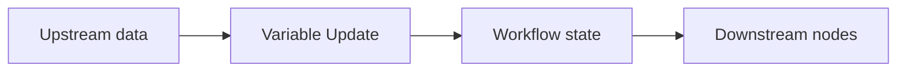
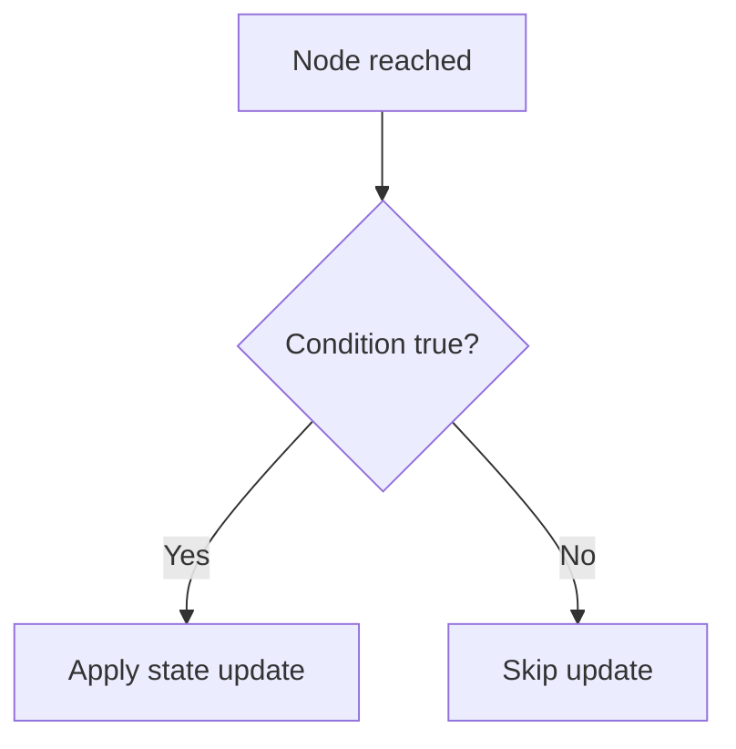
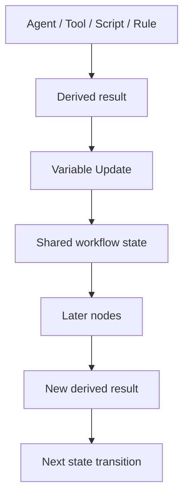

# Variable Update Node

> **Evidence status:** DOCUMENTED + OBSERVED
> **Evidence date:** 2026-08-23
> **Primary evidence:** User-supplied QI Studio Variable Update screenshots plus supplied product guidance text.
> **Scope:** State mutation, update operations, value expressions, conditional execution, state-update collections, and design guidance.

The Variable Update node writes to the orchestration's shared state. It is the explicit state-mutation primitive used when a step's purpose is to create, replace, modify, or clear a value that later steps can read.

> **Core principle:** Treat workflow state as a shared notebook carried through the orchestration. Variable Update is the explicit write operation. Read state deliberately, mutate it intentionally, and make conditional writes explicit.

## 1. What the Variable Update node does

A Variable Update node changes one or more state variables.

Conceptually:



The supplied guidance describes state as a shared notebook that steps carry as the flow runs. Values written in one step can therefore be consumed and updated by later steps.

## 2. Adding an update

The node exposes **Manage state updates**.

A single Variable Update node can contain one or more update rows.

Use **+ Add State** to add another state mutation. The UI shows a **State updates configured** counter that reflects how many update rows are currently configured.

Each update row can be removed with its trash icon.

### Update row anatomy

Each row contains three core parts:

1. **Select variable**: the state variable to change.
2. **Operation**: how the existing value should be changed.
3. **Value**: the value to write, where applicable.

Example:

```text
Variable: conversationStatus
Operation: Set
Value:     "Qualified"
```

## 3. Set operation

The supplied documentation explicitly describes **Set** as replacing the variable's current value with the supplied value.

Example:

```text
status = "Qualified"
```

Use Set when the new value should become authoritative state rather than being accumulated with previous content.

## 4. Value expressions and variable insertion

The value field can accept a fixed value or a variable expression.

The supplied UI text instructs users to type `{{` to insert a variable.

Example:

```text
Value:
{{nodes.SCRIPT_0.result.grade}}
```

The exact expression syntax available in the variable picker should be preferred over manually guessing paths.

### Recommended practice

Prefer explicit references to upstream outputs and state variables:

```text
{{nodes.<nodeName>.result.<field>}}
```

or the appropriate state/workflow expression shown by the variable browser.

Do not hard-code values that should come from runtime data.

## 5. Conditional execution: Run only when

By default, the Variable Update executes whenever the node executes.

The UI exposes **+ Run only when** to add an execution condition.

Conceptually:



The conditional section visibly provides:

- **ALL** mode
- **ANY** mode
- **+ Add Condition**

### ALL

All configured conditions must be true.

```text
Condition A AND Condition B AND Condition C
```

### ANY

At least one configured condition must be true.

```text
Condition A OR Condition B OR Condition C
```

Use conditional state updates when a write is only valid for certain branches, outputs, or workflow states.

## 6. Conditional operators

The supplied screenshot shows the condition operator list:

- Equals
- Not Equals
- Greater Than or Equal To
- Less Than or Equal To
- Greater Than
- Less Than
- Contains
- Is Empty
- Is Not Empty

These operators are visibly available in the UI. Their complete runtime coercion semantics are not established by the screenshot alone.

For example, do not assume without testing that:

```text
"95" Greater Than 80
```

behaves identically to:

```text
95 Greater Than 80
```

unless the runtime is verified to coerce types that way.

## 7. Multiple updates in one node

A Variable Update node can apply more than one state mutation in one step.

Example:

```text
1. Set status = "Qualified"
2. Set score = 92
3. Set decisionSource = "Rule"
```

This is useful when several state values should change as one explicit workflow step.

### Design implication

Group logically related state mutations together, but avoid making one node responsible for unrelated business-state changes simply because the UI allows multiple rows.

A good grouping criterion is:

> Would a reviewer describe these state writes as one logical state transition?

## 8. State as a shared execution memory

A useful architecture is:



This turns state into an explicit data backbone instead of relying on hidden prompt history.

## 9. Variable Update vs other state-update surfaces

QI Studio also exposes state-update capabilities in other nodes, including Agent and other node types through their **Advanced → State Update** areas.

The Variable Update node exists when the state mutation itself is the purpose of the step and should therefore be explicit on the canvas.

Use:

| Requirement | Preferred mechanism |
|---|---|
| Update state as the explicit purpose of the step | Variable Update |
| Mutate state as a side effect of another node's execution | That node's Advanced → State Update |
| Compute a value without persisting it | Script or other transformation node |
| Route based on existing values | Rule |

This distinction improves readability and makes state transitions easier to audit.

## 10. Conditional state mutation patterns

### Pattern A: set a status after successful processing

```text
Run only when:
    success = true

Update:
    processingStatus = "Completed"
```

### Pattern B: record an exception only when an error exists

```text
Run only when:
    error Is Not Empty

Update:
    processingStatus = "Failed"
```

### Pattern C: persist a decision only when a Rule branch matches

```text
Run only when:
    decision = "Qualified"

Update:
    qualificationStatus = "Qualified"
```

The important idea is that the write should represent a valid state transition, not simply mirror every intermediate value produced by the workflow.

## 11. State mutation discipline

State should be treated as a contract.

Before writing a variable, know:

```yaml
variable:
owner:
type:
meaning:
valid_values:
source:
write_operation:
write_conditions:
consumers:
```

This is especially important for shared objects such as:

```text
conversationHistory
supplierEvaluation
qualificationStatus
scoringResult
validationResult
```

Do not repeatedly overwrite a state object from unrelated nodes without documenting which node is authoritative.

## 12. Common mistakes

### Mistake 1: using Set when you meant to accumulate

Set replaces the current value. It does not append to a collection.

### Mistake 2: unconditional writes when the value is only valid in one branch

Use Run only when to prevent invalid or misleading state.

### Mistake 3: writing intermediate/debug values into canonical state

Keep temporary calculation results separate from business-state variables unless they are deliberately part of the contract.

### Mistake 4: multiple nodes silently owning the same variable

This creates hard-to-debug last-write-wins behavior.

### Mistake 5: guessing variable paths

Use the variable picker and visible runtime expressions rather than manually inventing a path.

### Mistake 6: assuming condition type coercion

The UI proves operator availability, not every comparison-semantic edge case.

## 13. Verification checklist

Before considering a Variable Update production-ready, verify:

1. The target variable exists.
2. The target variable's type matches the value being written.
3. The chosen operation matches the intended mutation semantics.
4. Conditional execution is configured when the write is branch-specific.
5. Every referenced source variable resolves at runtime.
6. Downstream nodes observe the expected post-update value.
7. Repeated execution does not unintentionally overwrite or duplicate state.
8. Failure paths do not leave partially mutated state without a deliberate design.

## 14. Evidence vs assumptions

### Observed / documented

- Variable Update is the explicit state-writing node.
- A node can contain one or more update rows.
- `+ Add State` adds another update.
- The state-update count is displayed in the UI.
- Each update exposes Select variable, Operation, and Value.
- Set is available as an operation and is documented as replacing the current value.
- Values can be fixed or can use variable insertion via `{{`.
- `+ Run only when` adds conditional execution.
- Conditional execution exposes ALL and ANY modes.
- `+ Add Condition` adds another condition.
- The visible operator list includes Equals, Not Equals, Greater Than or Equal To, Less Than or Equal To, Greater Than, Less Than, Contains, Is Empty, and Is Not Empty.

### Still requiring runtime validation

- Exact type-coercion semantics for comparisons.
- Missing-field behavior.
- Null vs empty-string behavior.
- Whether conditional evaluation short-circuits.
- State-update transactionality when multiple rows are configured.
- Behavior if one update succeeds and a later update fails.
- Collection semantics if operations other than Set are later exposed in this node.
- Persistence/visibility of the updated state across branches and nested executions.

## 15. AI-agent interpretation rules

1. Treat Variable Update as an explicit state transition.
2. Do not infer that merely computing a value persists it.
3. Prefer Set only when replacement is intended.
4. Use Run only when to guard branch-specific state writes.
5. Inspect the target variable's type and scope before writing.
6. Prefer explicit state ownership and avoid multiple competing writers.
7. Record runtime-discovered state semantics as evidence before promoting them to canonical behavior.
