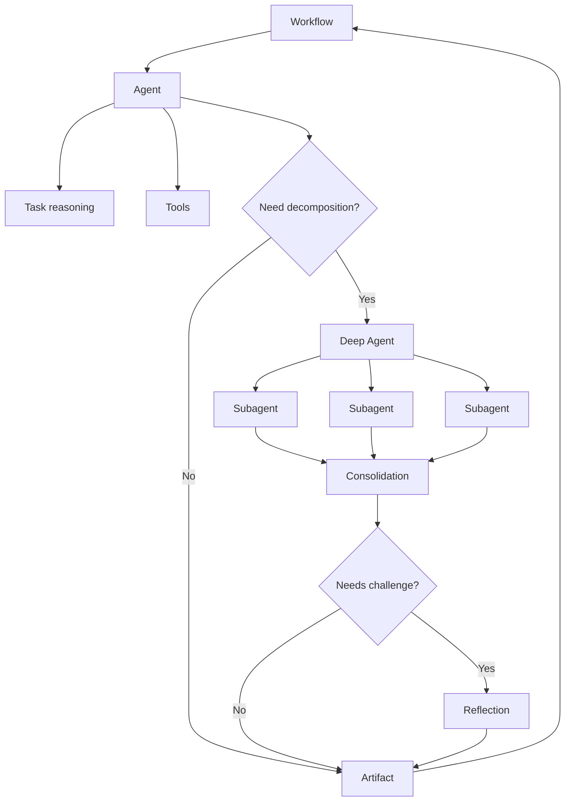

# Agent Architecture

## Mental model



## Agent design rules

1. Give an agent a bounded responsibility.
2. Minimize tool surface area.
3. Keep deterministic workflow state outside the agent where possible.
4. Require structured outputs for downstream stages.
5. Record evidence and provenance for important conclusions.
6. Use subagents only when decomposition materially improves quality or throughput.
7. Use reflection for explicit challenge/rework, not as an endless loop.
8. Do not let an agent silently redefine business rules.

## Deep Agent

Use when the task is difficult enough that decomposition, tool selection, parallel investigation, or iterative reasoning is justified.

Do not use a Deep Agent simply because the task contains several sequential deterministic steps.

## Subagents

Good candidates are independent analytical questions. Bad candidates are trivial tool calls that the parent workflow can execute directly.

## Parallelism

Parallelize only when tasks are genuinely independent and partial failure semantics are understood.

Unknowns to test include:

- failure of one child
- partial output handling
- ordering guarantees
- shared state behavior
- retry semantics
- cost/latency impact

## Reflection

Recommended pattern:

```text
Primary analysis -> challenge -> PASS or REWORK
```

Reflection should have an explicit stop condition.

## Handoff

Use when responsibility or conversational ownership must move across agent boundaries. Document input contract, output contract, ownership, and return path.
