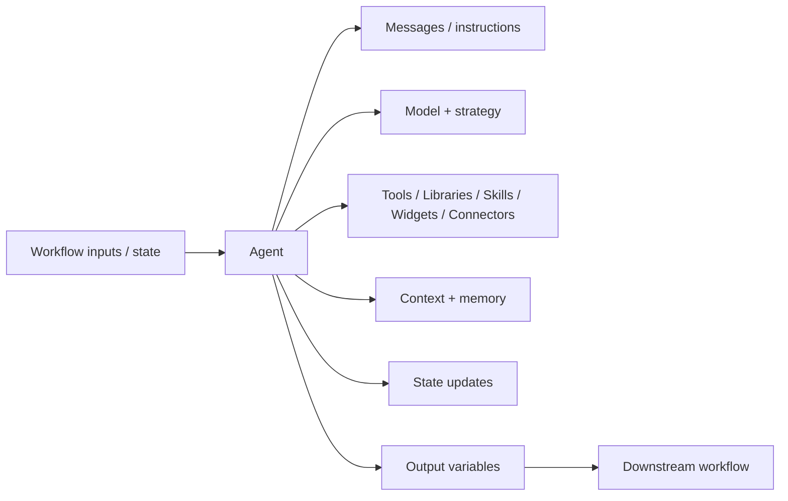

# Agent Node

> **Evidence status:** Observed + Documented; selected runtime semantics remain Open.
> **Evidence date:** 2026-08-23
> **Primary evidence:** User-supplied QI Studio Agent screenshots and tool configuration descriptions.

The **Agent** node is the semantic execution primitive for tasks that require reasoning, interpretation, synthesis, or iterative tool use. It combines a model and strategy with messages, capabilities, context controls, memory, state updates and output variables.

## Mental model



Use the Agent for semantic work. Prefer deterministic primitives for exact rules, calculations and explicit state transitions.

## Strategy

Observed strategy options:

- `ReAct`
- `Deep Agent`

The Deep Agent UI exposes subagent controls, including a visible maximum of 3 parallel subagents. The control surface is established; full scheduling and aggregation semantics remain unverified.

## Capabilities

The Agent UI exposes:

- Tools
- Libraries
- Skills
- Widgets
- Connectors

Expose only the capabilities required for the task. The observed system-tool governance pattern is:

```text
SearchSystemTools
      ↓
GetSystemToolSchema
      ↓
ExecuteSystemTool
      ↓
Validate result
```

For knowledge-source workflows, `get-knowledge-workflow-instructions` must be called first according to the supplied product rule.

See `04-Evidence/Tool-Contracts/Agent-Tool-Catalog.md`.

## Messages

Observed message roles include `system`, `user`, and `assistant`. Use roles deliberately and keep deterministic workflow control in native nodes/variables rather than hiding it in prompts.

## Response format

Observed choices include Plain Text and JSON. Prefer JSON when Agent output forms an inter-stage contract.

## Advanced surface

Observed advanced areas include:

- Response Format
- Include Thoughts
- Guardrails
- Context Management
- Long-term Memory
- Error Handling
- State Update
- Output Variables

The presence of these controls does not establish their complete runtime behavior.

### Context Management

Observed concepts include scope choices such as Tool results only vs Full history, strategies such as Replace vs Drop, and thresholds by Tokens or Turns. Exact token accounting and resulting context semantics remain open.

### Long-term Memory

Long-term memory is described as durable information across conversations and is distinct from current workflow state and conversation history.

### Include Thoughts / Error Handling / Guardrails

These controls are observed. Their exact runtime representation, recovery behavior, and sequencing remain open.

### State Update

Observed operations include Append, Extend, Set, and Clear, with conditional execution controls. Exact transactionality and type behavior remain unverified.

## Variables and output

The observed Agent variable browser exposes multiple scopes, including Flow/business state and System values such as `attachments`, `dateTime.utcNow`, `files`, `humanInput`, `sessionId`, `uiAction`, and `userQuery`. Security-sensitive values such as authorization tokens and runtime credentials must never be copied into prompts, tests, or repository documentation.

Observed Agent outputs include:

| Output | Purpose |
|---|---|
| `text` | Agent text output |
| `toolCalls` | Tool-call information |
| `structuredOutput` | Structured result |
| `success` | Execution status |
| `error` | Error information |
| `error.message` | Error message |
| `error.status_code` | Error status |

Exact downstream mapping should be confirmed with runtime tests.

## Design rules

1. Use deterministic nodes for deterministic logic.
2. Give the Agent only the capabilities it needs.
3. Prefer structured JSON output for inter-stage contracts.
4. Keep workflow state separate from long-term memory and conversation history.
5. Place consequential external actions behind Approval where required.
6. Do not infer undocumented Agent semantics.
7. Record runtime discoveries in `04-Evidence/` and remove resolved questions from `05-Verification/`.

## Open verification items

- Context Management thresholds and message semantics.
- Long-term Memory persistence and retrieval timing.
- Include Thoughts output semantics.
- Error Handling and recovery semantics.
- Deep Agent subagent scheduling and partial-failure behavior.
- Agent state-update semantics.
- Variable scope precedence.
- Complete downstream output mapping.
