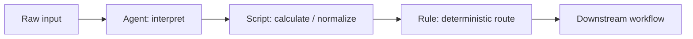

# Script Node

> **Evidence status:** DOCUMENTED + OBSERVED
> **Evidence date:** 2026-08-23
> **Primary evidence:** User-supplied QI Studio Script screenshots plus supplied product guidance text.

The Script node runs user-defined JavaScript when a transformation, calculation, data reshape, or custom logic is not conveniently expressible through a built-in node.

> **Core principle:** Use Script for explicit computation and transformation. Keep the script small, typed through its input/output schema, deterministic where possible, and easy for a reviewer to understand.

## Configuration and contract

The Script node provides a controlled JavaScript execution boundary. Inputs are declared in the **Inputs** section and are available as `input.<field>`. The UI exposes names, types, descriptions, and test values.

Observed input/output types include:

- string
- number
- boolean
- object
- array<string>
- array<number>
- array<boolean>
- array<object>
- array<array>

The Return (Output) section defines the downstream contract. The return object from the script should match that schema.

Example:

```javascript
if (input.score >= 85) {
    return { grade: "A" };
}
return { grade: "B" };
```

## Runtime and editor behavior established by supplied guidance

The UI exposes:

- code editor
- Visual Editor and JSON Schema views for inputs and outputs
- Required flags for output fields
- Test Script
- Advanced sections for Error Handling, State Update, and Output Variables

The supplied example uses `console.log(...)` for debugging.

The documented runtime output variables include:

```text
result          -> script return object
success         -> execution success flag
error           -> error object
error.message   -> error message
error.status_code -> error status code
```

The supplied guidance states that a Script result can be consumed as `nodeOutput.result` within the node and through `nodes.<nodeName>.result.<field>` references elsewhere, subject to the runtime's expression UI.

## Recommended lifecycle

```text
1. Define inputs
2. Provide realistic test values
3. Write JavaScript
4. Define output schema
5. Test Script
6. Inspect result/errors
7. Integrate downstream
```

## Design guidance

Use Script for:

- custom calculations
- transformations and reshaping
- deterministic normalization
- combining fields
- logic not conveniently expressed with built-in nodes

Use **Rule** instead for straightforward deterministic branching. Use **Agent** when semantic interpretation or judgement is the actual hard part.

A clean hybrid pattern is:



## State and error handling

Advanced State Update can persist workflow state separately from the Script node's returned result. Keep the distinction explicit:

```text
return {...}  -> node result
State Update  -> shared workflow state mutation
```

When execution fails, downstream design should not assume a valid `result`; route using the success/error contract where appropriate.

## Defensive coding

Validate inputs where necessary and avoid accidental type coercion. Do not log credentials, tokens, authorization values, or unnecessarily sensitive payloads.

## Still requiring runtime validation

- Exact JavaScript runtime version and available globals/libraries.
- Execution time and memory/resource limits.
- Async/Promise behavior.
- External network access and restrictions.
- Exact error-handling and retry semantics.
- State-update transactionality and ordering.
- Depth of JSON Schema support and enforcement.
- Exact downstream expression handling for arrays/objects.

## AI interpretation rules

1. Treat Script as a deterministic code-execution boundary.
2. Read inputs through the declared `input` contract.
3. Return an object matching the declared output schema.
4. Prefer Rule for simple branching.
5. Use Agent only when semantic judgement is needed.
6. Test Script before integrating it into a larger orchestration.
7. Distinguish node result from persistent state updates.
8. Treat runtime limits and advanced execution semantics as unverified until tested.
