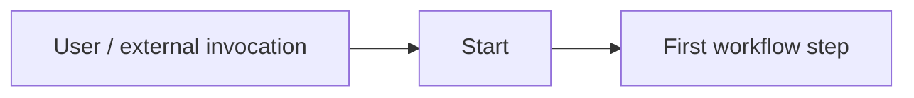

# Start Node

> **Evidence status:** Runtime Confirmed for the tested invocation path.
> **Evidence date:** 2026-08-23
> **Primary evidence:** User-supplied QI Studio screenshots and runtime execution records.

The **Start** node is the entry boundary of a QI Studio orchestration. It receives the invocation and initializes the tested workflow execution context.

## Runtime-confirmed observations

A controlled Start → Human Input → Output test showed:

```text
nodes.start.marker = "START"
nodes.start.interface.inputs.message = "hello"
nodes.start.success = true
nodes.start.options.sessionId = <session id>
nodes.start.options.streamMode = "verbose"
nodes.start.timestamp = <runtime timestamp>
nodes.start.nodeId = "start"
nodes.start.nodeType = "start"
```

The execution completed successfully after downstream Human Input and Output steps.

## Conceptual role



Start is an intake boundary, not the place for business logic.

## Observed input surface

The supplied UI/runtime evidence references invocation data including:

- message
- attachments
- UI action information

The complete Start input contract and exact requiredness of every field remain unverified.

## Design guidance

Prefer:

```text
Start
  ↓
Validation / normalization
  ↓
Agent / Rule / Script / Tool / Subflow
```

Do not overload Start with transformations that belong in explicit downstream primitives.

## Important distinction

Start execution success does **not** guarantee user-visible completion.

The historical regression in the E2E test proves that an upstream flow can complete without a usable Output response source.

## Still unverified

- Complete Start input schema.
- Required vs optional invocation fields.
- Exact attachments representation.
- Exact UI-action representation.
- Custom Start inputs, if supported.
- Differences between entry/invocation modes.

## Evidence

See `04-Evidence/Runtime/Start-HumanInput-Output-E2E.md`.
