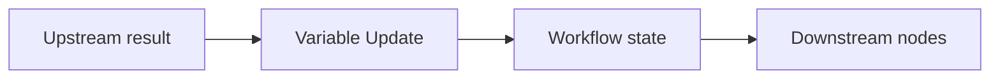

# Variable Update Node

> **Evidence status:** DOCUMENTED + OBSERVED
> **Evidence date:** 2026-08-23
> **Primary evidence:** User-supplied QI Studio Variable Update screenshots plus supplied product guidance text.

The Variable Update node writes to orchestration state. It is the explicit state-mutation primitive used when a step's purpose is to create, replace, modify, or clear a value that later steps can read.

## Configuration

The node exposes **Manage state updates** and **+ Add State**. Each update row contains:

1. Select variable
2. Operation
3. Value, where applicable

The supplied documentation establishes **Set** as an operation that replaces the current value.

Values can be fixed or inserted from runtime state using the variable expression mechanism, with `{{` used in the UI to invoke variable insertion.

## Conditional execution

The node exposes **+ Run only when**, with **ALL** and **ANY** modes and additional conditions.

Observed operators include:

- Equals
- Not Equals
- Greater Than or Equal To
- Less Than or Equal To
- Greater Than
- Less Than
- Contains
- Is Empty
- Is Not Empty

The UI establishes availability of these operators, but not all runtime type-coercion semantics.

## State model



Use the node when the state mutation itself should be visible and auditable on the canvas. Other nodes can also expose Advanced → State Update for mutations that are a side effect of their main work.

## Design guidance

Treat state as a contract with a clear owner, type, meaning, source and consumers. Avoid multiple unrelated writers for the same business-state variable. Guard branch-specific writes with explicit conditions.

Prefer:

```text
Variable Update
  target = qualificationStatus
  operation = Set
  value = "Qualified"
  condition = decision == "Qualified"
```

over hidden state changes embedded inside prompts or incidental node output.

## Still requiring runtime validation

- Exact type-coercion semantics for conditions.
- Missing-field and null/empty behavior.
- Conditional short-circuiting.
- Transactionality when multiple updates are configured.
- Behavior if a later update fails after an earlier update succeeds.
- Persistence/visibility across branches and nested executions.

## AI interpretation rules

1. Treat Variable Update as an explicit state transition.
2. Do not infer that merely computing a value persists it.
3. Use Set only when replacement is intended.
4. Use Run only when to guard branch-specific writes.
5. Inspect target variable type and scope before writing.
6. Prefer explicit state ownership and avoid competing writers.
7. Record runtime-discovered state semantics as evidence before promoting them to canonical behavior.
