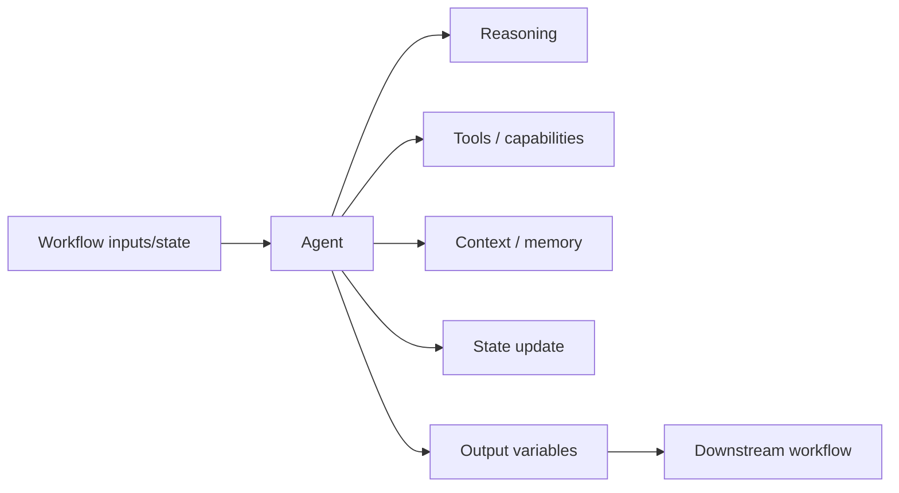

# Agent Node Evidence

**Evidence date:** 2026-08-23  
**Status:** UI/configuration evidence captured; runtime semantics remain selectively unverified.  
**Source:** User-supplied QI Studio Agent screenshots and configuration descriptions.

## Observed configuration

- Agent strategies observed: `ReAct`, `Deep Agent`.
- Deep Agent exposes subagents, a displayed maximum of 3 parallel subagents, and a parallel-execution control.
- Model selection spans multiple provider families in the observed build, including OpenAI, Google, and Anthropic. The visible model list is a point-in-time observation, not a permanent catalog.
- Message roles observed: `system`, `user`, `assistant`, with variable insertion.
- Capability groups observed: Tools, Libraries, Skills, Widgets, Connectors.
- Advanced areas observed: Response Format, Include Thoughts, Guardrails, Context Management, Long-term Memory, Error Handling, State Update, Output Variables.
- Response Format options observed: Plain Text and JSON.
- Context Management exposes Tool results only / Full history, Replace / Drop, and Tokens / Turns thresholds.
- Long-term Memory is exposed as a separate capability from current workflow state and conversation history.
- Agent State Update exposes Append, Extend, Set, Clear and conversation-history roles User, Assistant, System, Tool.
- Variable browser scopes observed include Current Node, workflow/referenced contexts, Environment, Authorization, Metadata, Flow and System.
- Agent output variables observed include `text`, `toolCalls`, `structuredOutput`, `success`, `error`, `error.message`, and `error.status_code`.

## Important design interpretation

The Agent is an execution boundary that combines semantic reasoning with configurable context, capabilities and state interaction. It should not be treated as a generic replacement for deterministic primitives.

Use deterministic nodes for exact rules, calculations and explicit state transitions. Use Agent reasoning where interpretation, judgement or semantic synthesis is required.

## Evidence boundary

The screenshots establish that the controls and variables above exist in the observed build. They do not by themselves establish exact runtime semantics for:

- Context Management truncation/replacement/drop ordering and token accounting.
- Long-term Memory persistence and retrieval timing.
- Include Thoughts representation and downstream exposure.
- Agent Error Handling, retry and fallback behavior.
- Guardrail sequencing and failure routing.
- State Update transactionality, conflict behavior and type semantics.
- Variable scope precedence when names collide.
- Deep Agent subagent scheduling, aggregation and failure isolation.
- Exact Agent output-to-variable mapping in all downstream configurations.

## Runtime verification queue

1. Context Management boundary and message construction.
2. Long-term Memory persistence across sessions.
3. Append / Extend / Set / Clear behavior for representative state types.
4. Include Thoughts runtime representation.
5. Error Handling and recovery semantics.
6. Deep Agent execution at 0/1/2/3 subagents and partial failure.
7. Structured JSON output downstream consumption.
8. Variable resolution across colliding scopes.

## Security

Observed variable browser entries include `Authorization` and `RuntimeToken`. Never store credentials, tokens, or other secrets in this repository.
