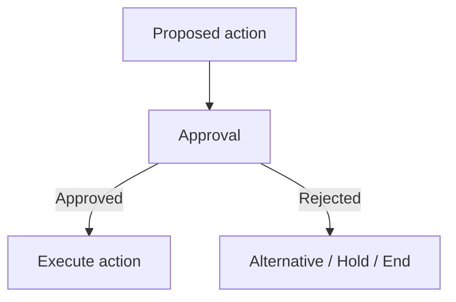

# Approval Node Evidence Record

**Evidence ID:** QI-OBS-2026-08-23-APPROVAL-001  
**Date:** 2026-08-23  
**Capability:** Human approval checkpoint, configurable approval message, action labels, Approved/Rejected routing, state updates, and decision output variable.  
**Source:** User-supplied QI Studio Approval screenshot and accompanying product guidance text.

## Evidence inventory

The supplied screenshot shows the QI Studio orchestration canvas with an `APPROVAL 0` node selected. The node is visually connected to the workflow canvas and exposes two outgoing handles labelled `Approved` and `Rejected`.

The configuration panel on the right shows:

- Approval Message
- Approve Button
- Reject Button
- Advanced
- State Update
- Output Variables

## Direct observations

### Node identity

The canvas identifies the capability as an Approval node. The selected node is labelled `APPROVAL 0`.

### Approval message

The visible Approval Message field contains:

```text
Approval required to proceed.
```

### Action labels

The visible defaults are:

```text
Approve
Reject
```

The supplied product guidance states that these labels can be customized to fit the business situation.

Examples in the supplied guidance include:

```text
Send it / Hold
Publish / Cancel
```

### Routing

The selected node visibly exposes two outgoing handles:

- Approved
- Rejected

The supplied guidance states:

- connect the Approved handle to continue the workflow
- connect the Rejected handle to an alternative path or end node

### Advanced settings

The configuration panel shows **Advanced** expanded.

#### State Update

The panel exposes:

```text
State Update
Manage state updates
Add State
```

The screenshot indicates that no state updates are currently configured in the shown node state.

#### Output Variables

The panel shows one visible output variable:

```text
decision : string
```

Description:

```text
The user's decision: 'approve' or 'reject'
```

This establishes a structured decision output surface in addition to the visible branch handles.

## Product-guidance semantics captured

The supplied Approval-node text states that the node:

- pauses the orchestration
- waits for a person to approve or reject
- presents an approval message
- provides two buttons
- routes the workflow according to the selected action
- should be placed before sensitive or irreversible operations
- allows customization of the visible button labels
- exposes Approved and Rejected routing handles
- exposes Output Variables for downstream use
- exposes State Update under Advanced

## Recommended human-checkpoint pattern



The message should make the decision concrete enough that the approver can understand what is about to happen.

## Evidence status

### Observed / documented

- Approval node exists.
- Approval Message is configurable.
- Approve Button is configurable.
- Reject Button is configurable.
- Default visible button labels are `Approve` and `Reject`.
- Approved and Rejected output handles are visible.
- Advanced exposes State Update.
- Advanced exposes Output Variables.
- A `decision` string output variable is visible.
- The visible decision description states `approve` or `reject`.

### Not established by this capture

The screenshot and guidance do not establish the exact runtime semantics for:

- whether the decision output is always lower-case regardless of custom button labels
- whether button labels affect the serialized decision value
- approval timeout behavior
- resume semantics after a long pause
- approval identity metadata
- timestamp/audit metadata
- comments or justification capture
- state-update transactionality around route selection
- behavior when a downstream branch is unconnected
- replay/idempotency semantics

These items remain open verification questions.

## Verification tests to capture next

| ID | Test | Purpose |
|---|---|---|
| APPROVAL-001 | Select Approve | Confirm Approved route executes |
| APPROVAL-002 | Select Reject | Confirm Rejected route executes |
| APPROVAL-003 | Inspect decision after Approve | Confirm exact serialized value |
| APPROVAL-004 | Inspect decision after Reject | Confirm exact serialized value |
| APPROVAL-005 | Change button labels | Determine effect on decision output |
| APPROVAL-006 | Configure State Update | Confirm update timing and persistence |
| APPROVAL-007 | Leave one output unconnected | Determine runtime behavior |
| APPROVAL-008 | Keep approval pending for an extended period | Determine timeout/resume semantics |
| APPROVAL-009 | Trigger repeated executions | Determine replay/idempotency semantics |
| APPROVAL-010 | Inspect execution/audit metadata | Determine whether approver identity and timestamps are exposed |

## Evidence handling rule

Do not store authorization values, runtime tokens, credentials, API keys, or sensitive business payloads in future Approval screenshots, examples, or exported evidence. Redact them before committing evidence.
