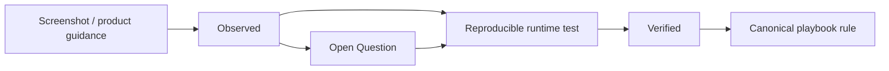

# Rule Node Evidence Record

> **Capture date:** 2026-08-23
> **Source:** User-supplied QI Studio screenshots and accompanying product guidance.
> **Status:** Evidence captured. Runtime semantics remain partially unverified.

## Evidence inventory

The supplied screenshot set shows the Rule node configuration UI in multiple states:

- Single IF block with operator selector open.
- IF block with multiple conditions and AND/OR control.
- IF + ELSE IF + ELSE configuration with separate branch handles on the canvas.
- Block enable/disable toggles.
- Add Condition and Add ELSE IF controls.
- Node guidance panel explaining block behavior and field references.

## Direct observations

### Rule identity

The canvas identifies the node as `RULE 0` and visually represents it as a branching node with separate output handles.

### Block types

Observed labels:

- IF / CASE 1
- ELSE IF / CASE 2
- ELSE / DEFAULT

### Condition structure

Observed fields:

- Select field
- Operator selector
- Enter value

### Operators visible

- Equals
- Not Equals
- Greater Than or Equal To
- Less Than or Equal To
- Greater Than
- Less Than
- Contains
- Is Empty
- Is Not Empty

### Compound conditions

A block can contain multiple condition rows.

The UI provides:

- `+ Add Condition`
- `AND`
- `OR`

### Block management

Each block has an enable/disable toggle.

The supplied guidance states that disabled blocks are skipped without being deleted.

### Output handles

The supplied guidance states that each rule block creates a new output handle and that removing a block removes its handle and connected edges.

### Field references

The supplied guidance explicitly shows:

```text
{{flow.fieldName}}
```

as a way to reference data from previous nodes.

## Canonical behavior captured from supplied guidance

The supplied Rule-node text states:

> Blocks are checked top to bottom, and the first block whose condition is true wins.

It also states that an ELSE block acts as the catch-all when no other condition is met.

These behaviors are therefore treated as **documented product behavior**, not merely inferred from the screenshots.

## What we should not infer from screenshots alone

The screenshots do not establish the complete runtime semantics for:

- missing vs null vs empty values
- text case sensitivity
- number/string coercion
- date comparisons
- array/object behavior with `Contains`
- nested Boolean grouping
- precedence if complex AND/OR expressions are supported
- evaluation telemetry for skipped blocks

These remain open verification items.

## Recommended evidence lifecycle



A future contributor should not silently upgrade an inference into canonical documentation. Each new runtime discovery should be added here first, then promoted into `02-Orchestration-Primitives/Rule.md`.

## Test cases to capture next

| ID | Test | Expected documentation outcome |
|---|---|---|
| RULE-001 | Exact text equality | Confirm equality semantics |
| RULE-002 | Text case variation | Determine case sensitivity |
| RULE-003 | Numeric values around a threshold | Confirm comparison and coercion |
| RULE-004 | Empty string vs missing field | Distinguish `Is Empty` semantics |
| RULE-005 | Null value | Determine null handling |
| RULE-006 | Contains on text | Confirm substring semantics |
| RULE-007 | Contains on array | Determine collection behavior |
| RULE-008 | Two overlapping blocks | Confirm first-match execution |
| RULE-009 | AND conditions | Confirm all-condition behavior |
| RULE-010 | OR conditions | Confirm any-condition behavior |
| RULE-011 | Disabled matching block | Confirm disabled-block skip behavior at runtime |
| RULE-012 | Removing a block with an attached edge | Confirm edge removal and graph integrity |
| RULE-013 | Missing referenced variable | Determine runtime failure or false-result behavior |
| RULE-014 | Complex AND/OR grouping | Determine whether nested groups are supported |

## Evidence handling rule

Do not store secrets, runtime tokens, authorization values, or other sensitive configuration in future Rule screenshots, examples, or exported documentation. Redact them before adding evidence to the repository.
