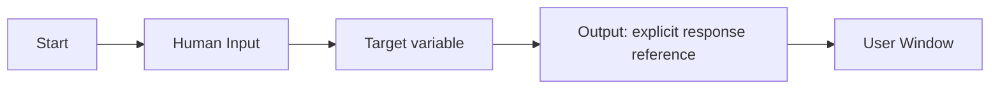

# Start → Human Input → Output: End-to-End Evidence

**Evidence date:** 2026-08-23  
**Status:** Runtime Confirmed  
**Purpose:** Canonical record of the smallest tests that establish the Start, Human Input, Flow/System variable, and Output contract.

## Test 1: Human Input writes to a Flow Variable

### Configuration

```text
START
  ↓
Human Input
  Save Response As → flow.startTestResponse
  ↓
Output
  Response source → {{flow.startTestResponse}}
```

Initial user message:

```text
hello
```

Human response:

```text
START_TEST
```

### Runtime observations

- `nodes.start.interface.inputs.message = "hello"`
- `nodes.start.success = true`
- `nodes.human_input_0.input = "START_TEST"`
- `nodes.human_input_0.variableTarget = "flow.startTestResponse"`
- `flow.startTestResponse = "START_TEST"`
- `nodes.human_input_0.success = true`
- `nodes.output_0.output.messages = "START_TEST"`
- overall execution status: `completed`

### Result

**PASS: Runtime Confirmed.**

A Human Input response can be saved to a user-created Flow Variable and consumed downstream by Output through an explicit variable expression.

## Test 2: Human Input writes to System `humanInput`

### Configuration

```text
START
  ↓
Human Input
  Save Response As → system.humanInput
  ↓
Output
  Response source → {{system.humanInput}}
```

Initial user message:

```text
hello
```

Human response:

```text
START_TEST
```

### Runtime observations

- `nodes.start.interface.inputs.message = "hello"`
- `nodes.start.success = true`
- `nodes.human_input_0.input = "START_TEST"`
- `nodes.human_input_0.variableTarget = "system.humanInput"`
- `system.humanInput = "START_TEST"`
- `nodes.human_input_0.success = true`
- `nodes.output_0.output.messages = "START_TEST"`
- User Window output: `START_TEST`
- overall execution status: `completed`

### Result

**PASS: Runtime Confirmed.**

The built-in System variable `system.humanInput` is populated by Human Input and can be consumed by Output through an explicit variable expression.

## Regression test: no explicit Output source

An earlier workflow allowed Start and Human Input to execute successfully but did not configure an explicit usable response source on Output.

The User Window returned:

```text
No response content found in the execution result. Please try again.
```

### Interpretation

**This is an Output-contract failure, not a Human Input failure.**

The upstream node can succeed and still produce no user-visible final response when the Output node has no usable response source.

## Established contract



The tested response sources are:

```text
{{flow.startTestResponse}}
{{system.humanInput}}
```

## What is now proven

- Start executes for the tested invocation path.
- Human Input pauses for a response and captures the response.
- Human Input can write the tested response to a Flow Variable.
- Human Input can write the tested response to `system.humanInput`.
- Output consumes explicit variable references.
- A successful upstream run does not guarantee a user-visible response.

## What remains open

- Complete Output expression-language coverage.
- Exact serialization of Human Input's `input` output variable for all response modes.
- Variable creation/overwrite behavior beyond the tested existing Flow Variable path.
- Human Input timeout, abandonment and resume behavior.
- General Start input schema beyond the fields observed in current tests.

Historical failures remain valuable evidence and should not be deleted merely because the configuration was corrected.
