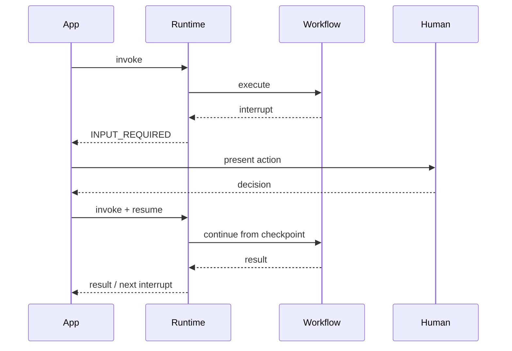

# API Integration

> Related: [START Node](../02-Orchestration-Primitives/START.md) and [HITL](../08-Human-in-the-Loop/README.md).

## Runtime invoke

The QI Studio API Reference exposes a workflow-engine invocation endpoint using bearer authentication. The request separates interface inputs from runtime options.

```json
{
  "interface": {
    "inputs": {
      "message": "Hello"
    }
  },
  "options": {
    "sessionId": "session-001",
    "includeIntermediateParts": true
  }
}
```

The actual endpoint and workflow identifier are environment-specific.

## Tokens

The UI distinguishes:

- Design-time token for management/configuration APIs.
- Runtime token for agent/workflow execution APIs.

Never place real tokens in the playbook or application source.

## HILT resume

A workflow can pause for human action and return an interrupt payload. The caller can then resume the same execution using an interrupt ID, HILT type, decisions and required metadata.



## Streaming

The Stream API exposes Server-Sent Events including run lifecycle, text message, tool execution, workflow step, completion and error events.

Observed event families:

```text
RUN_STARTED
TEXT_MESSAGE_START
TEXT_MESSAGE_CONTENT
TEXT_MESSAGE_END
TOOL_CALL_START
TOOL_CALL_RESULT
STEP_STARTED
STEP_FINISHED
RUN_FINISHED
RUN_ERROR
CUSTOM
```

## Integration guidance

- Keep session identity under runtime/workflow control.
- Persist HILT interrupt data needed for resume.
- Treat interrupts as workflow state, not as a brand-new request.
- Use streaming when the caller needs execution visibility or incremental output.
- Keep authentication secrets outside source control.

## Evidence status

These behaviors are **CONFIRMED as visible in the supplied API Reference UI**. Exact runtime semantics should be upgraded to TESTED only after independent invocation and resume experiments.
