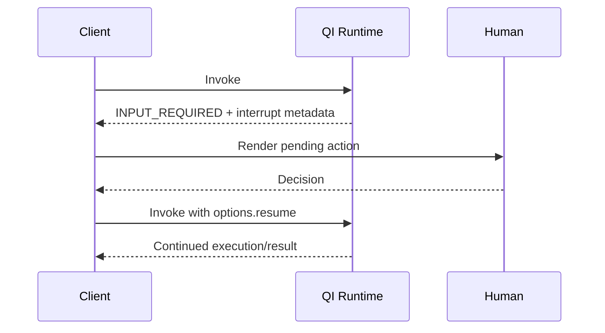
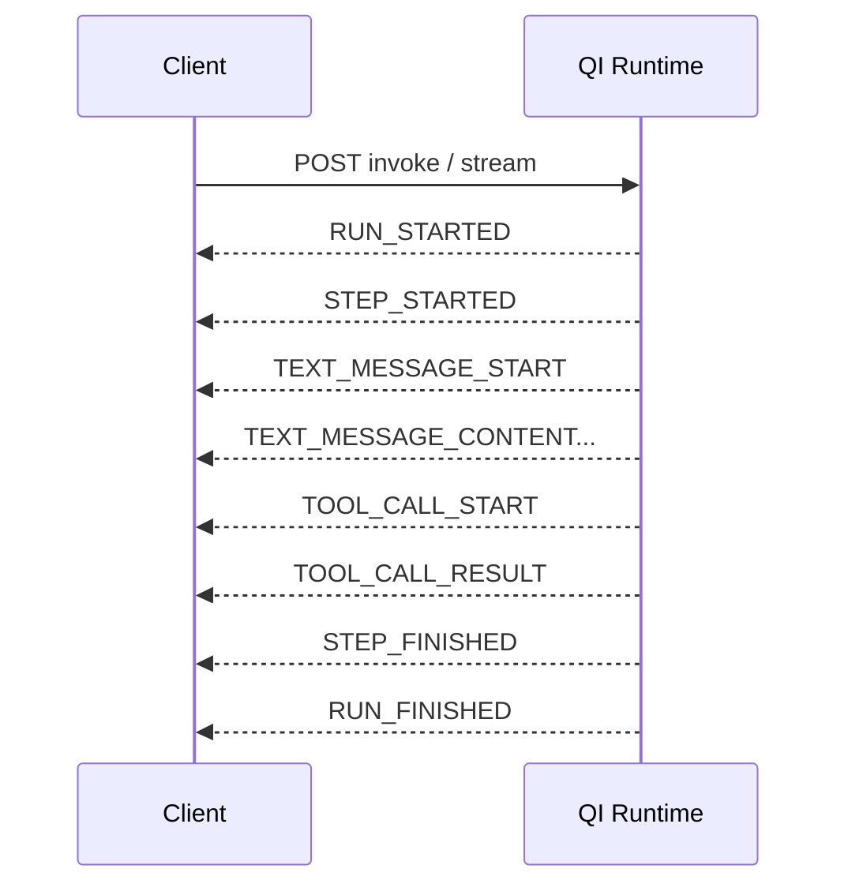

# QI Runtime API Reference

> Evidence: OBSERVED from QI Studio API Reference screenshots supplied 2026-08-23. This page records UI-visible contracts; endpoint behavior beyond the displayed contract is not assumed.

## Base runtime API

The API Reference UI shows a runtime base URL in the form:

```text
https://api-leoagentic-runtime-node-api.<environment>/...
```

The displayed Invoke example uses a workflow-engine endpoint under `/v2/workflow-engine/<workflow-id>/invoke` and a Bearer token.

## Authentication

The API Reference shows:

```http
Authorization: Bearer <YOUR_TOKEN>
Content-Type: application/json
```

The Auth Token Configuration dialog distinguishes:

- **Design Time Token**: described as being used for agent management/configuration APIs.
- **Runtime Token**: used for agent execution APIs.

Never store real tokens in this repository. Screenshots containing credentials must be sanitized before publication.

## Invoke Agent request model

The displayed request shape includes:

```json
{
  "interface": {
    "inputs": {
      "message": "Hello, how can you help me?"
    }
  },
  "options": {
    "sessionId": "session-001",
    "includeIntermediateParts": true
  }
}
```

The UI describes:

- `interface`: required object containing the agent input object; the message key is the user's query in the examples.
- `options.sessionId`: session identifier for conversation continuity; auto-generated if not provided.
- `options.includeIntermediateParts`: when enabled, intermediate execution details can be returned. The UI specifically mentions guardrail-related evaluation metadata/parts in this context.
- `options.resume`: object used to resume from a HITL interrupt.

## HITL resume

The API Reference shows that an invocation can pause and return an interrupt payload. The resume request requires the interrupt identifier, HITL type, decisions, and original interrupt metadata.

Conceptual sequence:



### Tool approval example

The screenshot shows a tool-approval interrupt with an `actionRequests[]` object containing fields such as:

- `toolCallId`
- `name`
- `args`
- `description`
- `allowedDecisions`

The displayed decision shape is conceptually:

```json
[
  {
    "toolCallId": "call_abc123",
    "decision": {
      "type": "approve"
    }
  }
]
```

The screenshots indicate decision types can differ by HITL type; do not assume the tool-approval shape applies to every interrupt category.

## Resume metadata

The screenshot shows resume inputs including:

```text
options.resume.interruptId
options.resume.payload.hitlType
options.resume.payload.decisions
options.resume.metadata
```

The displayed guidance says resume metadata should echo the interrupt metadata back unchanged except for the resume path field where applicable.

## SSE streaming

The Stream tab documents Server-Sent Events (SSE). The visible event taxonomy includes:

| Event | Meaning shown in UI |
|---|---|
| `RUN_STARTED` | Execution begins; includes thread/run identifiers |
| `TEXT_MESSAGE_START` | Agent message stream begins |
| `TEXT_MESSAGE_CONTENT` | Streaming text delta |
| `TEXT_MESSAGE_END` | Agent message stream complete |
| `TOOL_CALL_START` | Tool execution begins; includes tool call/name |
| `TOOL_CALL_RESULT` | Tool output |
| `STEP_STARTED` / `STEP_FINISHED` | Workflow node execution tracking |
| `RUN_FINISHED` | Execution complete; contains final result |
| `RUN_ERROR` | Execution failure and error message |
| `CUSTOM` | Custom event payload; UI mentions custom widget/event content types |

Conceptual stream:



## Architecture implications

The API surface suggests a useful separation:

```text
Workflow authoring
        |
        v
QI workflow / agent
        |
        +--> synchronous invocation
        +--> resumable HITL interrupt
        +--> streaming execution events
```

This is important for production architecture because an external application does not necessarily need to wait for a single opaque final response. It can observe execution and handle human interrupts explicitly.

## Open questions

The screenshots do not by themselves establish:

- token expiration/rotation behavior;
- exact HTTP status/error schema for every failure;
- idempotency behavior on repeated invoke requests;
- SSE reconnect/replay semantics;
- ordering guarantees across concurrent tool calls;
- persistence duration for `sessionId` state;
- limits on intermediate parts;
- exact resume semantics for every HITL category.

These should become runtime experiments before being marked TESTED or CONFIRMED.
