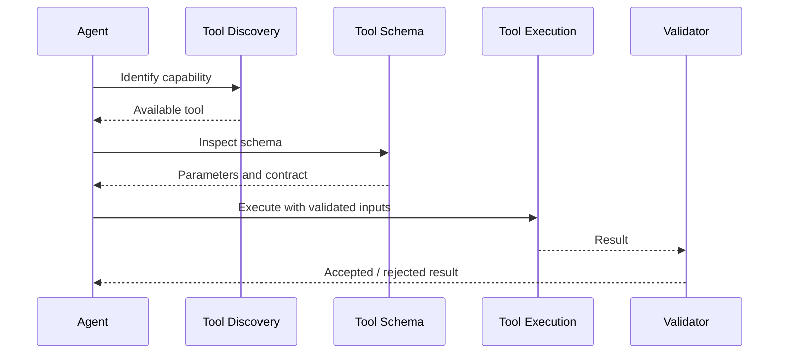

# Tools and Integrations

## Tool lifecycle

## Tool governance

Separate parameters into:

- Workflow-owned: IDs, run context, authorization, immutable system context.
- Agent-owned: semantic query, intent, reasoning parameters.
- Constrained-agent: values the agent may choose within validated limits.

Never let an agent invent identifiers that the system can supply deterministically.

## Tool documentation standard

Each tool page should record:

1. Purpose
2. Inputs
3. Outputs
4. Required parameters
5. Optional parameters
6. Parameter ownership
7. Authentication/context expectations
8. Failure modes
9. Retry behavior
10. Working examples
11. Known quirks
12. Anti-patterns
13. Evidence

## System tool discovery

Where system-tool discovery is available, the normal pattern is:

`discover -> inspect schema -> execute -> validate result`

Do not assume that a discoverable tool is appropriate for every agent. Tool exposure should be task-specific.

## MCP and external tools

Treat external services as explicit integration boundaries. Record authentication, timeout, error semantics, idempotency, and fallback behavior.