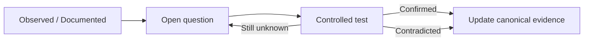

# QI Studio Verification Queue

**Purpose:** Active questions only. When a question is answered by a reproducible runtime test or stronger authoritative evidence, move the result into the relevant evidence/canonical document and remove the item here.

## Evidence lifecycle

## 1. Output and variables

### OUT-001: Complete Output expression coverage

**Known:** `{{flow.startTestResponse}}` and `{{system.humanInput}}` are runtime-confirmed Output response sources.

**Open:** Complete supported expression paths and source types.

### VAR-001: Complete Flow Variable lifecycle

**Known:** A user-created Flow Variable can be populated by Human Input and consumed by Output in the tested path.

**Open:** Automatic creation, overwrite behavior, collection/object mutation and behavior across other node producers.

### VAR-002: User-created System variables

**Open:** Whether custom System-scope variables behave like built-in System variables and what permissions/semantics apply.

## 2. Human Input

### HI-001: Output variable `input` serialization

**Open:** Exact `input` output-variable shape across free text and other response modes.

### HI-002: State Update ordering

**Open:** Ordering between response persistence and Advanced → State Update.

### HI-003: Timeout / abandonment / resume

**Open:** Waiting timeout, abandoned response handling and delayed resume behavior.

## 3. Approval

### AP-001: Decision serialization

**Open:** Exact runtime value/casing of `decision` after Approve and Reject.

### AP-002: Custom button labels

**Open:** Whether changing button labels changes only presentation or also the serialized decision value.

### AP-003: State Update ordering

**Open:** Ordering and transactionality of approval state updates relative to branch selection.

### AP-004: Pause / resume / timeout

**Open:** Long-running pending approvals and resume semantics.

### AP-005: Audit metadata

**Open:** Approver identity, timestamps, comments and action history.

### AP-006: Unconnected branch behavior

**Open:** Runtime behavior when Approved or Rejected has no downstream edge.

## 4. Rule

### RULE-001: Type and null semantics

**Open:** Null vs missing vs empty string, case sensitivity, numeric/string coercion, dates and collection behavior for `Contains`.

### RULE-002: Complex Boolean grouping

**Open:** Nested AND/OR groups and precedence.

### RULE-003: Missing-field behavior

**Open:** Runtime outcome when a referenced field does not exist.

## 5. Decision Tree

### DT-001: Produces-key completion/loop semantics

**Open:** Exact completion gating when produced keys exist, change or are cleared.

### DT-002: Internal condition semantics

**Open:** Type coercion, missing-key handling and path evaluation edge cases.

### DT-003: Ask User result persistence

**Open:** Exact state shape for typed replies, widget selections and person-handled responses.

### DT-004: Tool Call result/error behavior

**Open:** Result paths, missing fields, retries/timeouts and error routing.

### DT-005: Compute and Done semantics

**Open:** State mutation/clearing order, final-message interpolation and downstream result propagation.

## 6. Script

### SCRIPT-001: Runtime and execution limits

**Open:** JavaScript engine/version, globals/modules, async/Promise support, timeout and resource limits.

### SCRIPT-002: Schema enforcement

**Open:** Behavior for missing, extra or wrong-type inputs/outputs.

### SCRIPT-003: State Update and downstream result semantics

**Open:** Atomicity, ordering and exact downstream resolution.

## 7. Agent

### AG-001: Context Management

**Open:** Exact threshold accounting, replacement/drop ordering and resulting message context.

### AG-002: Long-term Memory

**Open:** Persistence and retrieval timing across sessions.

### AG-003: Include Thoughts

**Open:** Exact runtime representation and downstream exposure.

### AG-004: Error Handling

**Open:** Retry, fallback and failure-state semantics.

### AG-005: Deep Agent

**Open:** Scheduling, aggregation and partial-failure behavior with 0–3 subagents.

### AG-006: Agent State Update and scope precedence

**Open:** Append/Extend/Set/Clear behavior on representative state types and same-name scope collisions.

## 8. Agent tools and artifacts

### TOOL-001: Export tools end-to-end

**Open:** Execute each export tool, inspect generated artifact, exact result structure, `system.files` update and downstream attachment delivery.

Affected tools:
- Export Excel V2
- Export PowerPoint V2
- Export PDF V2
- Export Word V2
- Export HTML V2

Detailed verification remains in the corresponding tool-specific files.

### TOOL-002: Extract Document to Markdown

**Open:** Runtime extraction fidelity, OCR/vision quality, BlobProxy output, malformed-file behavior and exact success/error envelope.

### TOOL-003: Conversation Attachment / ExportBlob

**Open:** Retrieval and final attachment behavior, including multiple files.

### TOOL-004: Web Search

**Open:** Runtime result shape and citation propagation requirements in downstream/final responses.

### TOOL-005: Store / Retrieve

**Open:** Persistence scope and lifecycle of the memory bag.

### TOOL-006: Send Email

**Open:** Recipient validation, attachment behavior, exact result/error shape and downstream state.

### TOOL-007: System tool discovery layer

**Open:** Runtime behavior of SearchSystemTools → GetSystemToolSchema → ExecuteSystemTool, including failure/invalid-schema cases.

### TOOL-008: Knowledge workflow prerequisite

**Open:** Runtime enforcement and ordering of `get-knowledge-workflow-instructions` before knowledge-source tools.

## 9. Additional nodes

LLM, External Agent, Compute, Subflow, Handoff, Guardrail and Output have capability-level observations but incomplete dedicated configuration/runtime evidence. Do not infer their detailed contracts until dedicated captures and tests are performed.

## Promotion rule

For every confirmed item:

1. Record the test inputs and runtime result in the relevant evidence file.
2. Update the canonical node/tool documentation.
3. Remove the item from this queue.
4. Keep failed or historical tests in evidence/history so later investigators can understand why the current design exists.
