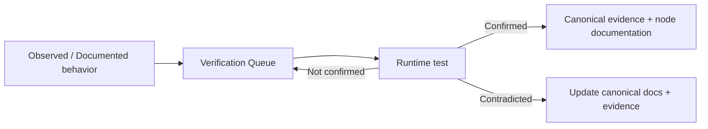

# QI Studio Verification Queue

> **Purpose:** Living register of QI Studio behavior that is understood well enough to document but is **not yet verified at runtime**.
>
> This file is deliberately temporary for each item. When an item is confirmed, **remove it from this queue and move the confirmed knowledge into the relevant canonical node documentation and evidence record**.

## Operating rule

The playbook uses five evidence states:

| State | Meaning |
|---|---|
| **Observed** | Visible in screenshots/UI. |
| **Documented** | Explicitly stated in supplied QI Studio/product guidance. |
| **Verified** | Confirmed by a reproducible runtime test. |
| **Inferred** | Reasonable engineering interpretation that still needs proof. |
| **Open Question** | Behavior not yet established. |

An item may be **Observed + Documented** and still belong in this queue until a runtime test confirms it.

## Verification lifecycle



## Required handling when an item is verified

1. Run and record the test.
2. Update the relevant evidence record with the observed runtime result.
3. Update the canonical node documentation if the verified result changes or strengthens the documented behavior.
4. Remove the item from this file.
5. Add a reference to the evidence record where useful.

Do **not** keep verified items in this queue as historical clutter. Git history already preserves the trail.

---

# Active verification items

## Decision Tree

### DT-001: Produces-key behavior and loop prevention

**Current understanding:** A Decision Tree step can produce state keys, and the documented guidance says produces keys gate ordering and help prevent loops.

**Needs verification:** Exactly how the runtime determines that a step is complete, especially when a produced key already exists, changes type, or is cleared later.

**Test:** Build a small tree with one step producing a key. Execute it repeatedly with the key present, absent, and explicitly cleared.

**Target evidence:** `03-Evidence/Decision-Tree-Node-Evidence.md`

### DT-002: Start connectivity requirement

**Current understanding:** Every Decision Tree step must ultimately connect back to Start to run, and the editor reports disconnected-node issues.

**Needs verification:** Exact runtime behavior for a step that is visually present but not connected to Start.

**Test:** Save/run a tree containing an unreachable branch and inspect validation and execution behavior.

**Target evidence:** `03-Evidence/Decision-Tree-Node-Evidence.md`

### DT-003: Condition operator semantics

**Current understanding:** Conditions expose operators including Equals, Not Equals, Greater Than or Equal To, Less Than or Equal To, Greater Than, Less Than, Contains, Is Empty, and Is Not Empty.

**Needs verification:** Type coercion, null handling, array/string behavior, and exact semantics for each operator.

**Test:** Exercise each operator against strings, numbers, booleans, null, empty strings, empty arrays, and missing keys.

**Target evidence:** `03-Evidence/Decision-Tree-Node-Evidence.md`

### DT-004: Path evaluation order

**Current understanding:** Decision paths are checked top-to-bottom and the first matching path wins; an `else` path runs when no named path matches.

**Needs verification:** Whether this ordering remains deterministic when multiple path conditions match and whether condition evaluation is short-circuited.

**Test:** Create overlapping conditions and observe the selected path.

**Target evidence:** `03-Evidence/Decision-Tree-Node-Evidence.md`

### DT-005: Ask User state capture

**Current understanding:** Ask User can capture typed replies, widget selections, or handoff-to-person responses into state.

**Needs verification:** Exact persisted state shape and serialization for typed replies, widget values, and human handoff results.

**Test:** Execute each response mode and inspect resulting state.

**Target evidence:** `03-Evidence/Decision-Tree-Node-Evidence.md`

### DT-006: Decision Tree Tool Call result handling

**Current understanding:** A Decision Tree tool step can call a backend tool, map inputs from state, and save part of the tool result under a chosen name.

**Needs verification:** Exact result-path syntax, behavior on missing result fields, tool errors, and whether saved values overwrite existing state.

**Test:** Return nested objects, missing fields, null values, and errors from a test tool.

**Target evidence:** `03-Evidence/Decision-Tree-Node-Evidence.md`

### DT-007: Compute state semantics

**Current understanding:** Compute can derive/update state without user interaction and can clear values from memory.

**Needs verification:** Exact expression capabilities, evaluation environment, mutation ordering, and behavior when a clear targets a missing key.

**Test:** Exercise multiple writes and clears in one Compute step and inspect final state.

**Target evidence:** `03-Evidence/Decision-Tree-Node-Evidence.md`

### DT-008: Finish behavior

**Current understanding:** Finish ends the Decision Tree flow and can show a final message.

**Needs verification:** Whether the final message supports variable interpolation, whether state is committed before termination, and whether downstream orchestration receives a structured result.

**Test:** Finish with interpolated state and inspect execution output.

**Target evidence:** `03-Evidence/Decision-Tree-Node-Evidence.md`

---

## Approval

### AP-001: Decision output serialization

**Current understanding:** The Approval node exposes `decision : string`, described as `approve` or `reject`.

**Needs verification:** Exact runtime value casing and serialization.

**Test:** Run both branches and inspect the output variable.

**Target evidence:** `03-Evidence/Approval-Node-Evidence.md`

### AP-002: Custom button labels vs decision value

**Current understanding:** Approve/Reject labels are configurable.

**Needs verification:** Whether changing the visible labels changes the serialized `decision` value or only presentation.

**Test:** Use labels such as `Award Supplier` / `Send Back` and inspect `decision`.

**Target evidence:** `03-Evidence/Approval-Node-Evidence.md`

### AP-003: Approval state-update timing

**Current understanding:** Approval exposes State Update.

**Needs verification:** Exact ordering between state mutation and route selection, including behavior on rejection.

**Test:** Write decision-related state and inspect it on both branches.

**Target evidence:** `03-Evidence/Approval-Node-Evidence.md`

### AP-004: Pending approval timeout and resume

**Current understanding:** Approval pauses orchestration for a human decision.

**Needs verification:** Timeout behavior, resume behavior after long pauses, and pending-state persistence.

**Test:** Leave an approval pending beyond the expected operational window and resume it later.

**Target evidence:** `03-Evidence/Approval-Node-Evidence.md`

### AP-005: Approval identity and audit metadata

**Current understanding:** The visible UI establishes the decision but does not establish the full metadata emitted by the runtime.

**Needs verification:** Approver identity, timestamp, comments, action history, and audit metadata.

**Test:** Approve/reject and inspect execution metadata/output objects.

**Target evidence:** `03-Evidence/Approval-Node-Evidence.md`

### AP-006: Unconnected approval handle behavior

**Current understanding:** Approved and Rejected handles are intended to route the workflow.

**Needs verification:** Exact runtime behavior if one handle is left unconnected.

**Test:** Run with one branch intentionally disconnected.

**Target evidence:** `03-Evidence/Approval-Node-Evidence.md`

---

## Human Input

### HI-001: Response serialization

**Current understanding:** Human Input asks a person a question and stores the response. The UI exposes output variable `input` with type `object` and description `The user's input response`.

**Needs verification:** Exact runtime shape and serialization of `input`, including whether free-text input is represented as an object with a text/value field or another structure.

**Test:** Submit controlled free-text responses of different lengths and inspect the downstream output/state.

**Target evidence:** `03-Evidence/Human-Input-Node-Evidence.md`

### HI-002: Save Response As variable resolution

**Current understanding:** The UI lets the designer select a variable target and displays `variableTarget` as the flow variable path where input was stored. The example target is `system / humanInput`.

**Needs verification:** Exact path resolution, whether missing variables are created automatically, and behavior when a target already exists.

**Test:** Use new, existing, nested, and differently scoped targets and inspect resulting state.

**Target evidence:** `03-Evidence/Human-Input-Node-Evidence.md`

### HI-003: State Update ordering

**Current understanding:** Human Input exposes Advanced > State Update in addition to saving the response.

**Needs verification:** Whether state updates execute before or after response persistence, and what value later steps observe when both touch related keys.

**Test:** Configure a State Update that writes a related key, capture Human Input, and inspect final state and downstream reads.

**Target evidence:** `03-Evidence/Human-Input-Node-Evidence.md`

### HI-004: Timeout, abandonment, and resume

**Current understanding:** Human Input pauses the orchestration while waiting for a person to respond.

**Needs verification:** Timeout behavior, abandonment handling, resume behavior, and state persistence across a delayed response.

**Test:** Leave the node waiting, resume after a controlled delay, and test abandoned/no-response scenarios.

**Target evidence:** `03-Evidence/Human-Input-Node-Evidence.md`

### HI-005: Downstream availability

**Current understanding:** The guidance says later steps can read the stored response and that an Agent/LLM or Rule can use it.

**Needs verification:** Exact downstream reference syntax, when the value becomes available, and how it behaves across Agent, Rule, and other nodes.

**Test:** Consume the Human Input result from multiple downstream node types and inspect the exact resolved values.

**Target evidence:** `03-Evidence/Human-Input-Node-Evidence.md`

### HI-006: Input/output relation

**Current understanding:** The UI exposes both `input` and `variableTarget` as output variables.

**Needs verification:** Whether `variableTarget` contains the literal configured path, a normalized path, or runtime metadata, and whether `input` always corresponds exactly to what was written to that target.

**Test:** Compare the output object with the resolved target value across several target paths.

**Target evidence:** `03-Evidence/Human-Input-Node-Evidence.md`

---

## Script

### SC-001: JavaScript runtime version and globals

**Current understanding:** Script executes JavaScript.

**Needs verification:** Runtime/engine version and available standard globals/modules.

**Test:** Run controlled feature-detection scripts and document supported capabilities.

**Target evidence:** `03-Evidence/Script-Node-Evidence.md`

### SC-002: Async/Promise support

**Current understanding:** The screenshots establish JavaScript execution but not asynchronous semantics.

**Needs verification:** Whether async functions and Promises are supported and awaited.

**Test:** Return resolved/rejected Promises and inspect behavior.

**Target evidence:** `03-Evidence/Script-Node-Evidence.md`

### SC-003: Execution timeout and resource limits

**Current understanding:** The node has an execution boundary.

**Needs verification:** Maximum execution time, memory limits, and practical payload limits.

**Test:** Controlled long-running and large-object experiments.

**Target evidence:** `03-Evidence/Script-Node-Evidence.md`

### SC-004: Output-schema enforcement

**Current understanding:** The node exposes a Return (Output) schema and the script returns an object.

**Needs verification:** Whether mismatched types/fields are rejected, coerced, dropped, or accepted.

**Test:** Deliberately return missing fields, extra fields, and wrong types.

**Target evidence:** `03-Evidence/Script-Node-Evidence.md`

### SC-005: State-update behavior

**Current understanding:** Script supports State Update under Advanced.

**Needs verification:** Atomicity, ordering, overwrite behavior, and interaction with the returned result.

**Test:** Perform multiple state mutations and inspect state and result independently.

**Target evidence:** `03-Evidence/Script-Node-Evidence.md`

### SC-006: Downstream result resolution

**Current understanding:** Guidance describes `nodes.<nodeName>.result.<field>` for downstream access.

**Needs verification:** Exact expression resolution, nested objects, arrays, missing fields, and node naming edge cases.

**Test:** Consume primitive, nested, and array outputs from downstream nodes.

**Target evidence:** `03-Evidence/Script-Node-Evidence.md`

### SC-007: Console-log visibility

**Current understanding:** `console.log(...)` is shown in the documented example.

**Needs verification:** Where logs are surfaced and whether production execution retains them.

**Test:** Run a simple log statement and inspect execution diagnostics.

**Target evidence:** `03-Evidence/Script-Node-Evidence.md`

---

## Agent

### AG-001: Context Management semantics

**Current understanding:** Context Management exposes Tool results only / Full history and Replace / Drop strategies with token/turn thresholds.

**Needs verification:** Exact message construction, truncation/drop ordering, token accounting, and threshold boundary behavior.

**Test:** Run identical agents with controlled context growth and inspect execution payloads/results.

**Target evidence:** `14-Evidence/2026-08-23-Agent-Node.md`

### AG-002: Long-term Memory persistence and retrieval timing

**Current understanding:** Long-term Memory is described as persisting useful facts across sessions.

**Needs verification:** Persistence timing, retrieval timing, scope, and overwrite behavior.

**Test:** Store a controlled fact in one session and query from a new session.

**Target evidence:** `14-Evidence/2026-08-23-Agent-Node.md`

### AG-003: State Update semantics

**Current understanding:** Agent exposes Append, Extend, Set, and Clear state updates.

**Needs verification:** Exact behavior for arrays, objects, scalars, missing keys, and conflicting updates.

**Test:** Exercise each operation against representative state types.

**Target evidence:** `14-Evidence/2026-08-23-Agent-Node.md`

### AG-004: Include Thoughts output behavior

**Current understanding:** Include Thoughts is exposed in Advanced settings.

**Needs verification:** Exact runtime representation, accessibility, downstream exposure, and whether the content is retained in execution outputs.

**Test:** Enable it in a controlled non-sensitive workflow and inspect outputs.

**Target evidence:** `14-Evidence/2026-08-23-Agent-Node.md`

### AG-005: Deep Agent subagent scheduling

**Current understanding:** Deep Agent supports subagents, with a displayed maximum of three parallel subagents and a parallel execution toggle.

**Needs verification:** Scheduling, ordering, aggregation, failure isolation, and behavior at 0/1/2/3 subagents.

**Test:** Run controlled subagent workloads and inspect execution traces.

**Target evidence:** `14-Evidence/2026-08-23-Agent-Node.md`

### AG-006: Error handling and retry semantics

**Current understanding:** Error Handling is exposed in Advanced settings.

**Needs verification:** Exact retry/fallback behavior and interaction with agent state/output.

**Test:** Trigger controlled tool and agent failures and inspect handling.

**Target evidence:** `14-Evidence/2026-08-23-Agent-Node.md`

### AG-007: Variable scope precedence

**Current understanding:** Variable Browser exposes multiple scopes including Current Node, workflow/referenced contexts, Environment, Authorization, Metadata, Flow, and System.

**Needs verification:** Precedence and collision behavior when same-named fields exist in multiple scopes.

**Test:** Create controlled collisions and resolve variables from the browser/runtime.

**Target evidence:** `14-Evidence/2026-08-23-Agent-Node.md`

---

## Additional observed nodes

### AO-001: Node configuration completeness

**Current understanding:** Additional observed nodes have been identified from the screenshots and grouped in `Additional-Observed-Nodes.md`.

**Needs verification:** Dedicated configuration controls, input/output contracts, runtime semantics, failure behavior, and routing details for each additional node.

**Test:** Capture one representative configuration screenshot and one runtime test per node before promoting claims to canonical evidence.

**Target evidence:** `03-Evidence/2026-08-23-Additional-Node-Evidence.md`

### AO-002: External Agent execution semantics

**Current understanding:** External Agent has been observed as a distinct capability.

**Needs verification:** Invocation contract, response mapping, authentication boundary, timeout behavior, and error handling.

**Test:** Execute a controlled External Agent call with success and failure cases.

**Target evidence:** `03-Evidence/2026-08-23-Additional-Node-Evidence.md`

### AO-003: Subflow semantics

**Current understanding:** Subflow has been observed as a distinct workflow capability.

**Needs verification:** Input/output mapping, state inheritance, error propagation, return behavior, and nesting limits.

**Test:** Execute parent/child flows with primitive and structured inputs/outputs.

**Target evidence:** `03-Evidence/2026-08-23-Additional-Node-Evidence.md`

### AO-004: Handoff / Human Input semantics

**Current understanding:** Human interaction and handoff capabilities have been observed.

**Needs verification:** Ownership transfer semantics, response routing, timeout/resume behavior, and state serialization.

**Test:** Run a controlled handoff and human-input cycle through completion and abandonment cases.

**Target evidence:** `03-Evidence/2026-08-23-Additional-Node-Evidence.md`

### AO-005: Guardrail execution behavior

**Current understanding:** Guardrail has been observed as a capability.

**Needs verification:** When the guardrail runs, what it can block, what output it produces, and how failures route.

**Test:** Create controlled allowed/disallowed inputs and inspect execution behavior.

**Target evidence:** `03-Evidence/2026-08-23-Additional-Node-Evidence.md`

### AO-006: Compute semantics

**Current understanding:** Compute has been observed as a node type and is described as deriving/updating values without user interaction.

**Needs verification:** Supported expression language, data types, null behavior, and error semantics.

**Test:** Exercise arithmetic, string, object, array, null, and invalid-expression cases.

**Target evidence:** `03-Evidence/2026-08-23-Additional-Node-Evidence.md`

### AO-007: Output node semantics

**Current understanding:** Output is represented in the observed node set.

**Needs verification:** Exact output contract, variable exposure, formatting, and downstream behavior.

**Test:** Emit primitive and structured values and inspect final execution outputs.

**Target evidence:** `03-Evidence/2026-08-23-Additional-Node-Evidence.md`

---

# Promotion rule

An item is removed from this file only when there is enough evidence to state the behavior confidently.

Use this sequence:

```text
Open question
    ↓
Test designed
    ↓
Runtime result captured
    ↓
Evidence record updated
    ↓
Canonical node documentation updated
    ↓
Item removed from this queue
```

When a test **contradicts** the current understanding, do not simply delete the item. First update the relevant evidence and canonical documentation to reflect the corrected behavior, then remove the resolved question from the queue.

# What does NOT belong here

Do not put the following in this file:

- generic product ideas with no evidence
- personal notes unrelated to QI Studio behavior
- already verified facts that have been moved into evidence records
- secrets, credentials, authorization values, runtime tokens, or sensitive payloads
