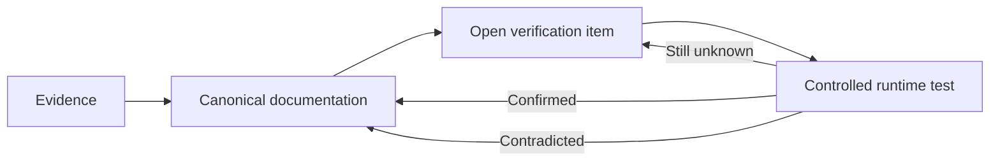

# Current Understanding & Verification Ledger

**Status:** Canonical truth boundary  
**Last updated:** 23 Aug 2026  
**Scope:** QI Studio behavior established from supplied UI/configuration evidence and runtime tests.

This ledger is the compact source of truth for what is established, what is only observed/documented, and what still requires verification.

## Evidence model

| Status | Meaning |
|---|---|
| **Observed** | Visible in supplied UI/screenshots. |
| **Documented** | Explicitly stated in supplied QI Studio/product guidance. |
| **Runtime Confirmed** | Reproduced in execution and consumed downstream or shown to the user. |
| **Open** | Identified but not yet sufficiently tested. |

A capability can be Observed + Documented without being Runtime Confirmed.

## Runtime-confirmed understanding

### Variables and state

- QI Studio exposes Flow, System, Conversation History, Runtime and aggregate variable views.
- Flow Variables are user-created workflow state configured through the Variables UI.
- Built-in System variables are platform-managed.
- `system.humanInput` is populated by Human Input in the tested path.
- Conversation History is contextual conversation data, not a substitute for explicit workflow state.
- Runtime values describe execution context and should not be treated as business state.

### Start → Human Input → Output

Two controlled tests passed:

```text
Human Input → flow.startTestResponse → Output {{flow.startTestResponse}}
Human Input → system.humanInput       → Output {{system.humanInput}}
```

Both produced `START_TEST` downstream. The System-target test also displayed `START_TEST` in the User Window.

Canonical detailed record: `03-Evidence/Start-HumanInput-Output-E2E.md`.

### Output

An explicit response source must be configured. The Output node does not automatically infer a final response merely because an upstream node succeeded or because a value exists somewhere in runtime state.

A historical run without a usable Output source produced:

```text
No response content found in the execution result. Please try again.
```

That regression establishes an important contract: **upstream execution success is not the same thing as user-visible completion.**

### Start

Start execution is runtime-confirmed for the tested invocation path. The runtime record contained the invocation message, session ID, stream mode, timestamp, node identity and success status.

This does not establish the complete Start input schema for every invocation mode.

## Current Agent understanding

The Agent is a configurable semantic execution boundary combining model, strategy, messages, tools/capabilities, context controls, memory, state updates and output variables.

Observed strategy options include `ReAct` and `Deep Agent`. Deep Agent showed subagent controls with a displayed maximum of 3 parallel subagents.

Observed advanced areas include Response Format, Include Thoughts, Guardrails, Context Management, Long-term Memory, Error Handling, State Update and Output Variables.

Canonical sources:

- `02-Orchestration-Primitives/Agent.md`
- `03-Evidence/Agent-Node-Evidence.md`
- `03-Evidence/Agent-Tool-Catalog.md`

## Tool knowledge boundary

The supplied configurations establish tool names, required parameters, option sets, documented outputs and declared artifact wiring. They do not automatically establish successful runtime execution.

The current catalog includes:

- Export Excel V2
- Export PowerPoint V2
- Export PDF V2
- Export Word V2
- Export HTML V2
- Extract Document to Markdown
- Brave Web Search
- Store / Retrieve
- Send Email
- Conversation Attachment
- ExportBlob
- SearchSystemTools
- GetSystemToolSchema
- ExecuteSystemTool
- `get-knowledge-workflow-instructions`

Canonical catalog: `03-Evidence/Agent-Tool-Catalog.md`.

## Open verification priorities

1. Output expression coverage beyond the two proven variable references.
2. Approval decision value, routing and resume semantics.
3. Agent Context Management, Include Thoughts, Error Handling and long-term-memory runtime behavior.
4. Agent state-update runtime semantics and variable-scope precedence.
5. Tool execution and artifact persistence for the export tools.
6. ExportBlob end-to-end attachment delivery.
7. Web Search citation propagation.
8. Store/Retrieve persistence scope.
9. ConversationAttachment behavior with multiple files.
10. Knowledge-workflow prerequisite ordering.
11. Decision Tree, Rule, Script and Variable Update edge-case runtime semantics.
12. Additional node families such as LLM, External Agent, Compute, Subflow, Handoff, Guardrail and Output where configuration evidence is still incomplete.

## Canonical verification lifecycle



When an item is confirmed, remove it from the active queue and preserve the historical test through Git history/evidence records. Do not delete a failed test merely because the workflow was later corrected.

## Repository structure rule

- `02-Orchestration-Primitives/` = explanatory canonical node docs.
- `03-Evidence/` = compact evidence records and runtime tests.
- `04-Verification/` = active unverified questions only.
- `05-Current-Understanding/` = current truth boundary.

Do not create parallel evidence trees for the same capability.
