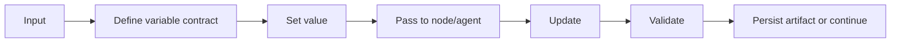

# Data and State

State is a first-class architectural concern.

## Three categories

1. Workflow control state: current stage, branches, approvals, retries.
2. Execution data: inputs, outputs, intermediate artifacts.
3. Persistent memory: context intended to survive beyond a single execution.

Do not collapse these into one undifferentiated memory store.

## Variable lifecycle



## Variable documentation must answer

- Where is it created?
- What is its type?
- What is its scope?
- Who may write it?
- Who may read it?
- Is the value deterministic or agent-selected?
- What happens if null or missing?
- What is the expected JSON shape?
- How is it passed between subflows?
- How is it debugged?

## Artifact pattern

Prefer structured artifacts over free-form strings for inter-stage contracts.

Recommended metadata:

```yaml
artifact_id:
run_id:
artifact_type:
version:
producer:
status:
provenance: []
validation_status:
created_at:
content: {}
```

## State mutation rule

A workflow-owned value should not be unexpectedly rewritten by an agent. Agent recommendations should be returned as outputs and explicitly accepted into workflow state.