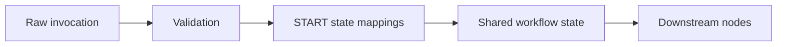

# START State Updates

> Related: [START Node](../02-Orchestration-Primitives/START.md)

START can initialize or transform workflow state before downstream processing. This is separate from merely declaring inputs.

## Observed operations

| Operation | Meaning | Typical START use |
|---|---|---|
| Set | Replace/set current state value | Current user query, current attachments, session context |
| Append | Add to an existing collection/history | Conversation history |
| Clear | Remove stale state | Reset file state between executions |
| Run only when | Conditional execution of a state update | Optional inputs, event-specific mappings |

## Example

```text
conversationHistory <- Append(User, message)
system/files        <- Clear
system/userQuery    <- Set(message)
system/attachments  <- Set(attachments)
system/uiAction     <- Set(ui_action)
system/sessionId    <- Set(options.sessionId)
```

## Design rule

Treat START state updates as the **initial state normalization layer**:



Keep critical mappings visible in the workflow. Do not hide business-critical initialization inside Agent prompts.

## Variables

The variable editor supports string and object types. Object variables can use visual fields or JSON Schema. Input variables can expose descriptions, required flags, validation rules, allowed values and defaults.

## Open questions

See [START Node](../02-Orchestration-Primitives/START.md) for unresolved runtime questions about update ordering, failure semantics and null handling.
