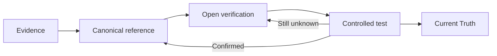

# Current Truth

**Last updated:** 2026-08-24

This is the compact control tower for the playbook. It is not a second documentation library.

## Confirmed

- Flow Variables are user-created workflow state configured through the Variables UI.
- Built-in System variables are platform-managed.
- `system.humanInput` is populated by Human Input in the tested path.
- Conversation History is contextual conversation data, not a substitute for explicit workflow state.
- Runtime values describe execution context and should not be treated as business state.
- Agent nodes are being used as the semantic execution boundary; Deep Agent is the selected strategy for the Bid Analysis Agent specialist/master nodes.
- Agent output is being configured as JSON for inter-stage contracts.
- Deep Agent context baseline currently used: Context Management ON, Tool results only, Replace, Tokens; Long-term Memory OFF; Include Thoughts OFF; Error Handling OFF during initial construction.
- Handoff tool configuration is being used as the outbound delegation contract. Dedicated typed parameters are preferred over relying only on graph-edge context transfer.
- Specialist Agent return edges use Pass context ON + Last message (append) as the current baseline.
- Script nodes expose declared typed inputs, a JavaScript editor, typed output schema, State Update and native result output.
- Script results can be referenced using `{{nodes.<nodeName>.result}}` and field-specific forms such as `{{nodes.configuration_validation.result.evaluationConfiguration}}` through the QI Studio expression system.

## Bid Analysis Agent architecture currently locked

```text
START
  ↓
MASTER DEEP AGENT
  ├── Handoff → Criteria Deep Agent → return
  ├── Handoff → Supplier Deep Agent → return
  ↓
HUMAN INPUT
  ↓
CONFIGURATION VALIDATION
  ↓
QUESTIONNAIRE VALIDATION
  ↓
CANONICAL MAPPING
  ↓
MASTER DEEP AGENT (same node re-entered)
  └── Handoff → Evaluation Deep Agent → return
       ↓
     MASTER QC
       ↓
  Handoff → Execution & Reporting Deep Agent
       ↓
  Handoff → Knockout Evaluation
       ↓
  Score Validation
       ↓
  Weighted Score
       ↓
  Ranking
       ↓
  Result Builder
       ↓
  report-generation Skill
       ↓
  Export Excel V2
       ↓
  OUTPUT
```

## Current build decisions

- Human Input captures the immediate response in `system.humanInput`.
- Configuration Validation is the intended producer of `flow.evaluationConfiguration`.
- Questionnaire Validation is the intended producer of `flow.validationResult`.
- Canonical Mapping is the intended producer of `flow.canonicalQuestionMap`.
- The same Master Deep Agent is re-entered after canonicalization and uses `flow.currentStage` to distinguish workflow phases.
- Master QC owns `flow.evaluationQC` and gates the deterministic execution handoff.
- Knockout Evaluation owns `flow.knockoutResult`.
- Score Validation owns `flow.scoreValidationResult`.
- Weighted Score owns `flow.weightedScores`.
- Ranking owns `flow.rankingResult`.
- Result Builder owns `flow.evaluationResult`.
- Report generation is being moved into the `bid-analysis-report-generator` Skill.
- The Skill bundles `Export Excel V2` rather than leaving the export tool directly exposed on Execution & Reporting.
- The Excel report must contain exactly four sheets: Executive Summary, Supplier Profiles, Q&A Scorecard, Score Legend.
- The report is based on a supplied reference workbook for tone, structure and visual language.
- Merge cells are intentionally not used in the generated report.

## Open priorities

1. Runtime proof of same-Agent multi-stage re-entry.
2. Runtime proof of Handoff parameter serialization and return context.
3. Human Input correction/rejection loop design and resume semantics.
4. Agent structured-output field mapping and QC state update semantics.
5. Script input/output object typing and nested expression behavior.
6. Export Excel V2 execution and artifact persistence.
7. Skill invocation and bundled-tool execution.
8. Final Output artifact exposure through `flow.report`.
9. End-to-end controlled Bid Analysis test with realistic source files.
10. Knowledge workflow/tool runtime behavior under the Skill and Agent architecture.

## Knowledge lifecycle



## Update rule

When an open item is confirmed:

1. Record the test in `04-Evidence`.
2. Update the relevant canonical page in `03-Canonical-Reference`.
3. Remove the item from `05-Verification`.
4. Keep historical failures and prior tests in evidence/history.
