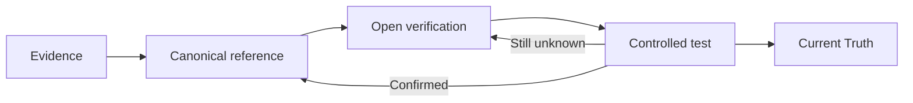

# Current Truth

**Last updated:** 2026-08-23

This is the compact control tower for the playbook. It is not a second documentation library.

## Confirmed

- Flow Variables are user-created workflow state configured through the Variables UI.
- Built-in System variables are platform-managed.
- `system.humanInput` is populated by Human Input in the tested path.
- Conversation History is contextual conversation data, not a substitute for explicit workflow state.
- Runtime values describe execution context and should not be treated as business state.

### Start → Human Input → Output

Two controlled tests are runtime-confirmed:

```text
Human Input → flow.startTestResponse → Output {{flow.startTestResponse}}
Human Input → system.humanInput       → Output {{system.humanInput}}
```

Both produced `START_TEST` downstream. The System-target test also displayed `START_TEST` in the User Window.

Canonical evidence: `04-Evidence/Runtime/Start-HumanInput-Output-E2E.md`.

### Output

Output requires an explicit response source. A historical run without a usable source returned:

```text
No response content found in the execution result. Please try again.
```

Therefore upstream execution success is not equivalent to user-visible completion.

### Start

Start is runtime-confirmed for the tested invocation path. The runtime record contained invocation message, session ID, stream mode, timestamp, node identity and success status. The complete Start schema is not yet established.

### Agent

Agent is the semantic execution boundary. Observed strategies include `ReAct` and `Deep Agent`; the latter exposes a visible maximum of 3 parallel subagents. Advanced areas include Response Format, Include Thoughts, Guardrails, Context Management, Long-term Memory, Error Handling, State Update and Output Variables. Detailed runtime semantics remain open.

### Tools

Configuration contracts are captured in `04-Evidence/Tool-Contracts/Agent-Tool-Catalog.md`. Tool configuration evidence does not imply successful runtime execution.

## Open priorities

1. Output expression coverage beyond the two proven variable references.
2. Approval decision serialization, routing and resume behavior.
3. Agent Context Management, Long-term Memory, Include Thoughts, Error Handling and Deep Agent behavior.
4. Agent state-update semantics and variable-scope precedence.
5. Export tool execution, artifact persistence and downstream attachment behavior.
6. Extract Document to Markdown runtime fidelity.
7. ExportBlob and ConversationAttachment end-to-end behavior.
8. Web Search citation propagation.
9. Store/Retrieve persistence scope.
10. Send Email validation and attachment behavior.
11. System tool discovery/execution and knowledge-workflow prerequisite enforcement.
12. Decision Tree, Rule, Script and Variable Update edge cases.
13. Deeper coverage of LLM, External Agent, Subflow, Handoff, Guardrail and Output.

## Knowledge lifecycle



## Update rule

When an open item is confirmed:

1. Record the test in `04-Evidence`.
2. Update the relevant canonical page in `03-Canonical-Reference`.
3. Remove the item from `05-Verification`.
4. Keep historical failures and prior tests in evidence/history.
