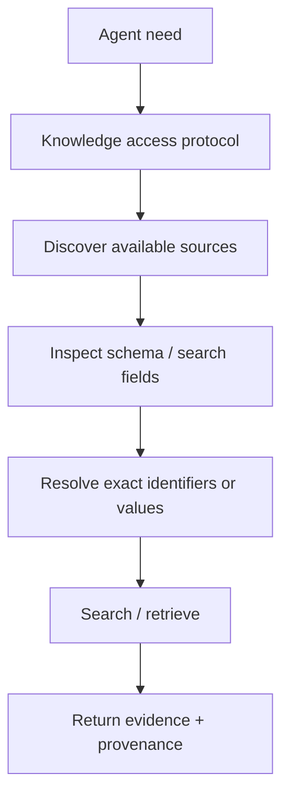

# Knowledge and Document Processing

Knowledge retrieval and document processing should be treated as explicit capabilities rather than magic context.

## Retrieval mental model



## Retrieval rules

- Use authoritative source material where source truth matters.
- Preserve provenance.
- Do not let contextual knowledge silently become a business rule.
- Do not invent knowledge IDs or schema values.
- Separate semantic retrieval from deterministic filtering when appropriate.

## Document processing

The preferred pattern for complex files is:

`uploaded document -> canonical extraction -> normalized document artifact -> agent interpretation`

Do not repeatedly extract the same document independently in every downstream agent unless there is a tested reason.

A normalized document artifact should preserve, where available:

- document identity
- page/section provenance
- text blocks
- tables
- images
- extracted metadata
- extraction warnings

## Evidence boundary

```text
Source document = evidence
Knowledge = context
Human-confirmed configuration = authority
Agent interpretation = recommendation
Deterministic engine = calculation
```

These categories must not be silently merged.