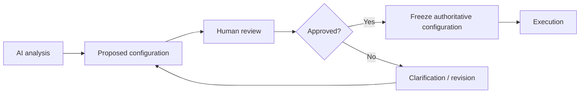

# Human in the Loop

Human interaction is a workflow control mechanism, not an afterthought.

## Patterns

### Human Input
Use when the workflow needs information from a person.

### Approval
Use when a person must authorize a proposed configuration, action, or transition.

### Escalation
Use when automated reasoning reaches an unresolved ambiguity or policy boundary.

## Recommended gate

## Rules

- Record the exact inputs shown to the human.
- Record the human decision and timestamp.
- Do not silently mutate an approved configuration.
- Make re-approval explicit after material changes.
- Distinguish human confirmation from human-provided evidence.