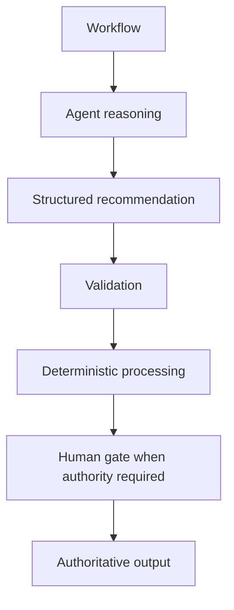

# Design Patterns

## Pattern catalog

- Deterministic workflow + bounded agents
- Parallel independent analysis
- Deep Agent with bounded subagents
- Agent + tool retrieval
- Human-gated execution
- Agent + deterministic scoring
- Reflection as controlled rework
- Explicit handoff between responsibilities
- Reusable subflow composition

## Deterministic-agentic hybrid



## Parallel analysis

Use when subtasks are independent and merge semantics are defined.

```text
Input
  -> Analysis A
  -> Analysis B
  -> Analysis C
       -> Consolidation
```

## Reflection / rework

```text
Primary result -> challenge -> PASS
                         -> REWORK -> primary result
```

Reflection should have a bounded retry count and explicit rework reasons.

## Pattern quality criteria

Every reference pattern should document:

- problem solved
- architecture diagram
- node selection
- state contract
- tool contract
- failure behavior
- observability
- cost/latency implications
- when not to use