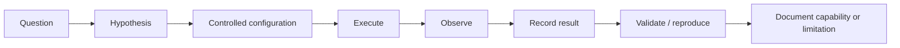

# Testing and Validation

## Why testing matters

Agentic workflows fail in ways that are different from ordinary software. The playbook therefore separates UI capability tests, runtime behavior tests, integration tests, and architecture tests.

## Test lifecycle

## Test record

Each experiment should include:

- Test ID
- Date
- QI Studio area/version if known
- Question
- Hypothesis
- Setup
- Inputs
- Node configuration
- Expected behavior
- Actual behavior
- Pass/fail
- Reproduction steps
- Evidence references
- Workaround
- Confidence
- Open questions

## Regression testing

When a product change is suspected, rerun tests covering:

- variable passing
- node transitions
- tool execution
- agent outputs
- subagent behavior
- human gates
- error handling
- external integrations

## Observability

Capture enough information to reconstruct a failed run without guessing: node, inputs, outputs, branch, state mutation, tool call, error, retry, and human action where applicable.