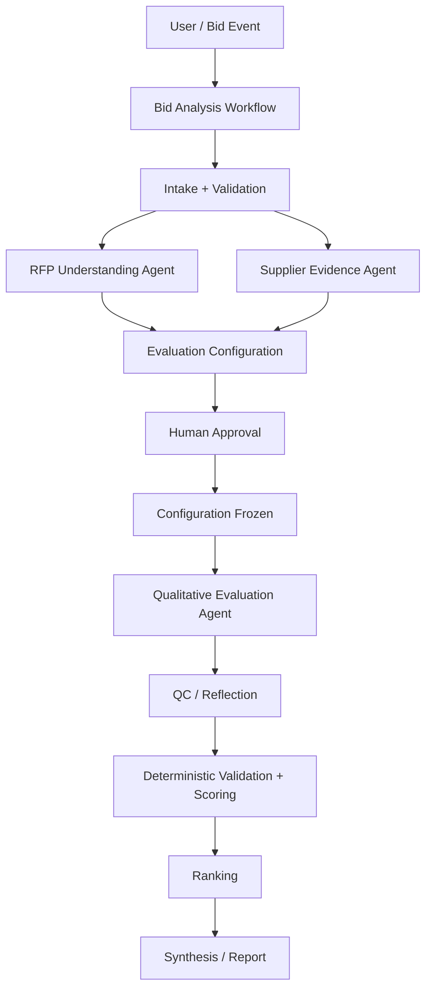

# Bid Analysis Reference Architecture

This area applies the platform playbook to the Bid Analysis Agent. It should never redefine platform facts; it should link back to the relevant platform primitives.

## Target architecture

## Architectural stance

The Bid Analysis workflow should remain the outer control plane. Specialist agents should perform bounded reasoning. Deterministic computation should remain outside the LLM. Human confirmation should establish authoritative evaluation configuration.

## Specialist boundaries

### RFP / Evaluation Criteria Analyst

Responsible for extracting and interpreting criteria, scoring rules, mandatory conditions, ambiguities, and proposed evaluation configuration.

### Supplier Evidence Analyst

Responsible for source-faithful extraction and normalization of supplier responses and evidence. It should not independently invent scores or rankings.

### Qualitative Evaluation Analyst

Responsible for interpreting supplier evidence against the confirmed evaluation rubric and producing structured recommendations with rationale and evidence.

### QC / Challenge

Challenge the reasoning and evidence before deterministic processing. Separate semantic QC from deterministic validation.

## Key invariants

- Source documents are source truth.
- Human-confirmed configuration is authoritative.
- Knowledge is contextual unless explicitly incorporated through the approved workflow.
- LLMs do not own deterministic arithmetic or ranking.
- Evaluation configuration is immutable during an execution snapshot.
- Scenarios preserve lineage rather than overwriting the original evaluation.

## Relevant platform links

- [Architecture](../ARCHITECTURE.md)
- [Agents](../03-Agent-Architecture/README.md)
- [Data and State](../05-Data-State/README.md)
- [Human in the Loop](../08-Human-in-the-Loop/README.md)
- [Design Patterns](../09-Design-Patterns/README.md)
- [Anti-Patterns](../10-Anti-Patterns/README.md)
