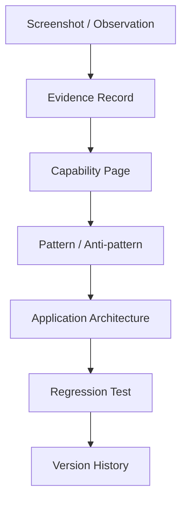

# Evidence Repository

Evidence is first-class. Raw screenshots are not enough; every evidence item should explain what the screenshot or experiment establishes.

## Evidence lifecycle



## Evidence record template

```yaml
id:
title:
date:
source:
type: screenshot | experiment | runtime | documentation
status: CONFIRMED | TESTED | DOCUMENTED | INFERRED | UNKNOWN
capability:
what_is_visible:
what_it_proves:
what_it_does_not_prove:
related_pages: []
related_tests: []
observations: []
failures: []
workarounds: []
open_questions: []
```

## Important rule

A screenshot showing a UI option proves that the option exists. It does not by itself prove its runtime semantics, limits, failure behavior, persistence, or interaction with other nodes. Those require testing or authoritative documentation.

## Current evidence intake

Future QI Studio screenshot uploads should be indexed here and then reflected into the affected capability pages. Do not leave important knowledge trapped in raw screenshots.