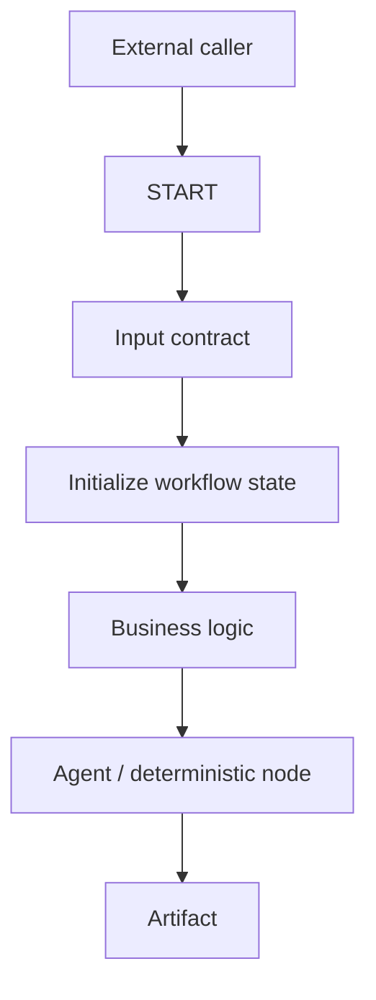

# START Capability Snapshot

## Current knowledge status

| Area | Status |
|---|---|
| Node purpose | Documented / observed |
| API invocation | Documented / observed |
| Scheduler trigger | Documented / observed |
| Event trigger | Documented / observed |
| Input contracts | Observed |
| Scalar validation UI | Observed |
| Object / JSON Schema UI | Observed |
| State Set / Append / Clear UI | Observed |
| Conditional state updates | Observed |
| Session continuity model | Partially documented; runtime precedence open |
| HITL resume API | Observed in API Reference |
| SSE event taxonomy | Observed in API Reference |

## Current architectural interpretation

START is best understood as an **entry contract + initialization boundary**, not as the business process itself.

## High-value implementation guidance

- Keep system identifiers and session context workflow-owned.
- Use explicit input validation instead of relying on agent interpretation.
- Use Clear when stale state can leak across runs.
- Use Append for intentional histories only.
- Use Set for current-run context.
- Keep object inputs schema-driven when downstream stages depend on stable shape.
- Do not assume UI configuration implies runtime guarantees; turn uncertain behavior into a test.

## Related evidence

- [START node](../02-Orchestration-Primitives/Start.md)
- [Variable foundations](../05-Data-State/Variables-Foundations.md)
- [Runtime API](../04-Tools/API-Reference-and-Runtime-API.md)
- [START test matrix](../11-Testing/START-Node-Test-Matrix.md)
- [START evidence record](2026-08-23-START-Node.md)
