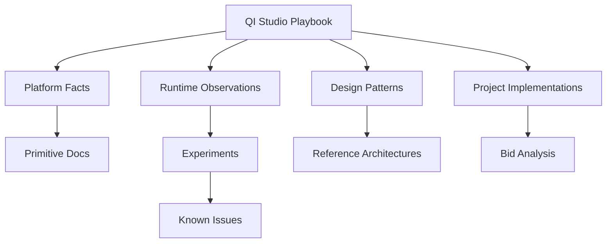

# AI Index

## Mission

You are entering an evolving technical knowledge base for QI Studio. Your job is to use established evidence rather than assumptions, preserve provenance, and improve the repository when new screenshots or experiments reveal better information.

## Fast orientation

Start here:

1. `README.md` for scope and navigation.
2. `ARCHITECTURE.md` for the overall mental model.
3. `02-Orchestration-Primitives/README.md` for the node taxonomy.
4. `03-Agent-Architecture/README.md` for agents and delegation.
5. `04-Tools/README.md` for tool use and tool governance.
6. `05-Data-State/README.md` for variables and state.
7. `09-Design-Patterns/README.md` for reusable architectures.
8. `10-Anti-Patterns/README.md` for things to avoid.
9. `14-Evidence/README.md` for observed platform behavior.
10. `13-Bid-Analysis/README.md` for the procurement application.

## Knowledge hierarchy

## Evidence rules

- CONFIRMED: UI or runtime directly observed.
- TESTED: experiment executed and behavior observed.
- DOCUMENTED: authoritative documentation.
- INFERRED: interpretation based on evidence.
- UNKNOWN: behavior not established.

## AI behavior rules

- Prefer deterministic primitives where the responsibility is deterministic.
- Do not use an agent as a workflow engine unless there is a documented reason.
- Do not treat tool descriptions as proof of runtime semantics.
- Do not invent IDs, fields, node capabilities, limits, or failure behavior.
- Cite internal evidence pages when making platform claims.
- When adding new knowledge, update backlinks and the change log.
- When correcting knowledge, preserve the old version in archive or historical notes.

## Document template expectations

Capability pages should cover:

1. Definition
2. Mental model
3. UI configuration
4. Inputs and outputs
5. Variable behavior
6. Runtime lifecycle
7. When to use
8. When not to use
9. Interactions with other primitives
10. Working examples
11. Failed approaches
12. Workarounds
13. Testing notes
14. Known limitations
15. Unknowns
16. Evidence links
17. Version history

## Decision rule

When choosing between primitives, ask:

> Is this deterministic control, semantic reasoning, data retrieval/execution, reusable orchestration, or human authority?

Then choose the narrowest primitive that reliably satisfies that responsibility.
