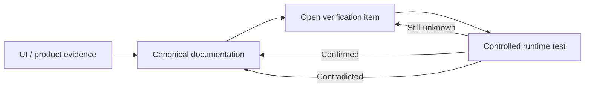

# QI Studio Playbook

A living, evidence-backed operating manual for QI Studio. The repository separates **canonical explanations**, **evidence**, **active verification**, and the **current truth boundary** so that tested behavior does not get mixed with assumptions.

## Repository map

### Canonical node documentation

- [Start](./02-Orchestration-Primitives/Start.md)
- [Agent](./02-Orchestration-Primitives/Agent.md)
- [Approval](./02-Orchestration-Primitives/Approval.md)
- [Decision Tree](./02-Orchestration-Primitives/Decision-Tree.md)
- [Human Input](./02-Orchestration-Primitives/Human-Input.md)
- [Rule](./02-Orchestration-Primitives/Rule.md)
- [Variable Update](./02-Orchestration-Primitives/Variable-Update.md)
- [Script](./02-Orchestration-Primitives/Script.md)
- [Additional Observed Nodes](./02-Orchestration-Primitives/Additional-Observed-Nodes.md)

### Evidence

- [Agent Node Evidence](./03-Evidence/Agent-Node-Evidence.md)
- [Agent Tool Catalog](./03-Evidence/Agent-Tool-Catalog.md)
- [Start → Human Input → Output E2E](./03-Evidence/Start-HumanInput-Output-E2E.md)
- [Approval Evidence](./03-Evidence/Approval-Node-Evidence.md)
- [Decision Tree Evidence](./03-Evidence/Decision-Tree-Node-Evidence.md)
- [Human Input Evidence](./03-Evidence/Human-Input-Node-Evidence.md)
- [Rule Evidence](./03-Evidence/Rule-Node-Evidence.md)
- [Variable Update Evidence](./03-Evidence/Variable-Update-Node-Evidence.md)
- [Script Evidence](./03-Evidence/Script-Node-Evidence.md)
- [Additional Node Evidence](./03-Evidence/2026-08-23-Additional-Node-Evidence.md)

### Verification

- [Verification Queue](./04-Verification/Verification-Queue.md)
- [Export Excel V2](./04-Verification/Export-Excel-V2-Verification.md)
- [Export PowerPoint V2](./04-Verification/Export-PowerPoint-V2-Verification.md)
- [Export PDF V2](./04-Verification/Export-PDF-V2-Verification.md)
- [Export Word V2](./04-Verification/Export-Word-V2-Verification.md)
- [Export HTML V2](./04-Verification/Export-HTML-V2-Verification.md)
- [Extract Document to Markdown](./04-Verification/Extract-Document-to-Markdown-Verification.md)
- [Web Search](./04-Verification/Web-Search-Verification.md)
- [Memory Store/Retrieve](./04-Verification/Memory-Store-Retrieve-Verification.md)
- [Conversation Attachment](./04-Verification/Conversation-Attachment-Verification.md)
- [Send Email](./04-Verification/Send-Email-Verification.md)
- [Agent Memory Tools](./04-Verification/Agent-Memory-Tools-Verification.md)

### Current truth boundary

- [Current Understanding & Verification Ledger](./05-Current-Understanding/Current-Understanding-and-Verification-Ledger.md)

## Evidence states

| State | Meaning |
|---|---|
| **Observed** | Visible in the QI Studio UI/screenshots. |
| **Documented** | Explicitly stated in supplied product guidance. |
| **Runtime Confirmed** | Reproduced in execution and consumed downstream or shown to the user. |
| **Open** | Still requires a controlled test or stronger evidence. |

Never promote an observation or inference to Runtime Confirmed without a reproducible test.

## Evidence lifecycle



## Conversation-to-Git rule

Substantive QI Studio knowledge established during investigation belongs in this repository: node behavior, configuration, tool contracts, test results, failures, workarounds, design patterns, diagrams, and open questions.

The preferred path is:

```text
Evidence
  ↓
Canonical explanation + evidence record
  ↓
Verification item when needed
  ↓
Runtime test
  ↓
Update canonical truth
```

## Structural rule

Use one canonical location for each knowledge class:

- `02-Orchestration-Primitives/` for explanations.
- `03-Evidence/` for evidence and runtime tests.
- `04-Verification/` for unresolved questions only.
- `05-Current-Understanding/` for the present truth boundary.

Do not maintain a second parallel evidence directory for the same capability.