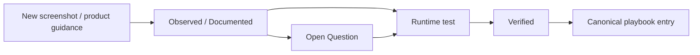

# QI-Studio-Playbook

A living, evidence-backed operating manual for QI Studio.

The playbook is designed for two audiences:

1. **Humans** who need clear explanations, examples, diagrams, design guidance, and troubleshooting.
2. **AI agents** that need precise operational knowledge without relying on undocumented assumptions or prior conversation context.

## Current coverage

### Orchestration primitives

- [Agent Node](./02-Orchestration-Primitives/Agent.md)
- [Approval Node](./02-Orchestration-Primitives/Approval.md)
- [Rule Node](./02-Orchestration-Primitives/Rule.md)
- [Variable Update Node](./02-Orchestration-Primitives/Variable-Update.md)
- [Script Node](./02-Orchestration-Primitives/Script.md)

### Evidence records

- [Approval Node Evidence](./03-Evidence/Approval-Node-Evidence.md)
- [Rule Node Evidence](./03-Evidence/Rule-Node-Evidence.md)
- [Variable Update Node Evidence](./03-Evidence/Variable-Update-Node-Evidence.md)
- [Script Node Evidence](./03-Evidence/Script-Node-Evidence.md)
- [Agent Node Evidence](./14-Evidence/2026-08-23-Agent-Node.md)
- [Agent Screenshot Evidence Index](./14-Evidence/2026-08-23-Agent-Node-Screenshot-Index.md)

## Documentation standard

Every QI Studio capability should distinguish between:

- **Observed**: directly visible in screenshots or UI.
- **Documented**: explicitly stated in QI Studio/product guidance.
- **Verified**: confirmed by a reproducible runtime test.
- **Inferred**: a reasonable engineering interpretation that has not yet been proven.
- **Open Question**: behavior that still needs investigation.

Do not silently convert an inference into a fact.

## Conversation-to-Git rule

**Anything we discuss that establishes QI Studio product knowledge, node behavior, configuration, examples, failure modes, workarounds, design patterns, testing results, or open questions is part of the playbook and should be committed to Git.**

The working rule is:

```text
Conversation evidence
      ↓
Normalize into playbook knowledge
      ↓
Create / update canonical node documentation
      ↓
Create / update evidence record
      ↓
Update index / cross-links
      ↓
Commit to Git
```

Do not leave substantive node knowledge only in chat.

When a screenshot batch introduces a new node or capability, the expected repository changes are:

1. canonical node documentation
2. evidence record
3. README/index cross-link
4. explicit open questions where runtime semantics are not yet verified

## Evidence lifecycle



## Core principle

The repository should evolve from screenshots and experiments into a durable QI Studio knowledge system. Each new screenshot batch should be added with:

- exact UI observations
- configuration details
- examples
- diagrams where they improve understanding
- recommended usage patterns
- anti-patterns
- failure modes
- workarounds
- runtime verification status
- links/backlinks to related nodes and concepts
- explicit open questions for future testing

This structure is intentional: a future human or AI agent should be able to understand how QI Studio works, how we use it, what has failed, and what remains uncertain without needing the original conversation.
