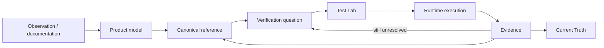

# QI Studio Playbook

An evidence-backed operating manual for understanding, testing, and designing QI Studio workflows.

The repository is being rebuilt around a strict separation between **governance, product model, canonical reference, evidence, verification, current truth, and test design**.

## New architecture

```text
01 Governance
      ↓
02 Product Model
      ↓
03 Canonical Reference
      ↓
04 Evidence
      ↓
05 Verification
      ↓
06 Current Truth
      ↓
07 Test Lab
      ↓
99 Legacy
```

### 01 Governance
Rules for evidence, documentation ownership, repository maintenance, and AI interpretation.

### 02 Product Model
The conceptual map of QI Studio: node taxonomy, state/variable model, Agent capability model, and tool/integration model.

### 03 Canonical Reference
The current maintained explanation of each node and tool capability. This is where a reader should learn how the product currently works.

### 04 Evidence
The proof layer. Contains runtime tests, UI observations, supplied product guidance, and tool contracts.

### 05 Verification
Active unresolved questions only. Resolved items leave this layer.

### 06 Current Truth
A compact control tower showing what is currently established and what needs attention next.

### 07 Test Lab
Test strategy, efficient test suites, reusable fixtures, and test designs. Executed results are stored in Evidence.

### 99 Legacy
Temporary migration boundary for the previous repository structure. Nothing here is authoritative.

## Knowledge lifecycle



## Evidence states

| State | Meaning |
|---|---|
| **Observed** | Visible in UI, screenshots, runtime envelope, or supplied artifact. |
| **Documented** | Explicitly stated in authoritative product guidance. |
| **Runtime Confirmed** | Reproduced by a controlled runtime test with recorded evidence. |
| **Open** | Not sufficiently established yet. |

A claim may be both Observed and Documented. Runtime confirmation requires an actual test.

## Non-duplication rule

Each important fact has one canonical owner.

```text
Explanation   → 03 Canonical Reference
Proof          → 04 Evidence
Open question  → 05 Verification
Snapshot       → 06 Current Truth
Test design    → 07 Test Lab
```

Do not maintain parallel copies of the same knowledge as separate sources of truth.

## Rebuild status

The new structure has been established on branch `restructure/repo-foundation`.

The existing material is intentionally not yet deleted. The next phase will migrate useful content into the new ownership model, consolidate duplicates, correct contradictions, and retire the old structure only after the rebuilt references are validated.

See [01 Governance/Documentation-Architecture](./01-Governance/Documentation-Architecture.md) and [06 Current Truth](./06-Current-Truth/README.md) for the operating rules.
