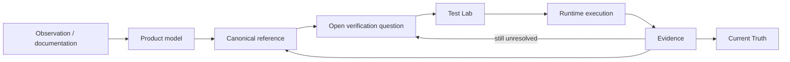

# QI Studio Playbook

An evidence-backed operating manual for understanding, testing, and designing QI Studio workflows.

The repository uses a strict knowledge-ownership model so that explanation, evidence, unresolved questions, current truth, and test design do not become competing sources of truth.

## Final architecture

```text
01 Governance
      ↓
02 Product Model
      ↓
03 Canonical Reference
      ↓
04 Evidence
      ↓
05 Verification
      ↓
06 Current Truth
      ↓
07 Test Lab
```

### 01 Governance
Rules for evidence, documentation ownership, repository maintenance, migration, and AI interpretation.

### 02 Product Model
Conceptual models for node taxonomy, variables/state, Agent capabilities, and tool/integration boundaries.

### 03 Canonical Reference
The maintained explanation of how each documented node or capability works. This is the primary learning layer.

### 04 Evidence
Proof and source material: UI observations, supplied product guidance, runtime tests, and tool contracts.

### 05 Verification
Active unresolved questions only. When a question is confirmed, its result is promoted to evidence/canonical documentation and removed from this queue.

### 06 Current Truth
A compact control tower showing what is currently established and what needs attention next.

### 07 Test Lab
Test strategy and reusable test designs. Executed results belong in `04-Evidence`.

## Knowledge lifecycle



## Evidence states

| State | Meaning |
|---|---|
| **Observed** | Visible in UI, screenshots, runtime envelope, or supplied artifact. |
| **Documented** | Explicitly stated in authoritative product guidance. |
| **Runtime Confirmed** | Reproduced by a controlled runtime test with recorded evidence. |
| **Open** | Not sufficiently established yet. |

A claim may be both Observed and Documented. Runtime confirmation requires an actual test.

## Non-duplication rule

Each important fact has one canonical owner:

```text
Explanation   → 03 Canonical Reference
Proof          → 04 Evidence
Open question  → 05 Verification
Snapshot       → 06 Current Truth
Test design    → 07 Test Lab
```

Do not keep parallel copies of the same explanation or verification queue.

## Current status

The repository migration is now being consolidated on the default `main` branch. Legacy duplicate node and evidence locations have been moved into the new ownership model and removed where their unique information had already been preserved.

Start, Human Input, Approval, Decision Tree, Rule, Script, Variable Update and Agent now have canonical node references under `03-Canonical-Reference/Nodes/`. Runtime/UI/tool evidence is under `04-Evidence/`. Active verification questions are under `05-Verification/`. Current status is maintained in `06-Current-Truth/Current-Truth.md`.

See `01-Governance/Documentation-Architecture.md` and `01-Governance/Migration-Map.md` for the operating rules.
