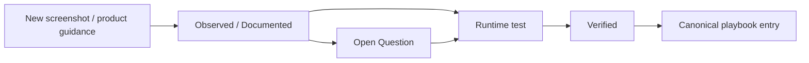

# QI-Studio-Playbook

A living, evidence-backed operating manual for QI Studio.

The playbook is designed for two audiences:

1. **Humans** who need clear explanations, examples, diagrams, design guidance, and troubleshooting.
2. **AI agents** that need precise operational knowledge without relying on undocumented assumptions or prior conversation context.

## Current coverage

### Orchestration primitives

- [Agent Node](./02-Orchestration-Primitives/Agent.md)
- [Rule Node](./02-Orchestration-Primitives/Rule.md)

### Evidence records

- [Rule Node Evidence](./03-Evidence/Rule-Node-Evidence.md)

## Documentation standard

Every QI Studio capability should distinguish between:

- **Observed**: directly visible in screenshots or UI.
- **Documented**: explicitly stated in QI Studio/product guidance.
- **Verified**: confirmed by a reproducible runtime test.
- **Inferred**: a reasonable engineering interpretation that has not yet been proven.
- **Open Question**: behavior that still needs investigation.

Do not silently convert an inference into a fact.

## Evidence lifecycle

## Core principle

The repository should evolve from screenshots and experiments into a durable QI Studio knowledge system. Each new screenshot batch should be added with:

- exact UI observations
- configuration details
- examples
- diagrams where they improve understanding
- recommended usage patterns
- anti-patterns
- failure modes
- workarounds
- runtime verification status
- links/backlinks to related nodes and concepts
- explicit open questions for future testing

This structure is intentional: a future human or AI agent should be able to understand how QI Studio works, how we use it, what has failed, and what remains uncertain without needing the original conversation.
